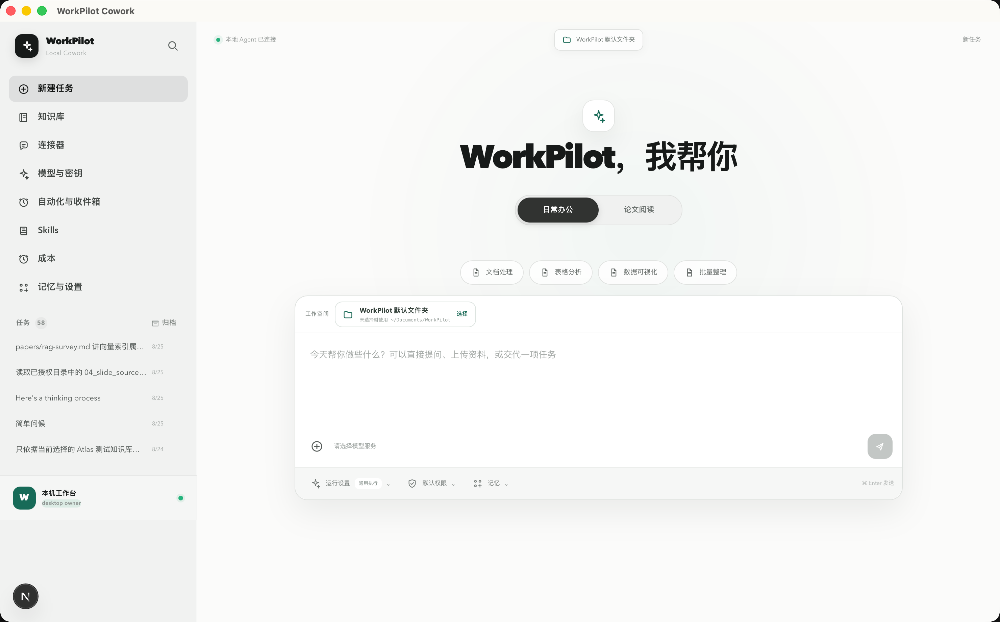
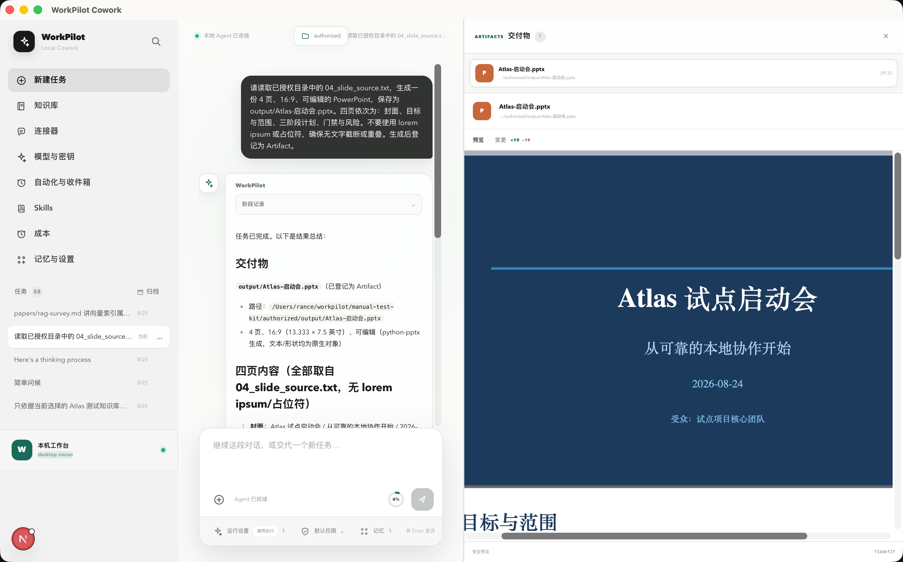
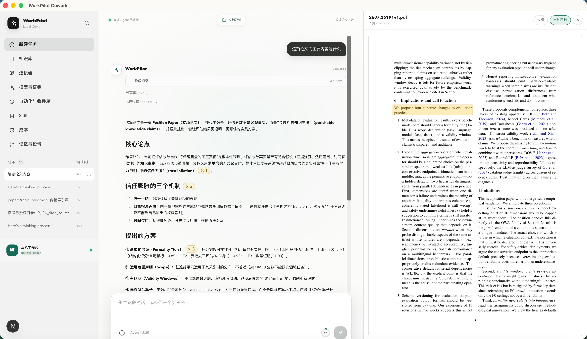
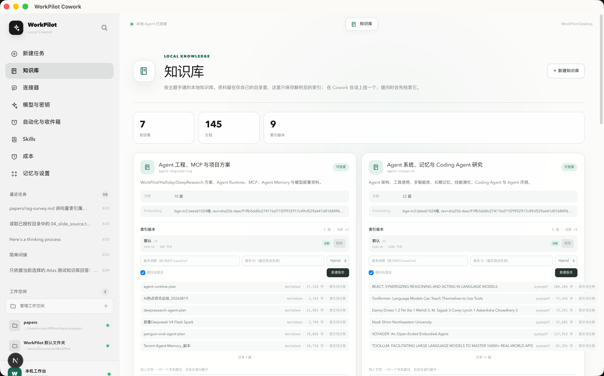
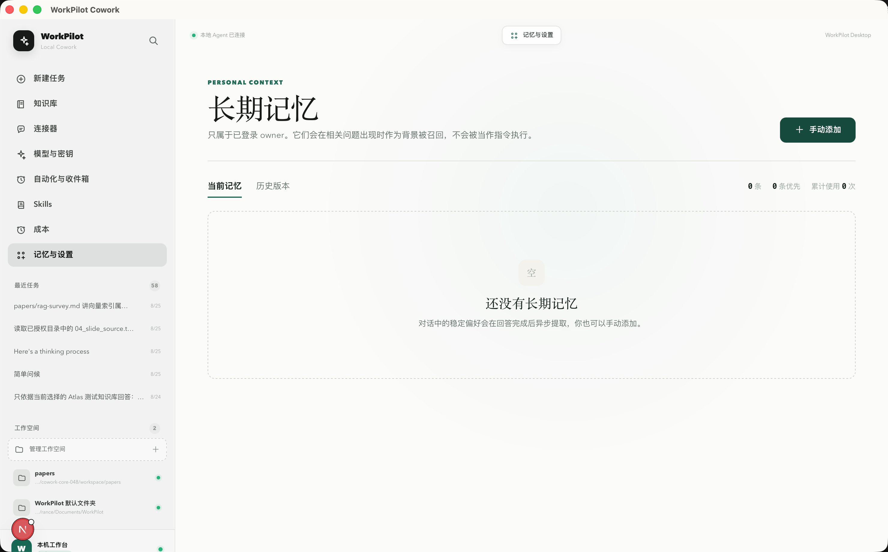
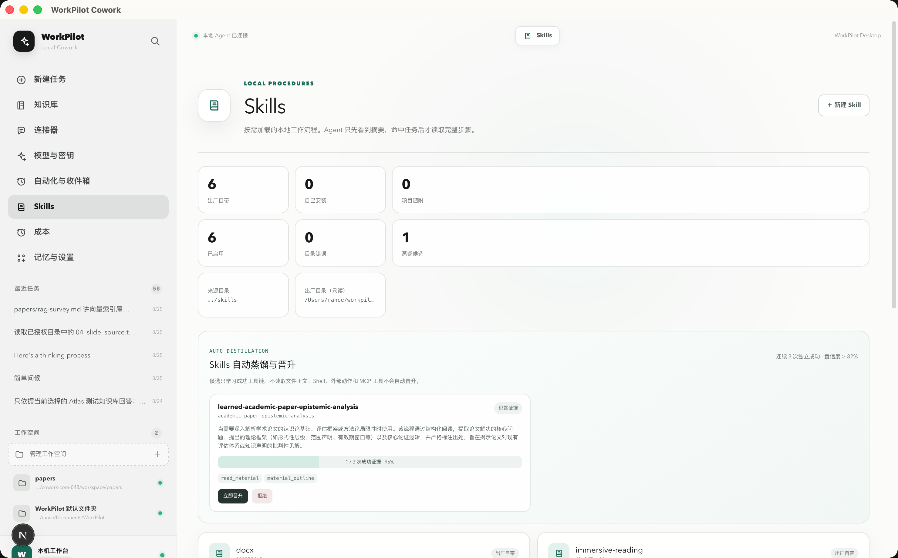
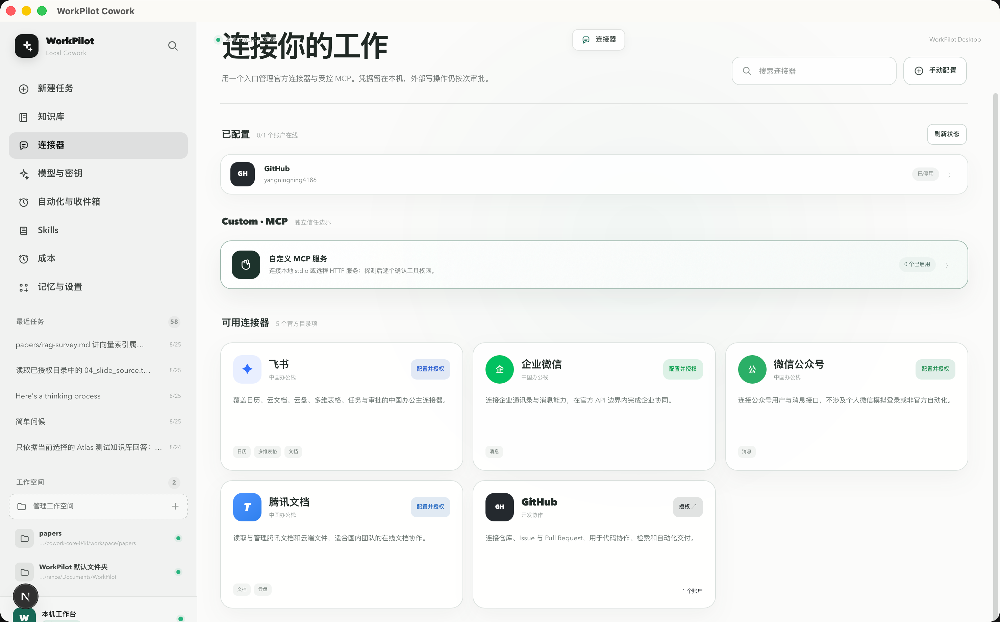
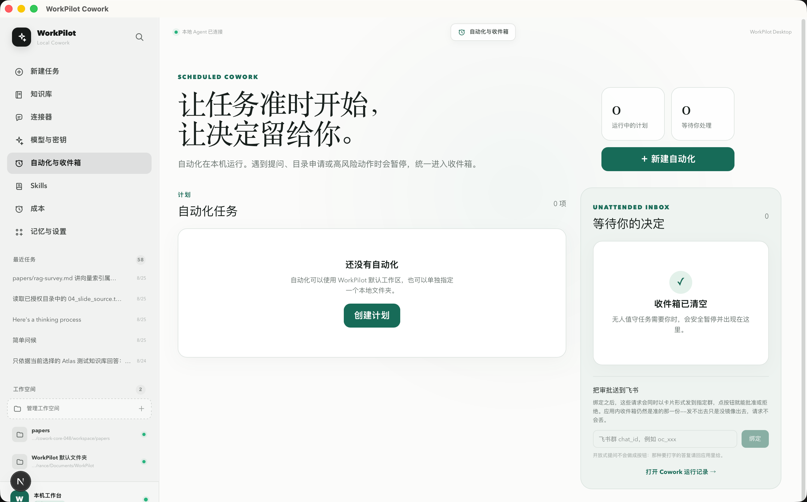
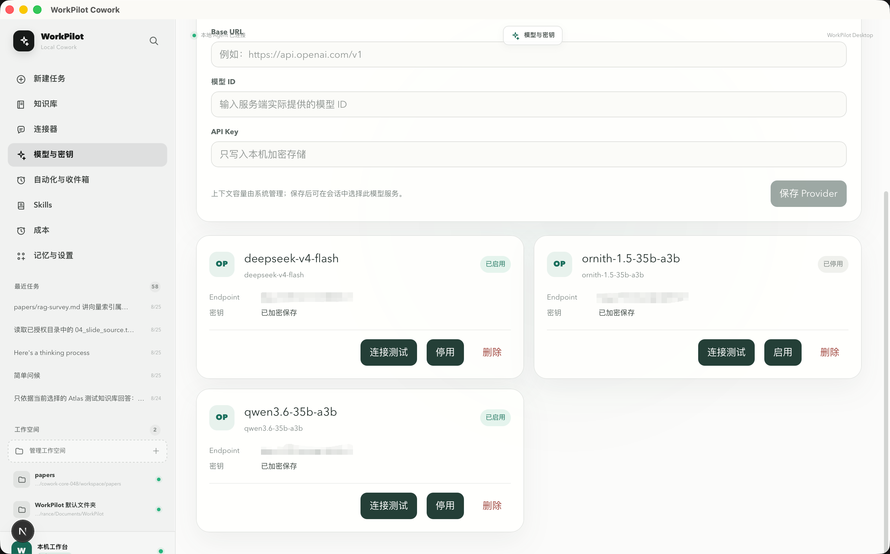
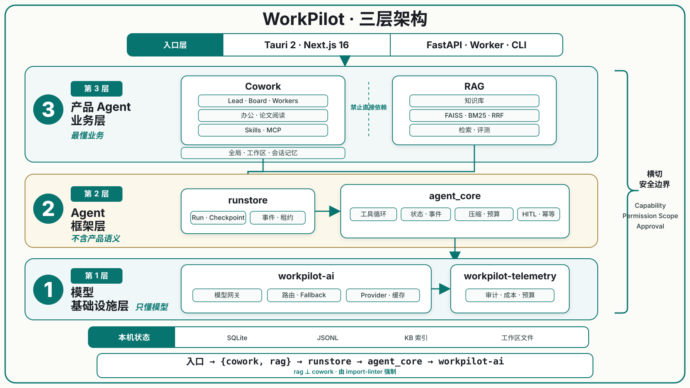

# WorkPilot · 桌面 AI 知识副驾

WorkPilot 是一个运行在本机的 AI 工作助手，把有依据的文档阅读、个人知识库和可审计的文件操作放进同一个 Agent 工作流。

你可以让它阅读论文并定位原文、检索自己的资料库、整理多份材料，或直接在授权工作空间中编辑 Word、Excel、PowerPoint、PDF 和文本文件。任务执行过程可见、可中断，也能从事件记录和 checkpoint 恢复。

默认状态保存在本机。只有在用户明确启用模型端点、网页、Connector 或 MCP 时，完成任务所需的最小数据才会发往对应服务。

## 核心能力

| 能力 | 示例 | 行为保证 |
|---|---|---|
| 阅读 | “这篇论文第三节在论证什么？” | 回答可携带页码定位，阅读器跳转并高亮对应原文 |
| 知识库 | “我读过的资料里，哪些方法使用了负样本？” | FAISS + BM25 混合检索，可选本机 cross-encoder 精排，引用到文件与页码 |
| Agent 任务 | “整理这些资料并生成一份综述” | 模型维护任务清单，支持计划审批、过程可见、中断和恢复 |
| Agent Team | “让架构、测试和安全 Worker 并行审查项目” | Lead 维护共享 Board；独立任务并发执行；返工保留反馈与上一版报告；未完全收口时明确标记“部分完成” |
| 本地办公 | “修改 Word 结论并更新 Excel 汇总公式” | 在用户选择的工作空间内操作，提供备份、冲突检测、原子替换和 Artifact 预览 |
| 长期记忆 | “以后先给结论，再补依据” | global / workspace / conversation 三级作用域，修改保留版本历史 |
| 自动化 | “每天早上检查任务并发送摘要” | 支持单次与 cron 计划、重叠保护、离线补跑和人工处理 Inbox |

## 产品演示

| Cowork 首页 | 日常办公与产物预览 |
|---|---|
|  |  |

| 论文阅读 | Agentic RAG |
|---|---|
|  |  |

| 知识库 | 三级记忆管理 |
|---|---|
|  |  |

| Skill 自动蒸馏与晋升 | MCP 连接器 |
|---|---|
|  |  |

| 自动化任务 | 模型与密钥 |
|---|---|
|  |  |

替换演示图时保留相同文件名即可；新增图片放入 `docs/assets/demo/`，再通过相对路径 `` 引用。

## 安全与可信边界

- **本地优先**：SQLite、JSONL、知识库索引和工作文件默认留在本机。
- **工作空间授权**：目录由用户通过系统选择器明确指定，后端再次规范化并校验访问边界。
- **能力分级**：文件、网络、Shell 和外部写入分别受 capability、审批模式与会话授权约束。
- **依据可回溯**：阅读与知识库回答保留文件、页码、locator 和内容哈希等定位信息。
- **执行可恢复**：任务事件、工具调用租约、checkpoint 和 Artifact 记录支持重连、去重与恢复。
- **秘密独立存储**：模型和连接器凭据使用 Fernet 加密，主密钥以库外 `0600` 文件保存。

## 技术架构



| 层 | 技术与实现 |
|---|---|
| 桌面 | Tauri 2 · 随机 localhost sidecar · 每次启动注入 token · 单实例运行 |
| 前端 | Next.js 16 App Router · React 19 · TypeScript · SSE · 原生 CSS |
| 后端 | Python 3.12 · FastAPI · Pydantic · 嵌入式 worker |
| Agent | 确定性工具循环 · checkpoint · 三维预算 · 计划审批 · 调用租约 · Lead/Worker Agent Team · 共享 Board |
| 阅读 | PDF/文本 locator · block 级 bbox · 引文校验 · 阅读器联动 · 持久批注 |
| 知识库 | MinerU / PyMuPDF · LlamaIndex · FAISS/BM25 · 多版本索引 · 可选精排 |
| 办公编辑 | 会话级工作空间 · 格式 Skill · 受控持久 Shell · Artifact 预览与语义 diff |
| 模型 | OpenAI / Anthropic / Gemini / DeepSeek / Qwen / Ollama · 会话级切换 · fallback |
| 扩展 | MCP client · 用户 Skill · 飞书日历/多维表格/消息工具 · OAuth Connector |
| 存储 | SQLite + JSONL + 本机目录，不依赖外部数据库、队列或容器服务 |

## 启动桌面版

安装 Python 3.12、Node.js、Rust stable 以及当前平台的 Tauri 2 系统依赖，然后执行：

```bash
cd backend
uv sync --locked
npm --prefix app/cowork/skills/builtin/pptx/scripts/pptxgenjs ci

cd ../frontend
npm ci
npm run dev:desktop
```

桌面壳会启动本机 FastAPI sidecar 与嵌入式 worker。运行状态默认写入：

```text
~/.workpilot/
├── cowork.db
├── conversations/
├── telemetry.db
└── kb/
```

普通任务的新交付物默认写入 `~/Documents/WorkPilot`。新建任务时可以通过文件夹按钮选择真正的会话工作空间；工作空间会在创建 run 前绑定到会话，Agent 只能在授权目录内读写。

## 模型、MCP 与 Skills

模型服务在桌面端按会话选择，API Key 加密保存在本机。不同模型端点通过统一网关接入，并支持流式文本、reasoning、工具调用和 fallback。

MCP 服务可以在桌面端新增、探测、固定目录、绑定 OAuth 连接器并逐工具启用。配置示例见 [`config/mcp.yaml.example`](config/mcp.yaml.example)。副作用工具进入统一审批与调用租约流程。

用户 Skill 放在 `skills/<name>/SKILL.md`，与应用内置的只读 Skill 合并。桌面端支持安装、更新、启停、删除和 ZIP 导入，格式说明见 [`skills/README.md`](skills/README.md)。

## 构建安装包

构建脚本会冻结 FastAPI sidecar 和 Artifact Python，并把 PptxGenJS 与 Node 22 封装为独立
`workpilot-pptx-renderer`，执行各自自检后再交给 Tauri 生成当前平台的原生安装包。发布态不要求用户
安装 Node；构建脚本会根据 Skill 内的 lockfile 自动安装 Renderer 依赖。

```bash
cd backend
uv sync --locked
uv run playwright install chromium

cd ../frontend
npm ci
npm run bundle:desktop
```

产物位于：

```text
frontend/src-tauri/target/release/bundle/
```

macOS、Windows 和 Linux 安装包需要分别在对应原生平台构建。

## 技术文档

| 文档 | 内容 |
|---|---|
| [架构设计](docs/02-架构设计.md) | 分层架构、请求时序、目录结构和选型依据 |
| [数据模型](docs/03-数据模型.md) | SQLite、JSONL、目录结构与删除语义 |
| [知识与阅读设计](docs/04-知识与阅读设计.md) | 文档解析、locator、混合检索、引用与拒答 |
| [Agent 设计](docs/05-Agent设计.md) | 状态机、工具规范、记忆、预算和恢复机制 |
| [评测体系](docs/06-评测体系.md) | 数据集、指标、Judge 校准和 CI 门禁 |
| [模型路由与成本](docs/07-模型路由与成本.md) | 模型路由、fallback、缓存与成本口径 |
| [前端设计](docs/08-前端设计.md) | 页面结构、流式协议和交互边界 |
| [安全与部署](docs/12-安全与部署.md) | 威胁模型、权限、限流与部署检查 |
| [办公文件能力](docs/13-办公工作台与文档编辑.md) | 格式 Skill、工作空间、Shell 与 Artifact |
| [本地启动指南](docs/17-本地启动指南.md) | 初始化、启动、退出和故障排查 |
| [评测与回放层](docs/18-评测与回放层.md) | 回归门禁、事件回放与模型 cassette |
| [Harness 对齐差距](docs/19-Agent-Harness与PI对齐差距.md) | 与 Pi agent harness 的结构性差距与收敛动作 |
| [架构决策记录](docs/adr/) | 关键技术决策及其约束 |
