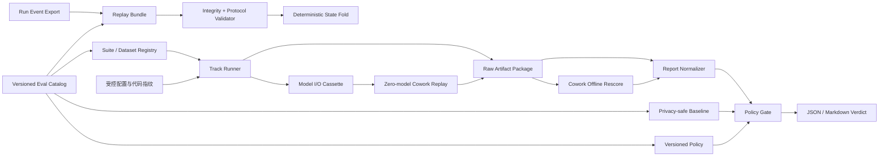

# 18 · 评测与回放层：回归评测、离线回放与发布门禁

> 状态：工程层已落地；正式质量 baseline 待重建
>
> 最后核对：2026-08-24
> 适用范围：Cowork、文件系统 KB 检索、grounded generation、Run 事件协议与评测目录

本文定义 WorkPilot 的统一评测与回放层。它回答五个不同的问题：

1. 当前改动是否让同一批样本退步；
2. 一份报告是否与 baseline 真正可比；
3. 已记录的 Run 事件能否确定性还原成相同的前端状态；
4. scorer 更新后，能否不再调用模型、不再执行工具，基于旧 observation 重新计分；
5. 在合成 fixture 里，能否用已录制的模型 I/O 重跑生产 Cowork graph，并证明没有真实模型请求。

这里的“回放”不能被泛化理解为“完整重演一次 Agent”。当前已支持 **Run UI
事件回放**、**Cowork observation 离线重评分**，以及 **fixture 范围的 Cowork 模型 cassette
执行回放**：后者录制完整模型请求/响应，在新的隔离工作区里重跑产品 graph，且结构上
不持有真实 provider。它尚不是生产全链路 cassette：RAG 原始交互、完整工具返回和外部副作用
还没有逐次录制，无断网 sandbox 时 Shell case 会被拒绝回放。

---

## 1. 目标与非目标

### 1.1 目标

- 用同一个门禁入口处理 `cowork`、`retrieval`、`generation` 三种报告形状；
- 做逐 case 配对比较，而不是只看一个容易掩盖 badcase 交换的总分；
- 把数据集、配置、实现、scorer 和 Git 状态纳入 provenance，拒绝“苹果对橘子”的比较；
- 将门禁结果分成“通过”“质量回退”“不可判定”三态，避免基础设施错误被误报成质量回退；
- baseline 只保留指标、状态、case 标识和哈希，不把 prompt、答案、工具参数、路径或引文正文提交进 Git；
- Run 事件 bundle 使用版本化协议和 SHA256 完整性校验，离线折叠时绝不触发工具、网络或生产存储；
- 录制 Cowork 模型交互并严格回放，cassette miss、请求漂移、篡改或未消费记录均 fail closed；
- 用机器可读 catalog 声明 track、suite、policy、baseline 与 replay 健康状态；
- 把日常开发、PR、nightly 和发布验收串成可执行的回归流程。

### 1.2 非目标

- 不用离线事件回放替代生产运行、checkpoint 恢复或灾备；
- 不把 `temperature=0` 当成模型调用完全确定性的证明；
- 不因为 suite 是 synthetic 就声称得到了产品质量结论；
- 不自动把“最新一次运行”晋升为 baseline；
- 不允许 replay 在 cassette miss 时回退到真实模型、真实工具或真实网络；
- 当前不提供包含生产模型、RAG、工具与外部副作用的全链路 execution cassette，也不提供在线
  shadow traffic replay 或跨版本数据库重放；
- 当前 v1 baseline 是单报告快照，不是多次运行的统计分布或噪声模型。

---

## 2. 设计原则

### 2.1 先证明可比，再讨论好坏

门禁顺序固定为：schema → 完整性 → kind → dataset → suite/dataset fingerprint → case
集合和 segment → 受控配置 → 指标适用性 → 质量规则。前置条件不满足时返回“拒绝判定”，
不能将它降级成 warning 后继续算分。

### 2.2 原始证据与可提交 baseline 分离

原始 `report.json`、`manifest.json`、`observations.jsonl` 和运行工作区用于本地诊断，可能
包含敏感内容；baseline 是从原始报告投影出的最小数据面，仅用于 Git 中的自动门禁。SHA256
用于发现改动，不等于加密、脱敏或身份认证。

### 2.3 回放默认无副作用

`eval.replay` 只依赖标准库、只折叠 JSON 事件。事件名即使是 `tool.start` 或
`tool.result`，也只是更新内存状态，不会解析出一个真实工具再执行。Cowork 离线重评分同样
不调用模型和工具，但评分器可能读取原评测工作区中的文件状态，因此源运行包需要保留完整。

Cowork 模型 cassette 回放不构造真实 gateway，严格匹配请求 hash 与全局序号；工具仍由产品
graph 执行，因此它只允许 suite-local adapter 与 case 隔离工作区，并且显式禁止 Shell 回放。

### 2.4 质量、成本和安全同时门禁

质量提升不能用未经授权的副作用换取，也不能用无限 token 掩盖。当前 policy 同时覆盖成功率、
工具选择、阅读质量、检索质量、引用/约束、错误率和 token 成本；安全项可以设置绝对下限，
例如 Cowork `guardrail_pass` 的候选聚合值必须为 `1`。

### 2.5 自动化给出判定，人负责晋升

脚本负责稳定地比较和拒绝不可比输入；suite 从 synthetic 升为 human、冻结 test、解释有意
trade-off、调整 policy 和晋升 baseline，必须由 owner 审核并留下记录。

---

## 3. 分层架构



| 层 | 职责 | 当前实现 |
|---|---|---|
| L0 Provenance | 固定 run、Git、suite、配置、模型、预算、实现与 scorer 指纹 | Cowork runner 与 KB retrieval runner 的 manifest/report |
| L1 Suite | 版本化样本、split、gold、review 状态、冻结 test | `eval/suites/` |
| L2 Runner | 运行真实被测链路，产生逐 case observation | `eval/cowork_runner.py`、`eval/kb_retrieval_runner.py` |
| L3 Scoring | 规则、检索、阅读、任务与成本指标 | `eval/metrics/`、Cowork scorer、`eval/report_metrics.py` |
| L4 Normalize | 把三类报告投影成统一的 case/metric 结构 | `eval/regression.py` |
| L5 Baseline/Policy | 最小化可信快照、版本化容差与硬约束 | `workpilot-regression-baseline.v1`、`eval/policies/*.json` |
| L6 Gate | 严格兼容性检查、逐 case 与聚合回归判定 | `python -m eval.regression` |
| L7 Replay | 导出/校验 Run 事件协议；录制/回放 Cowork 模型 I/O | `eval/run_replay_export.py`、`eval/replay.py`、`eval/model_cassette.py` |
| L8 Catalog | 机器可读声明 track/replay 与 baseline readiness | `eval/catalog.json`、`python -m eval.catalog doctor` |
| L9 Orchestration | PR、nightly、发布流程与人工晋升 | CI 已执行 catalog/event replay 确定性契约；真实跑批尚需本地/集群 scheduler |

旧的 `eval.compare` 仍适合检索/生成实验中的配对统计和诊断，旧的 `eval.gate` 仍承担历史
报告流程；新的交付门禁以 `eval.regression` 的三态契约为准。迁移完成前不要把两套 snapshot
格式混用。

---

## 4. 三条产品评测轨

### 4.1 Cowork 端到端任务轨

当前 suite 是 `eval/suites/cowork-core-50.json`，覆盖 workspace、knowledge、artifact、
office、web、安全/HITL 和沉浸阅读。runner 在独立的评测包中创建 `cases/` 与本地 store，
关闭记忆提取、skill distillation 和 fallback，并记录：

- `run_id`、`label`、开始/结束时间和时长；
- suite 名称、版本、SHA256、样本 ID 与 split；
- 模型 provider/model/endpoint/mode；
- token、调用次数、wall time 预算；
- Git SHA/dirty 状态；
- implementation/scorer fingerprint；
- fixture policy、模型发送授权摘要和 test 访问说明。

主要门禁指标是 `task_success`、`guardrail_pass`、`tool_selection_accuracy`、
`within_tool_budget`、`used_tokens`、`tool_error_rate`，阅读样本还计算
`read_before_claim`、`quote_verifiability`、`locator_accuracy`。可选指标若两侧适用样本发生
变化，会被视为不可比，而不是悄悄改变分母。

当前 suite 保留生成来源 `origin=synthetic`，行之已于 `2026-08-24T20:54:00+08:00` 完成逐条
复核并批准。冻结 test 仍不得用于调参，dev/test 继续使用独立 baseline。

### 4.2 文件系统 KB 检索轨

当前入口 `eval.kb_retrieval_runner` 直接走生产中的
`LocalKbService -> search_index`，gold 使用内容哈希、页码和页内字符区间作为稳定锚点。
报告包含 suite SHA、KB version、索引 fingerprint、Git/实现 fingerprint、完整配置与逐题结果。

policy 覆盖 `span_recall_at_k`、固定预算下的 `budget_span_recall`、`ndcg_at_k`、
`alpha_ndcg_at_k`、`mrr`、`context_precision`、拒答正确率和 `retrieved_tokens`。这条轨把
“是否找到证据”和“为此塞了多少上下文”同时纳入门禁。

当前 `eval/suites/kb-rag-research-dev-v1.json` 有 26 条 synthetic-origin 样本，已由行之批准；
旧 `m1-dev-70` 快照属于已退役架构，不能充当当前文件系统 KB 的 baseline。

### 4.3 Grounded generation 轨

统一 normalizer、`eval/report_metrics.py` 和 `eval/policies/generation.json` 已支持 generation
报告，门禁指标包括拒答、引用有效性、约束通过、可答样本约束、引用与 gold 对齐及总 token。

这条轨当前只有旧报告形状与旧 `m1-dev-70` 快照；工作树中尚没有一个与当前文件系统 KB、
当前 ModelGateway 和当前 evidence contract 对齐的 generation runner。因此它是**门禁契约已
就绪、生产对齐 runner 未接回**的状态，不能宣称已有可发布的 generation baseline。重建动作见
§10。

### 4.4 横向评分层

三条产品轨与“如何评分”是两个维度：

- 确定性规则：schema、gold span、引用格式、文件状态、权限/HITL、token 与工具预算；
- 模型评分：correctness、faithfulness、citation support 等，必须先用独立人工集校准；
- 人工复核：suite 升级、badcase 归因、baseline 晋升和发布 test 验收。

模型 Judge 的温度、prompt/rubric、模型版本和实现都应进入 scorer fingerprint；rubric 改动后应
优先使用离线重评分验证“分数变化来自 scorer”，而不是重新调用被测模型混入第二个变量。

---

## 5. Replay 支持矩阵

| 模式 | 输入 | 是否调用模型 | 是否执行工具/副作用 | 当前状态 | 能回答的问题 |
|---|---|---:|---:|---|---|
| Run UI event replay | 版本化 event bundle | 否 | 否 | **已支持** | 同一事件流是否满足协议，并折叠成预期前端状态 |
| Cowork offline rescore | 旧 Cowork `report.json` 中的 observation | 否 | 否；可能只读原评测工作区 | **已支持** | 新 scorer/rubric 会如何给同一观察结果打分 |
| Runtime checkpoint recovery | 生产 checkpoint/store | 视恢复点而定 | 可能 | 产品已有恢复能力，但**不属于评测 replay** | 中断后的运行如何继续 |
| Live rerun | suite + 当前代码/模型 | 是 | 是，限评测 fixture/隔离目录 | **已支持 runner，不是确定性回放** | 当前系统重新执行同一任务会怎样 |
| Fixture model cassette replay | 历史完整模型请求、工具 schema、chunk/终态响应 | 否；cassette 返回 | 是，但仅 suite-local adapter/隔离工作区；Shell 禁止 | **已支持** | 当前 Cowork graph 能否在无真实模型请求时消费同一模型交互序列 |
| Full execution cassette | 模型、RAG、工具交互的有序 cassette | 否 | 必须 mock | **未接入生产链** | 新 Agent 编排在相同外部世界下是否走相同轨迹 |
| Shadow/backtest | 生产历史输入 + 新应用版本 | 是或 cassette | 必须隔离 | **未实现** | 新版本对真实流量分布的离线表现 |

`eval.replay` 对 `message.delta/snapshot/reset`、citation 去重、plan/step/tool 状态、interrupt、
artifact、recovery 与终态进行确定性折叠。它验证连续 cursor、`run_id`/event id、一致的重复
事件、tool start/finish 配对、终态和 `expected_state` 子集断言。完全相同的重复事件是 warning
并按前端 cursor 语义忽略；同一 seq 的冲突事件、缺口、未知事件或未结束工具是 error。

重要边界：Run 事件是面向 UI 和审计的安全投影，不包含完整模型请求参数、工具定义、原始
tool result、RAG 全量返回、fallback 选择等信息。通过 event replay 只能证明协议和投影状态，
不能证明 Agent 执行可重现。

---

## 6. 六类版本化契约

### 6.1 Raw report

统一门禁接受报告文件或含 `report.json` 的目录。报告类型由显式 `kind` 或兼容的历史形状识别。

| 类型 | 必要 provenance | 逐 case 关键字段 | 隐私级别 |
|---|---|---|---|
| Cowork | `kind=cowork`、dataset/suite、suite SHA、config hash、run/label/Git、reproducibility | `item_id`、category、observation、score | 高；含 prompt、路径、工具轨迹和响应 |
| Retrieval | `kind=retrieval`、dataset、suite SHA、config/config hash、KB/index、Git | `item_id`、category、retrieval、retrieved、error | 高；可能含 query、文件名、内容哈希与内部 KB 元数据 |
| Generation | `kind=generation`、dataset fingerprint、config/config hash、Git | `item_id`、answerable、refusal/citation/constraint、usage、error | 高；可能含问题、答案和引文 |

原始报告用于本地诊断与审计，不应默认提交 Git。runner 生成的目录应被当作不可变运行包：
不要原地修改或复用相同输出目录；需要修正 scorer 时创建新的 rescore 包，并通过
`source_report_sha256` 关联源报告。

### 6.2 Regression baseline

新 baseline 的 schema 固定为 `workpilot-regression-baseline.v1`，包含：

- kind、dataset、dataset version/fingerprint；
- config fingerprint、Git SHA、`git_dirty=false`、label；
- suite origin、`approved` 状态、reviewer、带时区的 reviewed_at，以及所选 split/count；
- retrieval 额外固定独立拒答校准文件的 SHA256；
- policy 名称与 policy 文件 SHA256；
- source report SHA256；
- 每个 case 的 `case_id`、segment、status、error 与指标分子/分母；
- 覆盖除 `integrity` 外全部字段的 SHA256。

baseline 明确不保存 prompt、answer、tool args、工作区路径、检索内容和引文正文。`snapshot`
会拒绝含 runner error、Git dirty、题库未批准、复核信息不完整、split 选择缺失、缺少 policy
必需指标、dataset/config fingerprint、合法 Git SHA 或 run label
的报告，也不覆盖已存在的输出文件。`check` 的 baseline 参数只接受由 `eval.regression snapshot`
生成并绑定 policy 的快照，不接受 raw report 冒充 baseline。

`check` 会自动计算 policy 规范 JSON 的 SHA256，并与 baseline 中的
`policy.sha256` 强制比对。任何 policy 变更都是 exit `2` 的不可比较输入；需要改发布标准时，必须
人工 review policy diff 并生成新 baseline，而不能用一份更宽松的 policy 检查旧 baseline。

### 6.3 Regression policy

policy schema 是 `workpilot-regression-policy.v1`。每个 policy 固定报告类型、兼容性要求和
指标规则：

- `direction`: `higher` 或 `lower`；
- `required`: 是否必须有有效配对样本；
- `max_absolute_regression` / `max_relative_regression`: 允许回退；
- `case_regression` + `pass_threshold`: 已通过样本是否允许变为失败；
- `min_candidate` / `max_candidate`: 候选绝对硬门槛；
- `fail_on_candidate_errors`: runner/infrastructure error 是否阻断。

当前三个 policy 位于：

- `eval/policies/cowork.json`；
- `eval/policies/retrieval.json`；
- `eval/policies/generation.json`。

默认质量指标为零容忍回退，token 指标允许相对增加 20%。改 policy 等同于改发布标准，必须
独立 review，并与产品 trade-off 说明一起提交。

### 6.4 Run replay bundle

bundle 顶层契约：

```json
{
  "schema": "workpilot.run-replay-bundle",
  "schema_version": 1,
  "event_protocol": "workpilot.run-events/v1",
  "name": "...",
  "origin": "synthetic",
  "cases": [],
  "integrity": {
    "algorithm": "sha256",
    "canonicalization": "workpilot-json-sort-keys-utf8-v1",
    "digest": "<64 lowercase hex>"
  }
}
```

每个 case 需要非空 `case_id`、`run_id`、事件数组，以及可选的 `expected_state` 子集断言。事件
需要 `id=<run_id>:<seq>`、十进制字符串 `seq`、已知 `type` 和对象 `data`。规范化 JSON 使用
UTF-8、键排序、无多余空白、保留非 ASCII，并拒绝 NaN/Infinity；顶层 `integrity` 不参与
自身摘要。

当前合成回归种子是 `eval/replays/run-protocol-v1.json`。replay 输出的
`mode=offline_validation_only`，可同时生成 JSON 和 Markdown 报告。

### 6.5 Model interaction cassette

`workpilot.model-cassette` v1 由 `eval/model_cassette.py` 定义。live Cowork runner 会自动在运行包中产生
`model-cassette.json`，记录 `complete`、`complete_with_tools`、两种 stream 与 embedding 调用的：

- 完整 messages、attachments、tool definitions 和生成参数；
- 完整 chunk 序列、终态 completion、tool calls、usage 与录制错误；
- 全局 interaction sequence、case ID、规范化 request hash 和整包 SHA256；
- suite SHA、精确 item ID/顺序、provider/model 与 prompt budget。

已完成交互每次都 `fsync` 到 `.partial.jsonl`，完整包用临时文件替换并限制为 `0600`。
normalizer 只稳定化 case/workspace 路径、系统 `<environment>` 块中的当日时间，以及明确标注的
workspace root ID / 文件 mtime；其他 prompt 变化均导致严格失配。

回放端没有 delegate/real provider，也没有 live fallback。重复 JSON 键、序号缺口、请求漂移、响应篡改、
cassette miss 和未消费记录都会拒绝回放。cassette 含 prompt 和模型输出，是高敏本地运行制品，
不是可提交 Git 的 baseline。

### 6.6 Eval catalog

`eval/catalog.json` 是 track/replay 的唯一机器可读目录。`python -m eval.catalog doctor` 检查路径不逃逸仓库、
suite/policy/kind 对齐、track 的 split/count、ready baseline 的 suite/policy 精确 SHA、clean Git、
人工复核 provenance、case 集合、独立校准和完整性，以及 replay bundle。`rebuild_required` 会显式报
warning 但 doctor 返回 `0`；目录或 ready 资源损坏返回 `2`。Cowork dev/test 已拆成两条 track，
当前四条 track 都是 `rebuild_required`，不会被误判为发布可用。

---

## 7. 退出码与门禁语义

### 7.1 统一 regression gate

`python -m eval.regression` 的退出码是稳定协议：

| 退出码 | 含义 | CI 动作 |
|---:|---|---|
| `0` | 可比且所有规则通过；或 baseline snapshot 成功 | 继续 |
| `1` | 输入可比，但候选发生质量/成本/安全回退 | 阻断，查看 `violations` 和 case IDs |
| `2` | 拒绝判定：报告/策略不合法，suite、case、配置或指标不可比，baseline 完整性失败等 | 阻断并修复前置条件；不得当作质量失败或通过 |

候选中的 runner error 在 policy 开启 `fail_on_candidate_errors` 时是 exit `1` 的阻断项；报告
无法读取、fingerprint 缺失或漂移等是 exit `2`。`--allow-config-drift` 只改变配置兼容性这一项，
不会绕过 dataset、case、指标适用性或完整性检查。

### 7.2 Replay 与 runner

- `python -m eval.replay verify`: `0` 表示 bundle 有效，`1` 表示格式、完整性、协议或预期状态
  失败；当前没有 `2`，读取/JSON 错误也会转换成结构化失败报告；
- `eval.kb_retrieval_runner run`: `0` 成功，逐题有 error 时 `1`，无法安全运行时 `2`；
- `eval.cowork_runner`: 成功为 `0`；参数/授权/suite/运行错误目前通过异常以非零退出，尚未
  对外承诺与 regression 相同的三态协议。

因此 CI 的发布判定应以 `eval.regression` 为最终三态门禁，不要把不同 CLI 的 `1` 混成同一
语义。

---

## 8. 操作手册

以下命令都从仓库根目录执行，并使用仓库现有 `backend/.venv`。

### 8.1 最快的确定性自检

```bash
PYTHONPATH=backend backend/.venv/bin/pytest \
  backend/tests/test_eval_catalog.py \
  backend/tests/test_eval_model_cassette.py \
  backend/tests/test_eval_replay.py \
  backend/tests/test_eval_run_replay_export.py \
  backend/tests/test_eval_regression.py -q

backend/.venv/bin/python -m eval.catalog doctor --json
backend/.venv/bin/python -m eval.replay verify \
  eval/replays/run-protocol-v1.json \
  --format markdown
```

需要保留两种报告时使用新目录或新文件名：

```bash
backend/.venv/bin/python -m eval.replay verify \
  eval/replays/run-protocol-v1.json \
  --json-report eval/outputs/replay/run-protocol-v1.json \
  --markdown-report eval/outputs/replay/run-protocol-v1.md
```

这一步不需要模型、KB、网络、数据库或生产凭据，适合每个 PR。

### 8.2 从本机已完成 Run 导出事件 bundle

导出只读取权威 `run_events`，不恢复 checkpoint、不调用模型、不执行工具。真实事件可能
包含回答、引文和 artifact 元数据，因此必须显式确认敏感输出：

```bash
PYTHONPATH=backend backend/.venv/bin/python -m eval.run_replay_export \
  --run-id RUN_UUID \
  --output eval/outputs/replay/RUN_UUID.json \
  --acknowledge-sensitive-output

PYTHONPATH=backend backend/.venv/bin/python -m eval.replay verify \
  eval/outputs/replay/RUN_UUID.json --format markdown
```

可用 `--data-root /path/to/workpilot-data` 选择非默认本机 store。导出器只接受已进入终态的 Run，在写盘前
完成 seq/event ID/终态/协议和 SHA256 自验，然后以 `0600` 权限独占创建输出；目标已存在时
拒绝覆盖。导出真实 run 前应先确认保留周期与共享范围，不得提交 Git。

### 8.3 Cowork 离线重评分

源报告必须已经属于同一个 `cowork-core-50` suite；旧 `cowork-core-40` 报告不能跨 suite
重评分后伪装成 core-50。

```bash
PYTHONPATH=backend backend/.venv/bin/python -m eval.cowork_runner \
  --suite eval/suites/cowork-core-50.json \
  --label scorer-vNext-rescore \
  --allow-synthetic \
  --rescore-report eval/outputs/cowork-core/SOURCE_RUN/report.json
```

重评分包会写出新的 manifest、observation 和报告，记录 source report 的路径和 SHA256。
它不需要 `--allow-model-send`。若源报告含 test 样本，还必须显式加入
`--include-test --test-access-note "..."`。

### 8.4 Cowork dev 跑批

```bash
PYTHONPATH=backend backend/.venv/bin/python -m eval.cowork_runner \
  --suite eval/suites/cowork-core-50.json \
  --label nightly-cowork-dev \
  --split dev \
  --allow-synthetic \
  --allow-model-send \
  --authorization-note "nightly synthetic suite approved by OWNER/TICKET"
```

`--allow-model-send` 与非空授权说明缺一不可。说明正文不进入 manifest，runner 只保存其摘要；
但 prompt 和 fixture 内容会发送给配置的模型 endpoint。当前 fixture 网络是 suite-local
deterministic adapter，运行工作区和 store 位于独立输出包中。运行完成后会自动写入权限
`0600` 的 `model-cassette.json`；它含完整 prompt/响应，只能留在受控 artifact store。

### 8.5 Cowork 模型 cassette 回放

使用同一 suite、split 与精确 item 顺序，在新建的 case 工作区中重跑 Cowork graph：

```bash
PYTHONPATH=backend backend/.venv/bin/python -m eval.cowork_runner \
  --suite eval/suites/cowork-core-50.json \
  --label replay-cowork-dev \
  --split dev \
  --allow-synthetic \
  --replay-cassette eval/outputs/cowork-core/RECORDED_RUN/model-cassette.json
```

回放时不传 `--allow-model-send` 或授权说明；runner 会在构造任何真实 gateway 之前加载 cassette，
并在 report 记录 `mode=cassette_replay` 与 `real_model_dispatches=0`。suite SHA、item 集合/顺序、
每次请求与交互消费数必须完全相等。任何选中 case 的 gold 要求或 cassette 实际响应包含
`run_shell` 时都会在 graph 执行前拒绝，
直到有可验证的断网 sandbox。

### 8.6 KB retrieval dev 跑批

下面的 `rag-research` 是当前 suite 对应的示例 KB slug；运行前先确认本机 KB 已导入、索引已
激活且内容哈希与 suite gold 对齐。

```bash
PYTHONPATH=backend backend/.venv/bin/python -m eval.kb_retrieval_runner run \
  --kb-slug rag-research \
  --suite eval/suites/kb-rag-research-dev-v1.json \
  --kb-version v1 \
  --top-k 10 --diagnostic-k 50 --token-budget 4000 \
  --refusal-calibration eval/calibrations/kb-rag-research-refusal-v1.json \
  --label nightly-kb-retrieval \
  --allow-synthetic
```

如果 KB 不在 Settings 默认目录，额外传 `--kb-root /absolute/path/to/kb-root`；需要固定版本时
传 `--kb-version VERSION_ID`。不要在同一次对照中同时改 index、top-k、token budget、RRF
权重和拒答阈值。正式 retrieval baseline 不接受直接填写阈值；校准报告必须来自另一份已批准
suite，且使用相同实际 score source。若配置要求 reranker 而逐题真实来源发生 fallback，整批拒绝。

仓库内的校准候选集是 `eval/suites/kb-rag-research-refusal-calibration-v1.json`：8 条可答、
4 条不可答，8 个证据文档与 evaluation gold 文档无交集，并已由行之批准。先用与 evaluation
完全相同的 KB/index、Top-K、预算和 reranker 配置跑它（不传阈值），再冻结阈值；输出路径
必须不存在：

```bash
PYTHONPATH=backend backend/.venv/bin/python -m eval.kb_retrieval_runner run \
  --kb-slug rag-research --kb-version v1 \
  --suite eval/suites/kb-rag-research-refusal-calibration-v1.json \
  --label kb-refusal-calibration-v1 \
  --top-k 10 --diagnostic-k 50 --token-budget 4000 \
  --allow-synthetic

PYTHONPATH=backend backend/.venv/bin/python -m eval.refusal_calibration \
  --report eval/outputs/kb-retrieval/APPROVED_CALIBRATION_RUN/report.json \
  --reviewer OWNER \
  --reviewed-at 2026-08-24T10:00:00+08:00 \
  --output eval/calibrations/kb-rag-research-refusal-v1.json
```

runner 会验证 calibration suite SHA 不等于 evaluation suite SHA、阈值文件完整性、报告真实
score source 与本次运行一致；evaluation 报告再把校准文件 SHA 固定进 config 和 baseline。

### 8.7 创建新的隐私安全 baseline

以下示例假设 owner 已完成人工复核，报告来自干净 Git 状态，且输出文件尚不存在：

```bash
backend/.venv/bin/python -m eval.regression snapshot \
  eval/outputs/cowork-core/APPROVED_RUN/report.json \
  --policy eval/policies/cowork.json \
  --output eval/snapshots/v2/cowork-core-dev.json
```

retrieval 与 generation 分别替换 policy 和输出文件名。不要覆盖旧 baseline；新建文件、review
diff，再通过一次自比较确认完整性与 policy：

```bash
backend/.venv/bin/python -m eval.regression check \
  eval/outputs/cowork-core/APPROVED_RUN/report.json \
  --baseline eval/snapshots/v2/cowork-core-dev.json \
  --policy eval/policies/cowork.json
```

### 8.8 比较候选报告

```bash
backend/.venv/bin/python -m eval.regression check \
  eval/outputs/cowork-core/CANDIDATE_RUN/report.json \
  --baseline eval/snapshots/v2/cowork-core-dev.json \
  --policy eval/policies/cowork.json \
  --output-dir eval/outputs/regression/CANDIDATE_RUN
```

`--output-dir` 必须是新目录；它会生成 `report.json` 和 `report.md`。命令也接受一个直接包含
`report.json` 的运行目录作为 candidate 参数。

Cowork 的受控配置包含 implementation/scorer fingerprint，所以“被测代码本身发生变化”的
PR 可能按设计触发 config drift。只有 reviewer 已确认 suite、模型、预算、fixture、scorer
保持不变，漂移确实只来自预期实现变更时，才可显式运行：

```bash
backend/.venv/bin/python -m eval.regression check \
  eval/outputs/cowork-core/CANDIDATE_RUN/report.json \
  --baseline eval/snapshots/v2/cowork-core-dev.json \
  --policy eval/policies/cowork.json \
  --allow-config-drift
```

这个开关不是“让红灯变绿”的豁免。门禁报告会记录 `config_drift_allowed=true`，review 时必须附
受控配置 diff；模型、预算、suite 或 scorer 也变化时应拆成单变量实验，或先重评分再比较。

---

## 9. 日常、PR、nightly 与发布流程

### 9.1 日常开发

1. 修改事件协议、normalizer、policy 或 scorer 时先跑 §8.1 的确定性测试；
2. 修改 scorer 时优先对同一 observation 做 offline rescore，隔离 scorer 变量；
3. 修改单个 Cowork 能力时用 `--item-id CASE_ID` 跑目标样本，再跑完整 dev；
4. 修改检索策略时固定同一 suite、KB version、index 和其余参数，保留 raw report；
5. 不在本地失败后立刻改 baseline。先归因是产品、suite、scorer、数据漂移还是基础设施。

### 9.2 Pull Request

PR 层只运行无需私有模型/KB 的确定性检查：

- regression/replay 单元测试；
- 合成 event bundle 完整性与状态折叠；
- catalog doctor 与 suite/schema/policy 静态校验；
- model cassette 的录制/回放、严格失配和零真实 gateway 集成测试；
- 若改动输出逻辑，由作者在可信环境跑对应 dev 轨，并在 PR 附 candidate gate 报告。

GitHub runner 无法访问本机私有 KB 和内网推理集群，因此 PR 不应静默切换到商用 API，也不应
用一份无代表性的公开 toy corpus 冒充线上质量门禁。

### 9.3 Nightly

nightly 在有权访问模型和本地 KB 的受控机器执行：

1. 记录 Git SHA，要求工作树干净；
2. 固定模型 revision/endpoint、预算、suite SHA、KB/index version 和 policy；
3. 运行 Cowork dev 与当前 KB retrieval dev；generation runner 恢复前明确标记该轨缺席；
4. 对每份候选运行 `eval.regression check`，保存 raw package 与门禁 JSON/Markdown；
5. exit `1` 进入 badcase 归因，exit `2` 进入评测基础设施告警；两者不得混报；
6. 模型轨首次失败可追加两次同配置运行估计波动，但原始失败不能因“重跑一次变绿”自动清除。

Cowork 既有实验观察到同配置仍有样本级波动。当前 v1 gate 是单报告严格配对，不建模随机分布；
重复运行只用于人工诊断，不能挑最好的一次晋升。后续应实现 cohort baseline 与预注册的统计规则。

### 9.4 发布候选

1. 冻结代码、配置、模型、suite、scorer 和 policy；
2. 先通过全部 dev gate；
3. 由 owner 授权访问冻结 test，Cowork 必须使用 `--include-test` 和非空
   `--test-access-note`；
4. 在同一配置下重复运行并人工复核稳定失败、权限/HITL、安全与引用 badcase；
5. 任一未经授权副作用、test 泄漏、baseline 完整性失败或不可解释 config drift 都阻断发布；
6. 发布后将批准的 run/package、门禁报告、Git SHA 和决策记录关联存档，但只提交隐私安全
   baseline。

### 9.5 Baseline 晋升流程

baseline 晋升必须走以下清单：

1. **冻结 suite**：owner 逐题复核 gold、可解性、split 和隐私；正式 baseline 的 suite 必须
   是 `approved`，并记录 reviewer 与带时区的 reviewed_at；
2. **冻结被测条件**：Git clean、模型与 revision、预算、KB/index、实现与 scorer fingerprint
   均可追溯；
3. **运行与复核**：报告没有 runner error；逐 case 看稳定失败，不只看汇总分；
4. **先过旧门禁**：若候选相对旧 baseline 回退，记录 trade-off。不得靠临时放宽 policy 或
   挑最好的一次运行通过；
5. **生成新文件**：用 `eval.regression snapshot` 写入一个不存在的新路径；
6. **审计最小化**：确认 baseline 中没有 prompt、答案、工具参数、路径或引文正文，验证 integrity
   与 source report hash；
7. **审计 policy**：确认提交的 policy 文件 hash 与 baseline `policy.sha256` 一致；
8. **双人 review**：suite owner 与代码 owner 至少各一人批准；若是单人项目，分两次独立 review
   并在实验记录里写明依据；
9. **原子切换**：在同一变更中加入新 baseline、policy/说明和 CI 引用；旧文件保留为历史或明确
   标记 retired，不原地伪造历史。

`snapshot` 已强制 `git_dirty=false`、suite approved、reviewer/reviewed_at、split 选择；retrieval
还强制独立 calibration fingerprint。脚本不能替人完成题目内容复核或双人批准，签字真实性仍由
代码审查和实验记录负责。

---

## 10. 当前 stale baseline 的重建动作

当前 `eval/snapshots/` 下三份文件都是历史 raw snapshot，不是新的
`workpilot-regression-baseline.v1`，也不能直接组成当前发布门禁。

| 旧文件 | 为什么 stale | 重建动作 | 当前是否可点亮门禁 |
|---|---|---|---|
| `eval/snapshots/cowork.json` | 40 条 `cowork-core-40`，`items` 还是 `item_id -> bool`；当前 suite 是 50 条 v1.4.0，指标与 provenance 契约也已变化 | 人工复核已完成；在 clean Git、固定模型/预算下分别跑 39 条 dev 与获授权的 11 条 test；生成 `v2/cowork-core-dev.json` 和 `v2/cowork-core-test.json` | 否；dev/test 不再共用 baseline 语义，旧 40 条也缺新 policy 所需指标 |
| `eval/snapshots/retrieval.json` | `m1-dev-70` 与已退役检索架构绑定；当前 runner 是文件系统 KB，当前 suite 是 26 条 `kb-rag-research-dev-v1` | evaluation 与独立 calibration 的人工复核已完成；固定 KB/index、真实 score source 和预算运行；生成新的 retrieval v1 baseline | 否；dataset/suite、calibration 和 score source 会按设计拒绝错误比较 |
| `eval/snapshots/generation.json` | 旧 `m1-dev-70` 生成报告；当前架构对应的 generation runner 未在工作树中 | 先接回 production-aligned generation runner，记录 dataset/config/scorer fingerprint；复核 suite/Judge；跑新报告并 snapshot | 否；先补 runner，不能只把旧 JSON 改 schema |

建议新文件放在独立版本目录，例如 `eval/snapshots/v2/`，待三个轨全部迁移且 CI 引用切换后再
决定是否重命名。重建期间应让 nightly 明确报告“baseline unavailable”，不能跳过后显示绿色。

---

## 11. 隐私与副作用安全

### 11.1 数据分级

| 产物 | 典型内容 | 默认处理 |
|---|---|---|
| Raw run package | prompt、回答、工具轨迹、路径、文件状态、模型 endpoint、KB 元数据 | 本地受限保存，不进 Git，不上传公共 CI artifact |
| Model cassette | 完整 prompt/attachment/tool schema、模型 chunk/响应、usage 与路径占位符 | `0600` 本地受限制品；不进 Git/公共 artifact，用后按保留策略清理 |
| Rescore package | 源路径/hash、旧 observation、新 score，可能仍含 prompt 与路径 | 与 raw package 同级保护 |
| Replay bundle | 事件文本、引用 quote、artifact 元数据；合成 fixture 除外 | 导出真实 run 前先脱敏；公共仓库只放 synthetic |
| Regression baseline | case ID/segment、数值、状态、hash | 设计为可提交；仍需评估 hash/命名是否泄漏业务信息 |
| Gate report | 指标、差值、违规 case IDs | 可随 PR 保存；敏感 case ID 需映射 |

不要在 `--authorization-note`、`--test-access-note`、label 或路径中放 token、密码或用户隐私。
Cowork 模型授权说明只存摘要，但 test access note 会进入 manifest 明文。

### 11.2 副作用规则

- `eval.replay verify` 永远不能 import/调用工具 registry、网络 client 或生产 store；
- event bundle 中出现工具事件不构成执行授权；
- offline rescore 不得调用模型或工具，只允许读取源评测包完成断言；
- live Cowork 跑批只使用隔离的 `cases/` 与 store，默认 fixture 网络，不指向用户真实工作区；
- frozen test 的访问必须显式记录，不能在 dev 调参中反复使用；
- 已有模型 cassette replay 对 miss、顺序不符、request hash 不符、篡改和剩余交互 fail closed，
  不构造或回落到真实模型 gateway；
- 模型 cassette replay 只能在 suite-local adapter 与 case 隔离文件系统上执行；无断网 sandbox 时
  含 `run_shell` 的 case 必须在运行前拒绝；
- 生产写入、外部消息、shell、支付或删除等副作用在 replay 中必须禁止，或由后续工具
  cassette 短路返回已录制结果；当前只允许 suite-local adapter 和 case 隔离工作区内操作。

### 11.3 完整性不是保密性

baseline 与 bundle 的 SHA256 只能发现内容改变。它不防止有权限的人重新计算摘要，不隐藏原文，
也不证明产物由哪台机器生成。需要跨机器的强审计时，应在 artifact store 上增加访问控制、保留
策略、签名/attestation 和密钥管理，而不是继续堆哈希字段。

---

## 12. 故障诊断

### 12.1 Regression exit 2

| 提示 | 常见原因 | 处理 |
|---|---|---|
| 无法识别报告类型 | `kind` 缺失且历史形状不受支持 | 修 runner schema；不要手改结果冒充另一类型 |
| dataset/suite fingerprint 不一致 | suite/gold/样本变了，或正在使用旧快照 | 对同一 suite 重跑；suite 升级走 baseline 晋升 |
| case_id 集合或 segment 漂移 | split/filter 不一致，题目被新增、删除或换类 | 固定完全相同的选择条件；不要只比较交集 |
| 缺少 config fingerprint | 旧报告 provenance 不完整 | 用当前 runner 重建，不要填一个假 hash |
| config fingerprint 不一致 | 模型、预算、实现、scorer、fixture 或运行模式变化 | 查看 manifest/config diff；仅对审过的有意实现变更用 `--allow-config-drift` |
| 指标适用样本漂移 | 一侧把“不适用”记成 0，或 refusal/reading 分母变化 | 修 scorer/报告契约，保持 eligibility 定义一致 |
| baseline 完整性失败 | baseline 被编辑、换行/字段改变或摘要错误 | 从批准的 source report 重新 snapshot；不要只重算 digest 掩盖改动 |
| snapshot 含失败样本 | runner/infrastructure error 未清理 | 修环境并重跑；不晋升残缺 baseline |
| output 已存在 | 试图覆盖不可变 artifact | 使用新的 run ID/目录 |

### 12.2 Regression exit 1

先按 `violations` 分类：

- `candidate_error`: runner/基础设施失败，先修环境；
- `aggregate_regression`: 聚合指标超过绝对或相对容差；
- `case_regression`: 已通过 case 变为失败，即使总分被别的样本抵消也阻断；
- `minimum` / `maximum`: 触碰安全或成本绝对红线。

定位时回到 raw report 对照具体 observation。不要把 private raw report 贴进公共 issue；只摘录必要且
已脱敏的诊断。

### 12.3 Replay exit 1

| issue code/现象 | 含义 | 处理 |
|---|---|---|
| `integrity_missing/mismatch` | bundle 未封装或被改动 | 用固定 canonicalization 重新 seal；确认不是未审修改 |
| `seq_gap/out_of_order` | 事件丢失或导出顺序错误 | 从权威 event store 按 seq 重新导出 |
| `duplicate_seq_conflict` | 同一 cursor 有两个不同事实 | 修事件持久化/导出；无法安全猜测哪一个正确 |
| `event_id/run_id_mismatch` | case 与 envelope 串线 | 按 run 隔离导出 |
| `event_type_unknown` | 前端协议已扩展但 replay 协议未升级，或拼写错误 | 同步 `KNOWN_EVENT_TYPES`、payload 校验和 fixture，必要时升 protocol version |
| `tool_finish_without_start/unfinished_tool` | 工具生命周期不完整 | 修事件发射或补齐权威记录 |
| `terminal_event_missing` | bundle 不是完整 run | 标记 partial bundle；当前完整回归 fixture 不能使用 |
| `expected_state_mismatch` | 折叠语义变了 | 判断是前端协议变更还是 bug；有意变更时同时 review fixture |

warning 不会单独让 replay 失败，例如完全相同的重复事件会被去重；CI 仍应跟踪 warning 数量，防止
生产事件总线持续重复投递而被测试掩盖。

### 12.4 Runner 常见拒绝

- Cowork synthetic suite 未传 `--allow-synthetic`；
- live 模型调用未同时传 `--allow-model-send` 与非空授权说明；
- 访问 test 未同时传 `--include-test` 和非空 test access note；
- rescore 源报告 suite 不匹配或源工作区已被清理；
- KB stable quote 在当前 index 中缺失/歧义，或指定 version 不存在、索引 stale；
- 模型 endpoint/KB 只在内网可达，却误在公共 CI 上运行。

### 12.5 Model cassette 常见拒绝

| 现象 | 含义 | 处理 |
|---|---|---|
| `suite_sha256` 或 `item_ids/顺序` 不一致 | 录制和回放不是同一批 case | 使用原 suite/split/item 选择，不比较交集 |
| `完整性校验失败` | cassette 被改动或损坏 | 从受信录制包恢复；不仅重算 hash |
| `未录制请求` 与“首差异” | prompt/tool schema/参数或 graph 调用顺序漂移 | 审核首个 JSON 路径差异；需要新行为时重新录制 |
| `未消费交互` | 新 graph 少了调用或 case 提前结束 | 按轨迹定位编排变更；不忽略剩余记录 |
| 拒绝 `run_shell` | 当前无法证明 shell 断网/无副作用 | 换用无 shell 的 fixture case，或先实现可验证的 sandbox |

---

## 13. 扩展路径

### 13.1 P0：把当前门禁真正接入持续运行

- 完成 §10 的三轨 baseline 重建，先点亮 Cowork 与 retrieval；
- 在本地/集群 scheduler 上编排 nightly，保存唯一 run ID 的报告与 gate 输出；
- 把“某轨无可用 baseline”作为失败/未就绪状态，而不是 skip success。

已完成的 P0 基础包括：CI 中的 catalog/event replay 契约、policy SHA 强制校验，以及
`eval/catalog.json` 机器可读目录。

### 13.2 P1：production execution cassette

按依赖边界逐层接入可选 recorder：

1. 已完成：在原始 ModelGateway 外、BudgetedGateway 内记录规范化 messages、tool schema、模型参数、
   chunk/原始响应、usage 和 error，严格回放且无 live fallback；
2. 待完成：在 Cowork tool registry 完成 schema、权限与审批校验之后、真实 handler 之前记录调用，并在
   handler 之后记录结果；
3. 待完成：在 RAG service 边界记录 query、index/config fingerprint、排序结果与证据包；
4. 待完成：在已有模型 interaction sequence/request hash 上加 parent span，串联 model/tool/RAG；
5. 待完成：把生产 recorder 设为可选 no-op 注入，敏感正文进受控 artifact store 而不是 Git；
6. 待完成：全链路 replayer 默认 `network=deny`、`model=deny`、`tools=mock`，任何 cassette miss 立即失败；
7. 已完成模型边界的“cassette 全部消费完”断言；待工具/RAG 边界接入后扩展为全轨迹无额外交互。

只有工具、RAG 与外部副作用边界也完成录制/短路回放后，才可声称支持“生产全链路
execution replay”。Run event bundle 仍是 UI 投影，不应重命名为 cassette。

### 13.3 P2：统计与在线质量

- 为有随机性的模型轨增加多次运行 cohort baseline、配对 bootstrap/置信区间和预注册晋升规则；
- 将安全硬门槛与噪声指标分开，安全项永远不因置信区间放宽；
- 建立 badcase → suite case 的受控回流，去重、脱敏、人工标注并冻结 test；
- 将生产 trace 的抽样评分与离线 suite 分开，避免在线数据漂移污染回归基准；
- 增加成本、延迟、fallback、工具重复、未授权副作用和引用失效的趋势告警；
- 对模型 Judge 持续做盲标校准、类别切片和漂移检测。

### 13.4 新增一条评测轨

新增 `kind` 时至少需要：

1. 版本化 suite 与 review/split 契约；
2. 生产对齐 runner 和完整 provenance；
3. 逐 case 原始报告；
4. `eval.regression` normalizer 与必需/可选指标 eligibility 规则；
5. 独立 policy；
6. snapshot、相同报告自比较、聚合回退、case 回退、config/suite 漂移、错误报告和隐私测试；
7. baseline 晋升说明与 owner；
8. 若有事件或交互回放，提供 synthetic bundle/cassette 与 fail-closed 测试。

---

## 14. 外部项目借鉴与取舍

本方案借鉴的是协议和运维模式，不要求引入这些项目的 SDK：

| 项目 | 借鉴点 | WorkPilot 的取舍 |
|---|---|---|
| [LangSmith Evaluation](https://docs.langchain.com/langsmith/evaluation) / [Backtesting](https://docs.langchain.com/langsmith/run-backtests-new-agent) | dataset、experiment、离线/在线评测与历史输入 backtest 分层 | 保留 dataset/run/baseline 分离；当前还没有 production backtest |
| [OpenAI Agent Evals](https://developers.openai.com/api/docs/guides/agent-evals) / [Trace Grading](https://developers.openai.com/api/docs/guides/trace-grading) / [Evaluation Best Practices](https://developers.openai.com/api/docs/guides/evaluation-best-practices) | 从最终答案扩展到轨迹评分，持续增长 eval set，优先比较式判定 | Cowork 同时评最终状态、工具轨迹与安全；Judge 必须校准 |
| [Inspect AI](https://inspect.aisi.org.uk/) / [Scoring](https://inspect.aisi.org.uk/scoring-workflow.html) / [Eval Sets](https://inspect.aisi.org.uk/eval-sets.html) | task/solver/scorer/log 解耦、可恢复 eval set 和结构化日志 | 对应 suite/runner/scorer/artifact 分层；checkpoint recovery 不冒充 replay |
| [Phoenix](https://arize.com/docs/phoenix) / [Span Replay](https://arize.com/docs/phoenix/prompt-engineering/overview-prompts/span-replay) | 基于 trace/span 的观测、评测和 prompt replay | 已实现 fixture 模型 cassette；event replay 仍只做 UI 投影，生产全链路仍在 P1 |
| [Braintrust Evaluate](https://www.braintrust.dev/docs/evaluate) / [Compare Experiments](https://www.braintrust.dev/docs/evaluate/compare-experiments) / [CI](https://www.braintrust.dev/docs/evaluate/run-evaluations) | experiment 对照、scorer、CI gate 和在线评分分离 | 统一 paired gate 与离线/在线边界；baseline 晋升不自动化 |
| [Promptfoo](https://www.promptfoo.dev/docs/intro/) / [Tracing](https://www.promptfoo.dev/docs/tracing/) / [CI/CD](https://www.promptfoo.dev/docs/integrations/ci-cd/) | eval-as-code、可审查配置、CI 退出码与 tracing | policy/suite/bundle 全部版本化；PR 只跑无私有依赖的确定性层 |
| [DeepEval](https://deepeval.com/docs/introduction) / [Trajectory Evals](https://deepeval.com/docs/evaluation-trajectory-based-llm-evals) | pytest 集成、逐样本指标和 Agent trajectory 评测 | eval 单测进入 pytest；轨迹指标来自 Cowork observation，不声称 execution replay |
| [Langfuse Core Concepts](https://langfuse.com/docs/evaluation/core-concepts) / [Experiment Data Model](https://langfuse.com/docs/evaluation/experiments/data-model) | trace、observation、score、dataset item、experiment run 的关系 | Cowork observation/score 分层并保留 run/config provenance |

这些项目共同说明了一条边界：**评测报告、trace、事件投影和可执行 cassette 是不同对象**。
WorkPilot 已把报告、baseline、policy、catalog、事件协议、无副作用重评分和 fixture 模型 cassette
分层；生产全链路 cassette 仍需要工具/RAG 边界和可验证 sandbox。

---

## 15. 完成定义

评测与回放层达到“可用于发布”的最低标准是：

- [ ] Cowork core-50 完成人工复核并生成当前 v1 baseline；
- [ ] 文件系统 KB suite 完成人工复核并生成当前 v1 retrieval baseline；
- [ ] 当前架构 generation runner 恢复并生成 v1 generation baseline；
- [x] 三类报告由统一 normalizer 和 policy gate 处理；
- [x] baseline 最小化并带 SHA256 完整性；
- [x] regression 提供 0/1/2 三态退出码；
- [x] Run event bundle 有版本、完整性、协议校验与确定性状态折叠；
- [x] Cowork 支持无模型/无工具的 observation rescore；
- [x] baseline policy SHA 在 check 时自动强制一致；
- [x] 机器可读 catalog 显式标记 ready/rebuild-required 资源；
- [x] fixture 范围 Cowork 模型 cassette 支持录制、严格回放和零真实模型 dispatch；
- [ ] nightly scheduler 与 artifact 保留策略落地；
- [ ] production full-execution cassette 按 fail-closed 方式接入 RAG、工具和外部副作用边界。

在前三项完成前，可以说“回归评测与事件回放工程层已建立”，不能说“三条产品质量 baseline
已经点亮”；当前可以说“支持事件回放、离线重评分与 fixture 模型 cassette 执行回放”，
不能说“支持生产完整 Agent 执行回放”。
