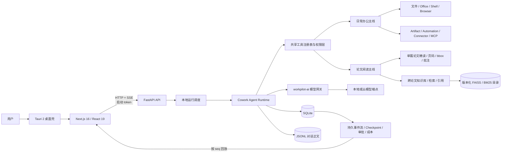
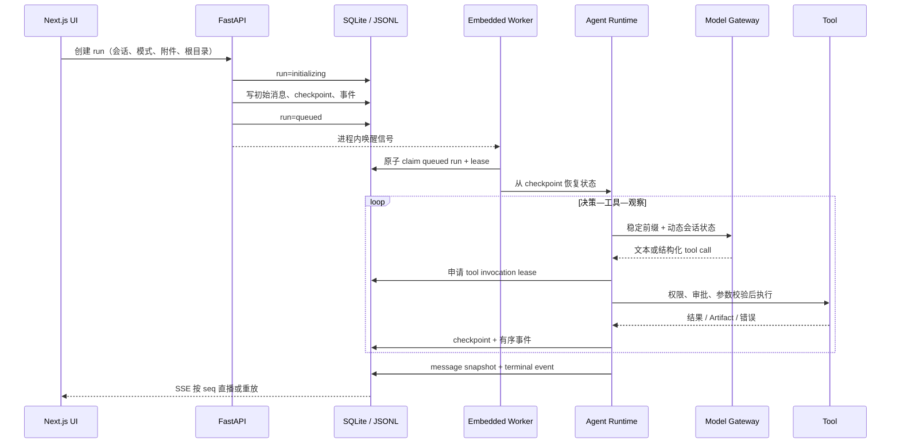
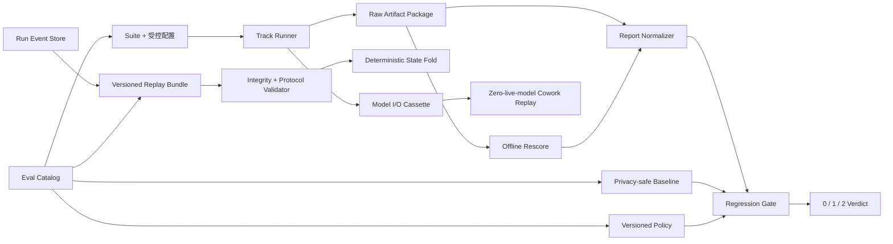

# 19 · WorkPilot 项目全景与面试作战手册

> 如果你准备的是 **AI Agent / Agent 应用岗位**，建议先读更口语化的配套文档
> [`21-Agent岗位大白话面试手册.md`](21-Agent岗位大白话面试手册.md)，再回到本文查完整技术事实、实验口径和审计细节。
>
> **产品双主定位：日常办公 + 论文阅读。** 两者是并列入口，共用同一个本地 Agent 运行底座，并可在一次任务中组合。
>
> 适用场景：把项目写进简历、准备项目深挖、系统设计题、AI Agent / RAG / 后端 / 全栈岗位面试。
>
> 审计时间：2026-08-24。本文以**当前代码和测试**为第一事实来源，而不是把早期设计稿当成现状。文中的数字来自这次本地审计快照，不等于公开 release 或生产环境结论。

---

## 0. 先读这一节：面试时如何使用这份文档

本文使用三种状态标签，防止把蓝图说成实装：

| 标签 | 含义 | 面试中可以怎么说 |
|---|---|---|
| **已实装** | 当前代码中存在，并能找到测试或可执行路径 | “我实现了……” |
| **实验结论** | 有冻结快照或实验报告，但可能来自历史架构、合成集或尚未人工复核的数据 | “在某次离线实验中观察到……，边界是……” |
| **未实现 / 待完善** | 只在设计、Backlog 或残留接口中出现 | “我没有实现，当前扩展方案是……” |

面试叙述遵循四条规则：

1. 先讲产品问题，再讲架构；不要把依赖库清单当项目介绍。
2. 每个技术亮点都能落到“问题—约束—方案—验证—代价”。
3. 实验数字必须带数据集、时间、基线和局限；不把相关性说成显著提升。
4. 不声称“已上线、已开源、日活、高并发、生产可用”，除非你另有可以证明的事实。

如果只有半小时准备，优先看：第 1、3、5、12、13、16、17、18 节。

---

## 1. 一句话、30 秒、2 分钟版本

### 1.1 一句话

WorkPilot 是一个本地优先的桌面 AI 助手，主打**日常办公**与**论文阅读**：办公侧安全地处理文件、Office 文档和自动化任务，阅读侧提供页码级证据、跨论文检索与引用联动，两条主线共用同一个可恢复、可审批的 Agent。

### 1.2 30 秒版本

> WorkPilot 有两个并列的产品入口。**日常办公**侧处理 Markdown、Word、Excel、PPT、文件、网页、Shell 和定时任务，强调授权、审批、冲突检测、备份和可恢复执行；**论文阅读**侧支持单篇 PDF 精读、跨论文知识库、页码 / bbox 引用、跳页高亮和批注，强调“真正读过再回答”。两条路径不是两套应用，而是共用同一个 Tauri + Next.js + FastAPI 桌面 Agent，所以“读完论文，把有依据的结论写进周报或演示文稿”可以在一次 run 中完成。

### 1.3 2 分钟版本

> WorkPilot 的两个主定位是日常办公和论文阅读。办公场景解决的是“模型能生成，但无法安全接管真实文件与连续任务”：它可以整理本地目录、编辑 Markdown / Word / Excel / PPT、读取网页、执行受控 Shell、生成可预览和可 diff 的 Artifact，以及运行定时任务；每一步受目录范围、capability、审批、文件版本和幂等协议约束。
>
> 论文阅读场景解决的是“模型给了答案，却无法证明读了哪一页”：单篇论文按物理页和 block bbox 精读，搜索片段不能冒充证据；跨论文问题走版本化 FAISS + BM25 知识库；引用可以驱动阅读器跳页、高亮并形成持久批注。阅读的目标不是只做摘要，而是建立可验证、可继续使用的研究证据。
>
> 两条主线的差异体现在工作模式、可见工具和质量指标，底层则共用同一个 run、模型网关、权限、checkpoint、SSE 事件、Todo、记忆和评测协议。典型融合任务是“阅读 8 篇论文，按方法分类，把带出处的结论写进周报并更新 Excel 汇总”；证据不是复制到另一个应用，而是直接进入后续办公交付链路。
>
> 架构上它是 Tauri + Next.js + FastAPI 的本地桌面应用，SQLite 保存运行、事件、审批和工具调用，JSONL 保存对话正文，版本目录保存知识索引。工具调用用 identity + lease 防恢复重放，SSE 用持久序号支持刷新和断线恢复。质量上，办公侧看任务、工具、安全和 Artifact，阅读侧看 read-before-claim、引用、locator 和检索；统一 regression gate 先检查可比性，再阻断逐 case 回退。当前评测工程层已建立，但三条正式新 baseline 仍待重建。

---

## 2. 产品定义、用户与边界

### 2.1 双核心定位

| 主定位 | 用户任务 | 产品能力 | 核心质量承诺 |
|---|---|---|---|
| **日常办公** | 整理文件、编辑 Word / Excel / PPT / Markdown、查网页、运行命令、生成交付物、安排定时任务 | Cowork 工具循环、Office Skill、文件 / Shell / Browser、Artifact、Connector、Automation | 不越权、不覆盖并发修改、不因恢复重复写；过程可见、可审批、可停止、可恢复 |
| **论文阅读** | 精读单篇论文、跨论文检索、核对原文、记录批注、比较方法与结论 | PDF locator / bbox、Reader、evidence ledger、版本化 KB、FAISS + BM25 + RRF、引用校验 | 搜索不等于读过；事实必须有可验证出处；引用可回到原页，找不到就拒答 |

两条主线是并列产品能力，而不是“阅读产品外加一个文件工具”或“办公 Agent 顺便能读 PDF”。它们共享同一套底座，但有各自清晰的入口、典型任务和验收标准：

- 办公模式优先暴露文件、Office、Shell、网页、Artifact 和自动化工具。
- 阅读模式优先暴露 outline、search、read、reader goto / annotate 与知识检索工具。
- capability 选择 prompt 和工具面，但真正执行仍需目录 / 网络资源授权与审批。
- 跨主线任务在同一个 run 中传递证据、Todo、上下文和 Artifact，不需要用户手工复制结果。

最能体现产品差异的融合场景是：

```text
论文原文 → 页码级阅读与引用 → 跨论文比较 → 形成有依据的结论
       → 写入周报 / Word → 更新 Excel → 生成 PPT / Artifact → 定时复盘
```

### 2.2 两条主线分别解决什么问题

目标用户是同时处理论文资料与日常交付物的研究者、工程师和知识工作者。

**日常办公痛点：**

- 模型只能给建议，用户仍要手工在本地文件、Office、网页和命令行之间搬运。
- 长任务关闭页面就丢，失败后只能重来，人工审批后还可能重复执行副作用。
- 文件可能被用户同时编辑，粗暴整文件覆盖会丢内容。
- 自动化任务遇到缺信息或危险操作时，要么失败，要么冒险自行继续。

**论文阅读痛点：**

- PDF 很长、术语密集，模型摘要难以证明具体依据来自哪一页。
- 搜索 snippet 很容易被误当成完整阅读，导致断章取义或伪引用。
- 单篇精读与跨论文检索通常割裂，读过的证据也难以进入后续工作成果。
- 论文、笔记和历史资料不断增长，但检索效果和引用质量缺少可量化验证。

**共同问题：** AI 功能很容易“看起来能用”，却没有数据证明办公任务是否真的完成、论文结论是否真正接地，所以两条主线都进入统一评测与回放层。

### 2.3 核心能力

| 归属 | 能力 | 当前状态 | 核心承诺 |
|---|---|---|---|
| 论文阅读 | 单篇论文精读 | 已实装 | PDF 按物理页、文本按章节定位；搜索片段不能直接作为证据；引用驱动跳页、高亮和批注 |
| 论文阅读 | 跨论文知识库 | 已实装 | FAISS 稠密检索 + 真 BM25 + RRF；多版索引显式激活；引用到文件和页码 |
| 日常办公 | 文件与 Office 编辑 | 已实装 | 处理 Markdown / DOCX / XLSX / PPTX / PDF；冲突检测、备份、重新打开、原子替换、预览与语义 diff |
| 日常办公 | 工具执行与交付 | 已实装 | 文件、网页、Git、Shell / sandbox、Artifact；用户点名目录，副作用受权限与审批约束 |
| 日常办公 | 自动化与外部协作 | 已实装 | 单次 / cron、离线补跑、重叠保护、Inbox；Connector / MCP 工具仍走统一策略 |
| 两者共享 | Agent 运行底座 | 已实装 | 多步循环、计划模式、Todo、checkpoint、SSE 恢复、steering、停止、HITL 和幂等 lease |
| 两者共享 | 长期记忆 | 已实装但质量门禁未通过 | global / workspace / conversation 作用域；新增、更新、失效、忽略；固定记忆不被自动改写 |
| 两者共享 | Skill / MCP | 已实装客户端与框架 | Skill 渐进加载；策展式 MCP client；动态扩展不能绕过 capability、资源范围和审批 |
| 长期蓝图 | 个人知识图谱、每日 digest | 未实现 | 不能写成当前简历成果 |

### 2.4 明确的非目标

- 当前不是多租户 SaaS，不提供组织 ACL、配额隔离和公网水平扩容。
- 日常办公主线不替代完整 Microsoft Office / WPS；它聚焦受控编辑、跨工具执行和可审计交付。
- 论文阅读主线不替代 Google Scholar、Semantic Scholar 或 Zotero；它聚焦用户已有材料的精读、检索和证据落地。
- 当前不以百万级向量为目标，FAISS 使用精确检索换取小规模个人库的简单与可解释。
- 不承诺任意 Office 文件修改后视觉像素级完美；“能重新打开”只证明结构有效。
- 不实现会“静默返回一个相似但错误答案”的语义结果缓存。
- 不把所有外部工具自动暴露给模型；MCP 工具必须经过目录固定、策略启用和权限校验。

### 2.5 为什么选择个人、本地优先

这是产品约束，也是架构选择：

- 用户资料天然敏感，本地存储能降低默认数据外流面。
- 单用户桌面场景不需要为了展示“分布式”而引入 PostgreSQL、Redis、对象存储和队列集群。
- SQLite + JSONL 更容易打包、备份、迁移和离线运行。
- 个人语料由作者真实阅读，理论上能够建立可信的人工 gold；但当前文件系统 KB 新评测集仍标记为 synthetic / pending human，不能越过这条证据边界。

代价也很清楚：单机进程、锁和本地目录设计不能直接扩成企业多租户；如果转企业版，需要把身份、租户、ACL 和审计放到检索前及每个副作用边界，而不是只换数据库。

---

## 3. 系统全景架构

### 3.1 总体结构



图中的两条产品主线在工具层分流，在运行层汇合：工作模式决定本轮更适合暴露办公工具还是论文阅读工具，但 run、模型网关、权限、事件、预算和存储协议不复制两套。这样既能分别优化两类体验，也能让论文证据直接进入办公交付物。

### 3.2 强制依赖方向

仓库通过 import-linter 约束后端依赖方向，大意是：

```text
API / Worker / CLI
        ↓
   RAG 与 Cowork（彼此隔离）
        ↓
      RunStore
        ↓
     Agent Core
        ↓
   workpilot-ai 网关
```

为什么值得讲：很多 Agent 项目最终会让 API、业务、存储和模型 SDK 互相 import，测试时只能整套启动。这里把 `agent_core` 保持为与具体产品相对无关的状态机与协议层，把 `cowork` 放产品能力，把 `runstore` 放持久化协议，把模型供应商差异收进网关。审计时 8 条 import contract 均通过。

唯一明确的模型调用例外是本地 embedding：它不走生成模型网关，因为不产生生成调用费用、prompt cache 或相同的路由语义；如果改成云 embedding，应该重新纳入统一治理。

### 3.3 仓库规模与目录职责

本次审计口径排除了 `node_modules`、构建目录和发布产物：约 568 个文件，Python 约 9.4 万行，TypeScript / TSX 约 1.15 万行；其中包含测试、评测脚本和历史实验，因此不能把总行数当“核心业务代码量”。

| 目录 | 主要职责 | 面试阅读入口 |
|---|---|---|
| `backend/app/agent_core` | 状态、预算、循环、压缩、HITL、幂等协议 | [`loop.py`](../backend/app/agent_core/loop.py)、[`budget.py`](../backend/app/agent_core/budget.py) |
| `backend/app/cowork` | 产品运行时、工具、安全、阅读、记忆、自动化、MCP、Skill | [`runtime.py`](../backend/app/cowork/runtime.py)、[`tools.py`](../backend/app/cowork/tools.py) |
| `backend/app/cowork_store` | SQLite schema、事件、审批、运行、消息索引 | [`sqlite.py`](../backend/app/cowork_store/sqlite.py) |
| `backend/app/runstore` | 面向 Agent 的存储接口封装 | [`runs.py`](../backend/app/runstore/runs.py)、[`run_stream.py`](../backend/app/runstore/run_stream.py) |
| `backend/app/rag/kb` | KB 文档、manifest、版本、索引和后台任务 | [`service.py`](../backend/app/rag/kb/service.py)、[`index.py`](../backend/app/rag/kb/index.py) |
| `backend/app/ingest` | PDF / Markdown 解析、质量判断与分块 | [`pdf.py`](../backend/app/ingest/pdf.py)、[`chunking.py`](../backend/app/ingest/chunking.py) |
| `backend/packages/workpilot-ai` | 供应商无关网关、路由、fallback、缓存 | [`gateway.py`](../backend/packages/workpilot-ai/src/workpilot_ai/gateway.py) |
| `backend/packages/workpilot-telemetry` | 成本、预算和一致性模型 | [`budget.py`](../backend/packages/workpilot-telemetry/src/workpilot_telemetry/budget.py) |
| `frontend/src` | Cowork、Reader、Knowledge、Memory、Cost 等界面 | [`cowork/page.tsx`](../frontend/src/app/cowork/page.tsx)、[`use-run-stream.ts`](../frontend/src/lib/use-run-stream.ts) |
| `frontend/src-tauri` | sidecar 生命周期、随机端口、token、文件选择器 | [`lib.rs`](../frontend/src-tauri/src/lib.rs) |
| `eval` | suite、runner、scorer、统一回归门禁、catalog、事件 / observation / 模型 cassette 回放 | [`README.md`](../eval/README.md)、[`regression.py`](../eval/regression.py)、[`replay.py`](../eval/replay.py) |
| `reranker` | 可选 cross-encoder 独立服务 | [`main.py`](../reranker/reranker_service/main.py) |

---

## 4. 一次任务从启动到完成发生了什么

### 4.1 桌面启动链路

1. Tauri 使用操作系统随机数生成 32 字节随机值，编码为 64 位十六进制启动 token。
2. 它在 `127.0.0.1` 选择可用端口，开发态启动虚拟环境中的 Python，打包态只认固定 sidecar 文件，不接受任意环境变量覆盖可执行路径。
3. 通过环境变量注入桌面模式、启动 token 和 Cowork 开关。
4. FastAPI 初始化 SQLite、JSONL 目录、成本 telemetry 和 embedded worker。
5. Tauri 每 250 ms 请求一次 `/health/ready`，最长等待 120 秒；成功后前端才开始正常请求。
6. 前端每次 API / SSE 请求都带启动 token。关闭桌面应用时，Tauri 先终止整个进程组，必要时再强制杀死，避免浏览器或 Shell 子进程残留。

打包态默认数据在 `~/.workpilot`。同一数据目录有进程生命周期级文件锁，防止两个应用版本同时消费同一批 queued run。

### 4.2 创建和执行 run



这里有三个容易被追问的点：

- **为什么先 `initializing`？** 不能先把 run 暴露成 queued、再慢慢写初始 checkpoint，否则 worker 可能抢到一个不完整任务。初始化完成才入队；启动时遗留的 initializing run 会被标失败。
- **为什么还要进程内队列？** 它只减少轮询延迟，是“门铃”；SQLite 的 queued 状态才是“包裹”。门铃丢了，周期扫描仍能找回任务。
- **为什么 API 不直接执行 Agent？** HTTP 生命周期和任务生命周期解耦。关页面、SSE 断开、API 请求结束都不会自动杀掉 run。

### 4.3 决策循环

当前运行时采用自研的确定性“决策—工具—观察”循环。循环只负责推进状态，可靠性来自以下显式协议：

- 每轮状态必须是可 JSON 序列化、不可出现 NaN 的深拷贝。
- 模型可见工具由工作模式、capability、权限和渐进加载共同决定。
- 每次模型调用前检查预算；每次工具前检查能力、资源范围和审批。
- 每个完整工具轮结束后保存 checkpoint；恢复时从持久状态继续。
- 同一工具签名连续出现超过 3 次会被阻断；连续两轮全部是重复调用，会强制下一轮禁用工具并要求给出结论。
- 模型输出的“伪工具调用文本”只有在工具当前可见、参数通过 schema 时才会被恢复；否则失败，不把普通文本当指令执行。
- 迟到的用户 steering 消息会在终止前同步成新的 user turn，避免已经收到纠偏却仍提交旧答案。

### 4.4 SSE 为什么能刷新后继续

所有事件先落 SQLite，再通过本地 bus 通知连接。SSE 连接建立时：

1. 先订阅 bus；
2. 再查询 `after_seq` 之后的历史事件；
3. 分批回放，每批最多 200 条；
4. 没有事件时发送 heartbeat comment；
5. API 优先采用 `Last-Event-ID`，否则采用查询参数 `after_seq`。

“先订阅、后查历史”用来关闭一个经典竞态：如果先查到序号 10、再订阅，而序号 11 恰好落在中间，客户端会永久漏掉 11。

前端为每个 run 单独维护 AbortController、cursor 和 reducer 状态；实时与重放共用 [`run-state.ts`](../frontend/src/lib/run-state.ts) 的纯 reducer，任何 `seq <= cursor` 的事件直接丢弃。因此：

- 断线后从最大 seq 重连，不丢后续事件；
- 刷新页面可以从 0 重放完整状态；
- 同一事件重复到达也不会重复展示；
- 多个 run 的流状态相互隔离；
- 关闭页面只断开观察，不取消后端任务。

取消也分两种：queued run 可以立刻进入终态；executing run 只记录 cancel request，由 worker 在下一个安全 checkpoint 响应，避免数据库已经写“取消”但工具仍在后台执行。

---

## 5. Agent 的可靠性：checkpoint、幂等、审批和预算

### 5.1 Checkpoint 只解决“从哪恢复”，不解决“是否重复执行”

典型错误答案是：“有 checkpoint，所以写操作不会重复。”实际上 checkpoint 只回答“从哪恢复”；从 interrupt 或崩溃恢复时，尚未确认完成的执行片段仍可能重放，其中的副作用也可能再次发生。

WorkPilot 把幂等下沉到工具副作用边界。一次调用的 identity 由以下内容稳定计算：

```text
run_id + plan_step_id + tool_name + canonical_json(arguments)
```

执行协议是：

1. 读取或创建 `tool_invocations` 记录；
2. 原子获取带过期时间的执行 lease；
3. 只有 lease 持有者可以真正调用外部副作用；
4. 成功后持久化结果；
5. 同一 identity 再次出现时复用成功结果；
6. lease 过期但没有成功结果时，watchdog 才允许恢复执行。

这实现的是本机协议内的 effectively-once，而不是理论上的全球 exactly-once。外部系统如果不支持幂等 key，进程在“外部成功、内部成功记录尚未落盘”的极窄窗口崩溃，仍可能不确定；面试时应主动说明这一边界。

### 5.2 三个不同维度不要混为一谈

| 维度 | 回答的问题 | 例子 |
|---|---|---|
| Capability | 当前工作模式是否允许模型拥有这类能力 | 阅读模式可以读材料，但不暴露写文件工具 |
| Permission / resource scope | 用户是否授权访问这个资源范围 | `filesystem.write` 只对会话授权根目录生效；`network.fetch` 可按 origin/domain 限制 |
| Approval | 即使能做、也有权限，当前这一次是否需要人确认 | Shell 或外部写操作逐次审批；常驻规则只免重复询问 |

常驻审批规则不会授予 capability，也不能用通配符扩大范围。目前只支持精确 `action_target` 或绑定 cwd 的精确 `argv_pattern`；包含 shell 运算符的命令永远不能命中规则。

### 5.3 计划模式与审批模式是两条轴

- **计划 / 执行模式**决定模型当前能看到读工具还是写工具。计划模式要求先 `propose_plan`，用户批准后才进入执行。
- **交互 / 自动审批模式**决定一个已可见、已授权的副作用是否还要弹一次确认。

把两者分开可以避免“批准计划”等同于“以后所有写操作都免审”。HITL 恢复还会同时校验 resume token 和 tool call id，避免把对一个中断的批准串到另一个调用。

### 5.4 三维运行预算与调用前熔断

Agent 的本地 run 预算按三维统计：模型调用次数、token 数和 active wall time。桌面默认可配置为 0，即单次 run 不设显式上限，但仍有重复调用熔断、取消和每日费用预算。

模型调用前不能只检查“已经花了多少”，还要为本次最坏情况预留：

```text
预计输入 token + max_output_tokens <= 剩余 token 预算
```

成功时用实际 usage 结算；明确未发出的请求不收费；供应商返回不确定错误时保守记账。每日成本预算在发送请求前进行原子 reservation，结束后再按实际成本 settle，避免多个并发调用同时看到“还有余额”而一起超支。

### 5.5 上下文压缩与 prompt cache

- 对话 canonical history 永不改写，压缩只生成本次出站视图。
- 工具调用和工具结果作为完整轮保留，不能只留下半个 protocol round。
- 超长历史先做滚动摘要，再裁剪工具输出；若供应商仍报 context overflow，只在 token 确实下降时重试，恢复次数有上限。
- system、工具定义、环境、记忆、persona、工作模式、预检索等稳定内容放在前缀；Todo、当前根目录、grant、plan、阅读器位置和动态加载工具等变化内容追加成末尾 user block，提高供应商 prompt cache 的前缀命中机会。
- reasoning 流和最终 answer 流分开；只有收到首个答案文本 delta 才重置可见答案，纯工具轮不会造成界面闪烁。

### 5.6 只读子 Agent

`explore` 子 Agent 用于资料探索，不是可任意写入的多 Agent 编排：

- 独立上下文，只拿只读工具注册表；
- 最多 4 轮、8 次工具调用；
- 与父 run 共享总预算，同时单独上报 usage；
- 每次工具前检查取消；
- 通过进度事件让前端可见；
- 最后使用 light tier 压缩探索结果。

“多 Agent 自主委派和写操作”仍不应写成已实现能力。

---

## 6. 日常办公主线：工具系统与文件安全

### 6.1 工具注册与渐进暴露

当前基础 registry 有 31 个核心工具，包括提问、计划、Todo、阅读、文件搜索、精确替换、Shell、沙箱、Git 只读、网页读取、Artifact、sleep / wake 等。产品运行时再按模块注册浏览器、知识库、记忆、自动化、Connector、Skill 和动态 MCP 工具。

不要在简历里写死“64 个工具”作为长期事实：动态 MCP 和策略配置会改变数量。更稳妥的说法是“31 个核心工具 + 按 capability / Skill / MCP 渐进加载的扩展工具”。

### 6.2 路径授权

文件路径必须：

- 是绝对路径；
- 所属授权根目录真实存在；
- 规范化后仍位于授权根内；
- 不包含 NUL、`..` 逃逸或通过符号链接越界；
- 目标类型与工具声明一致。

系统选择器有两种语义：上传资料会复制一份只读副本；选择本机工作文件则保持原路径，并把其目录作为显式会话根。后端会再次规范化和校验，不能信任前端选择器本身。

### 6.3 文本修改为什么不用“整文件直接覆盖”

`replace_in_file` 要求 old text 精确匹配，默认必须唯一；可传 `expected_count` 明确多处替换。已有文件在写前需要此前读取所得的 SHA-256 baseline：

1. 确认模型确实读过将要修改的版本；
2. 写前再次比对 hash，发现用户并发修改就拒绝；
3. 如果只读过文件的一部分，不允许整文件覆盖；
4. 创建受限数量的 `.workpilot-backups` 备份；
5. 在同目录写临时文件并 `fsync`；
6. 保留原 mode，最后 `os.replace` 原子替换。

这对应的是 optimistic concurrency control：不锁住用户的编辑器，但在提交时检测 lost update。

### 6.4 Shell 与容器沙箱

Shell 输入先用 `shlex` 分析。出现 `;`、管道、重定向、反引号、`$()`、换行等运算符时转入 shell 模式，这类命令永远不能进入免审批 allowlist。简单命令按 argv 直接执行，使用最小环境、无 stdin、超时和输出上限，并在取消时结束进程组。

系统还支持持久 PTY 和后台 Shell task，用户可以读取输出或终止。`sleep` 前会拒绝存在未结束的后台 task，避免 run 睡眠后留下无人管理的子进程。

`run_sandbox` 使用 Docker / Podman：禁网、只读 rootfs、drop capabilities、no-new-privileges、PID / 内存 / CPU 限制、`noexec` tmpfs，并只把授权 cwd 以读写方式挂载。容器不可用时不会悄悄退回宿主机执行。

### 6.5 Artifact 发现、校验和 diff

前台 Shell 执行前后会对授权目录做有界快照，发现新建或修改的文件；扫描跳过符号链接、隐藏目录、依赖目录、VCS 和备份目录，并限制文件数、单文件大小与总量。

发现 Office / PDF 产物后会重新打开验证格式，OOXML 还检查 ZIP entry 和总解压大小。登记 Artifact 时冻结 hash 和用于 diff 的快照。语义 diff 支持文本、DOCX、XLSX、PPTX、PDF，限制源文件 2 MB、抽取文本 12 万字符、输出 500 行 / 4.8 万字符。

一个很关键的 exactly-once 细节：如果 Shell 已成功执行，但后续 Artifact 扫描或登记失败，系统只报告“后处理失败”，不能为了补扫描而重新执行 Shell。

### 6.6 Office 为什么采用 Skill + Shell

没有为 DOCX / XLSX / PPTX 各做一套模型原生工具，而是用格式 Skill 告诉模型操作约束，再通过受控 Shell 调用成熟库或 CLI。好处是工具面更小、格式能力可迭代、Office 与一般文件共享授权和 Artifact 协议；代价是运行环境需要相应依赖，且“可重新打开”不等于视觉排版完美，仍需 Quick Look / LibreOffice 或人工视觉检查。

---

## 7. 论文阅读主线：单篇精读与跨论文检索

### 7.1 为什么不把所有阅读都塞进向量库

单篇材料精读和跨文档知识库问答有不同目标：

| 维度 | 单篇材料阅读 | 知识库检索 |
|---|---|---|
| 用户意图 | 正在读这份材料，要求定位到原文 | 在很多资料中寻找相关证据 |
| 数据准备 | 原文件即用，不建向量索引 | 解析、分块、embedding、BM25、版本发布 |
| 定位精度 | PDF 物理页 / 文本章节，支持 bbox | 文件 + 页码，当前没有 chunk 到 bbox 的完整映射 |
| 搜索角色 | 只用于导航，搜索 snippet 不能引用 | 检索候选本身可以成为证据来源 |
| 引用命名空间 | `[p.N]` | 预检索 `[K1]`、显式搜索 `[S1]` |

因此阅读模式保留原文件语义，不把一篇正在看的 PDF 强制走 chunk / vector pipeline。

### 7.2 单篇材料的 locator 模型

PDF locator 是包含空白页在内的 1-based 物理页；Markdown / 文本 locator 是章节。读取支持单个、范围和列表，单次最多 24 个 locator，并有字符上限。越界 locator 被丢弃，不会偷偷 clamp 到末页。

材料缓存是容量 6 的 LRU，key 为规范化路径、`mtime_ns` 和文件大小；并发解析相同文件时合并 inflight future，并使用 shield 避免一个调用取消导致所有等待者一起失败。`material_id` 使用内容相关 SHA-256 的前 16 个字符。

搜索分三层：

1. 原始精确匹配；
2. 空白和标点规范化匹配；
3. term 匹配，中文使用重叠 bigram 提高没有空格时的可搜性。

PDF outline 优先使用书签，没有书签才合成；解析器可走 PyMuPDF 或可选 MinerU。

### 7.3 “搜索过”为什么不等于“读过”

`search_material` 只返回导航 snippet，不能写入 evidence ledger。只有 `read_material` 或经过验证的 `reader_goto` 才表示模型实际读到了原文。

- `reader_goto` 的 quote 不匹配时仍会导航，但不高亮；如果 quote 在别页找到，可以纠正 locator。
- `reader_annotate` 必须逐字匹配，否则拒绝创建批注。
- 批注锚定材料内容 hash；文件变化后旧批注仍保留，但会标记为 stale。
- PDF block 元数据保存页号、页面尺寸、rotation、坐标原点和归一化 bbox，前端才能正确绘制高亮。

### 7.4 引用验证

回答解析时忽略代码块内类似 `[S1]` 的文本，只承认当前 evidence ledger 中已知引用。对有实质事实断言的 grounded answer，如果没有引用、引用未知或 quote 无法验证，会触发一次专门的 citation repair；修复仍失败就让 run 失败，而不是交付看起来流畅但无依据的答案。

这是质量与可用性的明确取舍：宁可显式失败，也不把“可能对”冒充“有证据”。

---

## 8. 论文阅读的知识库与 RAG

### 8.1 数据和版本模型

一个知识库对应一个目录，包含 manifest、内容寻址的 source snapshot 和 `versions/<version_id>`。每个版本固化：

- 文档清单及 hash；
- embedding model、dimensions、revision 组成的 signature；
- 分块和检索配置；
- FAISS / BM25 产物与元数据。

构建先在 staging 目录完成，校验后 rename，再原子更新 manifest。失败时旧 active 版本继续服务。多个版本可以并存，但必须显式激活；加入文档后旧 active 会标记 stale，不会把一个不完整新版本自动切上线；最后一个版本不能删除。

原始文件按内容 hash 快照，所以用户后来移动或修改源路径，不会改变已经发布版本的事实基础。

### 8.2 解析与分块

- PDF 先做质量判断，再路由 PyMuPDF 或 MinerU。
- PDF 解析在受资源限制的子进程中进行：CPU 限制、Linux 地址空间限制、页数上限和超时。
- MinerU 是可选独立过程；失败时是否 fallback、是否保留中间产物均由配置控制。
- Markdown 和文本保留结构信息。
- 内部统一为 `ParsedDocument / ParsedBlock`，位置和字符 offset 使用 Unicode NFC 后的 code point 语义。
- PDF 页转为 LlamaIndex `Document`，默认 `SentenceSplitter` 的 chunk size / overlap 为 512 / 64。

当前批量增加文档会重建 active 基线的完整索引，而不是只把新 chunk 追加到 BM25，因为 BM25 的 IDF 是 corpus-level 统计，增量追加而不重算会造成版本内分数不一致。

### 8.3 稠密、BM25 与 RRF

当前 FAISS 不是 HNSW，而是 `IndexFlatIP`。向量先 L2 normalize，因此 inner product 等价于 cosine similarity：

```text
cos(q, d) = (q · d) / (||q|| ||d||)
normalize 后：cos(q, d) = q · d
```

这是精确搜索，优点是没有近似召回参数和小库调参复杂度；代价是查询复杂度随向量数线性增长，百万级数据时应换 IVF / HNSW 或外部向量数据库。

BM25 是真实 BM25，不是早期 PostgreSQL 架构里的 `ts_rank_cd`。中文 tokenizer 采用“每个 CJK 字符 + 拉丁词”的简单规则；BM25 分数为 0 的候选不进入融合。

两路各取约 `top_k * 2` 候选，再使用 Reciprocal Rank Fusion：

```text
RRF(d) = Σ 1 / (k + rank_i(d))，默认 k = 60
```

选择 RRF 而非直接相加，是因为稠密相似度与 BM25 分数没有统一量纲；RRF 只依赖排名，对分数校准要求低。实验过 lexical weight 0.75，但没有显著收益，因此默认保留等权 RRF。

### 8.4 可选 reranker

默认候选链路是 RRF top 10，再可选送到 `BAAI/bge-reranker-v2-m3`，返回 top 5。服务特点：

- 启动时先加载 / warm up 模型，完成后才 ready；
- device 自动选择 CUDA、MPS 或 CPU，dtype 自动；
- batch 4、max length 512；
- inference semaphore 为 1，阻止同进程显存并发爆炸；
- `asyncio.to_thread` 避免阻塞 ASGI event loop；
- logits 经 sigmoid，分数相同时保持原输入顺序；
- 客户端验证返回 id、条数、有限浮点值；默认超时约 3 秒；失败时 fail-open 回退 RRF 原顺序。

仓库默认关闭 reranker。原因不是它无效，而是模型约 2.3 GB、启动和分发成本高，当前还没有纳入桌面安装包生命周期。

### 8.5 缓存与失败语义

索引和 BM25 对象使用 LRU，并合并同一版本的并发加载。embedding 失败不会静默降级成 lexical-only，因为那会让调用方误以为仍在执行配置好的 hybrid 语义；明确配置 BM25-only 时则使用 MockEmbedding 避免无意义的 embedding 依赖。Hybrid 中 BM25 文件损坏可以记录降级并保留 dense 结果，但 BM25-only 损坏必须显式失败。

知识库索引 job 当前是进程内状态、同一 KB 单 job、TTL 约 600 秒，并非 durable queue。进程崩溃会丢 job 状态，但不会发布半成品，因为最终 manifest publication 是原子的。这是“小概率可重做后台任务”和“核心数据一致性”之间的取舍。

---

## 9. 记忆系统

### 9.1 实际实现，不是“三层记忆”口号

当前长期记忆按作用域分为 global、workspace、conversation，类别包括 preference、profile、interest、fact；记录 source、confidence、pin、`valid_from`、`invalid_at`、`superseded_by` 等字段。工作记忆是当前 run state，长期记忆落 SQLite；所谓个人知识图谱**没有实现**。

可见记忆由“全局 + 当前工作目录 + 当前会话”组成。prompt 明确把记忆当成不可信数据：当前用户指令优先，模型不得泄漏记忆来源，个性化不能省略本来应该给出的通用答案。

### 9.2 两阶段异步提取

对话结束后创建持久 extraction job，并冻结 source snapshot。处理分两次模型调用：

1. 从对话提取最多 6 条候选事实；
2. 对照最近 20 条 active memory，把每条分类为 ADD / UPDATE / DELETE / NOOP。

解析失败最多修复两次。写入与 job 状态在同一个 SQLite transaction 中，避免记忆已经改了但 job 仍显示未完成。固定记忆不允许自动 UPDATE / DELETE。

`valid_from` 使用源事件时间，而不是 extraction 完成时间。因此迟到的旧任务可以写成历史记录，但不会覆盖更晚的当前偏好。这是“时序有效性”而不是简单 upsert。

### 9.3 为什么记忆工具不走外部副作用 lease

`remember`、`memory_update`、`memory_forget`、`memory_read` 被定义为内部 control-plane 操作，effect 为 none。它们仍有权限和状态约束，但不复用面向文件 / 外部系统的调用租约。这种设计减少协议复杂度，不过要求数据库写入自身具备事务性和可重试语义。

### 9.4 实验结论必须诚实

A6 的 12 条预注册合成任务中：记忆使用分从 0.83 到 1.83，qualified case 从 2/12 到 7/12，偏好比较为 on 胜 8、off 胜 2、平 2，source safety 两组都是 12/12；但任务质量只从 1.50 到 1.58，出现 2 个回归，而且 qualified 没达到预注册的 9/12 门槛。

所以正确结论是：**记忆更常被正确使用，但这次实验没有证明它提升了端到端任务质量，总门禁失败。** 简历可以写机制，不应写“显著提升个性化质量”。

---

## 10. 日常办公的自动化、无人值守与消息面

### 10.1 Scheduler

计划支持一次性时间或五段 cron，并保存 timezone、next run、last run、运行 / 跳过次数和派发 lease。周期 tick 会发现到期计划和 sleeping run：

- 应用离线错过时间点后最多补跑一次；
- 同一会话已有运行中或等待人工的任务时跳过，避免重叠堆积；
- enqueue 失败不把任务永久标为已处理，下次 tick 可以补偿；
- schedule 的 standing approval 只对同一 schedule 生效，删除 schedule 时一并删除。

### 10.2 睡眠与唤醒

`sleep` 将 `wake_at` 和工具结果持久化，释放 worker，而不是让线程真的阻塞等待。`wake_on` 可以订阅条件。到点后 scheduler 把 run 重新排队，从 checkpoint 继续。

### 10.3 无人值守遇到 HITL

定时任务需要补充信息、目录授权或危险操作审批时不会自动猜测，也不会自动扩大授权，而是创建唯一 pending Inbox item，run 进入 waiting_human。若用户配置了消息连接器，可镜像到聊天；人工响应后使用同一 resume token / tool call 协议恢复。

Worker 将前台 Cowork queue 与后台 priority queue 分离：记忆提取优先级 0、Skill 蒸馏优先级 10，但它们不能耗尽所有前台消费者，避免用户交互被后台维护任务饿死。

---

## 11. Skill、MCP、Connector 与浏览器

### 11.1 Skill 分层

Skill 有 project > user > built-in 三层，同名时高层 shadow 低层；built-in 只读，用户可以禁用或 fork，不能直接删除产品自带文件。当前 built-in 包含 DOCX、XLSX、PPTX、PDF、沉浸阅读和 Skill Creator。

加载时检查符号链接、大小、frontmatter、名称和 procedure。ZIP 导入限制总大小、路径、文件数量，并要求唯一的 `SKILL.md`。工具采用渐进发现：模型先查 catalog，再加载所需 Skill 和资源，避免每轮把所有说明塞进 prompt。

### 11.2 MCP 的安全边界

当前实现的是 MCP client，不是 MCP server。支持 stdio 与 Streamable HTTP。配置中的 secret 只能引用 `${ENV}` 或连接器 OAuth token；token 在内存注入，不明文写回 catalog。

MCP 工具必须：

- 来自明确配置的 server；
- 探测后固定 catalog hash，发生漂移就阻断；
- 逐项由策略启用，未策展工具不对模型可见；
- 声明 `data_scope=corpus_allowed` 才能接收语料，因为当前没有字段级 taint tracking；
- 副作用声明逐次审批，并要求 `external.write` / `external.destructive` 等 capability；
- stdio server 需要显式本机信任。

工具名归一化为 `mcp__server__tool`，返回大小受限并带 hash。

### 11.3 Secret 与 OAuth

连接器 token 保存到 Fernet 加密 JSON，主密钥单独存放且文件权限尽量收紧到 0600；父目录 0700，写入走临时文件、chmod、`os.replace`。Windows 用 `icacls` 做 best-effort 权限收紧。

这不是硬件密钥或云 KMS：密文和主密钥都在同一台机器，能够读取用户账户全部文件的攻击者仍可解密。备份迁移还必须同时保存主密钥，否则密文不可恢复。

OAuth callback 使用一次性 state。系统浏览器只允许打开预定义官方授权路径，例如 GitHub、飞书、微信和腾讯文档，不允许任意 URL 借桌面壳启动。

### 11.4 网页读取与 SSRF

网页工具只接受 HTTP / HTTPS，禁止 URL userinfo，域名先 IDNA 规范化。每次请求：

1. DNS 解析所有地址并拒绝非 global IP；
2. 把首个已检查 IP 固定为实际连接目标；
3. Host header 和 TLS SNI 仍使用原域名；
4. 禁用环境代理；
5. 每次 redirect 都重新授权、重新解析和重新固定；
6. 限制跳转次数、响应字节和 MIME 类型。

“解析后固定 IP”是为了防 DNS rebinding：只在校验阶段解析一次、发送请求时让 HTTP 库再次解析，攻击者可以让第二次结果指向内网。

---

## 12. 模型网关、路由、缓存与成本

### 12.1 统一网关

`workpilot-ai` 定义供应商无关的 message、tool、usage 和 streaming delta 协议，适配 OpenAI-compatible、Anthropic 和 Gemini；provider profile 还覆盖 DeepSeek、Qwen、Ollama 等配置形态。

当前路由有 `light / main / heavy / external` 四档，任务映射示例：

| 任务 | 默认档位 |
|---|---|
| Cowork 决策、只读子 Agent、上下文压缩 | main |
| 摘要、标题、记忆操作、Skill 蒸馏、轻量改写 | light |
| 评测 Judge | heavy |
| 未命中显式 route | main |

online fallback 开启，evaluation fallback 关闭。Fallback 是每档显式列出的非传递候选：不能因为 light 能到 main、main 能到 heavy，就暗中自动形成一条未声明链。动态 escalation 当前为空，即未启用。

### 12.2 Fallback 边界

- 只有在流式首字节发出前才能 fallback；一旦用户看到了部分输出，切模型会破坏流协议和语义一致性。
- 本地预算不足不是供应商故障，不能通过 fallback 绕过预算。
- 调用前会保守估计 context；当前模型装不下但 fallback 模型装得下时，可以在发送前选择适配者。
- 评测时必须关闭 fallback，否则报告上写的模型可能不是实际执行模型，实验无法复现。

### 12.3 两种“缓存”不要混淆

| 机制 | 缓存什么 | 当前策略 |
|---|---|---|
| 精确 completion cache | 完整非流式成功结果 | 进程内 LRU / TTL，最多约 512；仅 temperature=0、非评测，key 包含 tier、provider、model、消息、附件 hash、max tokens、temperature 和 request fingerprint |
| Provider prompt cache | 供应商复用稳定 prompt 前缀 | 通过稳定前缀设计提高命中；读 / 写 token 单独记 telemetry |

流式结果不做 completion cache，避免伪造 token 时序和中途取消语义。进程缓存重启即丢，属于优化而非事实存储。

### 12.4 成本口径

云模型按输入、输出、cache read / write token 和配置价格计算，内部使用整数 micro-USD，避免浮点累计误差；`NULL` 表示未知成本，不能把它当 0。

自建 GPU 不能用“每个请求 latency × GPU 单价”相加：并发请求共享同一段 GPU wall time，这会把同一成本重复计算 N 次。历史一次 8 并发实验中，总 wall time 约 0.51 秒，按各请求 latency 相加推得的观察并发度约 6.59，朴素算法会多算约 6.59 倍。正确做法是按批次 wall time / 完成任务数摊销，并同时报告吞吐、批量大小和并发；这个指标代表 client occupancy，不等于 GPU utilization。

成本页聚合档位、任务、调用、token、prompt cache、fallback、失败、延迟和费用，并提示尚未部署的 tier。

---

## 13. 数据模型与一致性

### 13.1 三类存储各自负责什么

| 存储 | 放什么 | 为什么 |
|---|---|---|
| SQLite | run、事件、checkpoint、审批、lease、自动化、记忆、成本等结构化状态 | 事务、索引、WAL、易打包 |
| Append-only JSONL | 长对话正文 | 追加简单，避免大型正文频繁改写 SQLite page；SQLite 保存 offset / length 索引 |
| 目录 | KB source/version、Skill、Artifact、附件等文件资产 | 文件系统天然适合大对象和原子 rename |

源码当前 schema 版本是 **v12**。早期 [`03-数据模型.md`](03-数据模型.md) 中的 v8 描述已经滞后，面试时以源码迁移和本手册为准。

### 13.2 主要表族

| 表族 | 代表表 | 作用 |
|---|---|---|
| 会话与消息 | `conversations`、`conversation_message_index` | 会话元数据；JSONL record 的 offset / length |
| 运行 | `agent_runs`、`run_events`、`agent_plan_steps`、`agent_attempts`、`agent_checkpoints` | 状态机、事件序号、计划、尝试、恢复 |
| 副作用与授权 | `tool_invocations`、`session_roots`、`capability_grants`、`cowork_approval_rules`、`cowork_workspace_trust` | 幂等 lease、目录、能力、审批和信任 |
| 文件产物 | `artifacts`、`cowork_attachments` | 产物、附件、hash、预览与 diff 元数据 |
| 自动化与消息 | `cowork_schedules`、`cowork_inbox_items`、bindings / subscriptions / thread sessions / unrouted | 定时、HITL Inbox 和外部消息路由 |
| 交互状态 | `cowork_steering_messages`、`cowork_reading_annotations` | 运行中纠偏、阅读批注 |
| 记忆 | `cowork_memories`、`memory_extraction_jobs` | 时序记忆和异步提取工作 |
| 成本 | `llm_calls`、`daily_cost_budgets`、`cost_reservations` | 调用明细、预算和原子预留 |

SQLite 开启 WAL、foreign keys 和 busy timeout。短事务使用 `BEGIN IMMEDIATE`；需要跨多个事务的 run 协议还使用 64 个按 run 分片的 asyncio lock，减少同一 run 内的交错，同时避免一把全局锁串行化所有运行。

### 13.3 JSONL 的更新语义

消息正文只追加，不原地改：每条有稳定 record id，更新相当于追加同 id 的新版本，读取时 last-write-wins。写入有文件锁、flush / fsync 和 record id 去重，SQLite 索引保存 byte offset 和 length。

这不是 event sourcing 的完整实现，因为业务状态并非全部由 JSONL 重放；更准确的说法是“append-only message body + relational control plane”。

### 13.4 运行租约与 watchdog

Worker 只能原子 claim `queued` run。执行中定期续 lease。watchdog 发现过期后：

- 有 checkpoint 且恢复次数未耗尽：重新入 queued，`recovery_count + 1`；
- 没有安全恢复点或超过预算：标 failed；
- 已请求 cancel：走取消终态，不再恢复。

事件 seq 在数据库中原子递增，对前端用字符串序列化，避免 JavaScript 对大整数的精度风险。

---

## 14. 桌面与 Web 安全模型

### 14.1 桌面模式

- API 只绑定 `127.0.0.1`。
- 除 OAuth callback 和飞书事件接收等明确路径外，请求都必须携带启动 token。
- token 用 `compare_digest` 比较，降低时序侧信道；owner identity 由服务端设置，不信任请求体。
- CORS 只允许精确 Tauri origin 与开发用 localhost:3000。
- sidecar 数据目录单实例锁防并行消费。

仍有一个小型 TOCTOU：Tauri 先找可用端口、释放 listener、再让 sidecar bind，中间理论上可能被其他本机进程抢占。更强方案是把已绑定 socket 句柄传给子进程或让 sidecar 自选端口后通过受保护管道回传。

### 14.2 浏览器 Web 模式

Web 管理端使用 bcrypt 密码 hash、进程内 session、HTTP-only + SameSite=Lax cookie。未配置密码 hash 时 fail closed。局限是 session 随服务重启丢失，且当前没有公网部署所需的 IP / account rate limiting。

早期 PostgreSQL / Redis 架构中的限流已经随桌面迁移移除。对本机单用户是合理简化；如果公网部署，这是阻塞项，不是“以后优化”。

### 14.3 威胁—控制—剩余风险

| 威胁 | 当前控制 | 剩余风险 |
|---|---|---|
| 网页诱导访问内网 | 协议、userinfo、IDNA、global IP、DNS pin、逐跳重检、禁代理 | 浏览器自动化路径仍需与 fetch 路径分别审计 |
| 模型越权读写文件 | capability + canonical root + symlink escape 检查 + 后端复核 | 用户一旦授权过宽根目录，合法范围也会变大 |
| 写文件覆盖用户修改 | read baseline hash、二次校验、备份、原子替换 | 某些外部程序的非原子写仍可能产生竞态 |
| 恢复导致重复副作用 | tool invocation identity + lease + 成功结果复用 | 外部成功、内部落盘前崩溃仍可能不确定 |
| 恶意 PDF / 压缩炸弹 | 子进程、CPU / 内存 / 页数 / 超时、OOXML 解压上限 | 解析库自身零日漏洞仍需依赖更新与 OS 隔离 |
| MCP catalog 漂移 | catalog hash 固定、逐工具启用 | 无字段级 taint tracking，只能按 corpus_allowed 粗粒度治理 |
| 本机 token 被窃取 | 随机启动 token、loopback、进程生命周期 | 同一用户权限下的恶意进程仍可能读取进程环境或数据 |
| 密钥泄漏 | Fernet、独立 0600 key、原子私密文件 | 同机高权限攻击者可同时拿到密文与主密钥 |
| 费用并发超限 | 调用前原子 reservation、结束 settle | 供应商 usage 缺失时只能保守估算 |

桌面发布仍缺代码签名、公证、自动更新与完整供应链策略，不能描述成已完成的正式分发体系。

---

## 15. 前端交互与工程设计

### 15.1 页面

当前桌面静态构建包含首页以及 Cowork、Knowledge、Automations、Connectors、MCP、Providers、Skills、Memory、Cost 等页面。Cowork 主界面支持：

- 创建、切换、归档、删除会话；
- 会话级 provider / model、persona、工作模式、知识库挂载；
- 计划模式、目录根和 capability grant；
- 添加只读副本或选择原始工作文件；
- 运行中 steering、停止、回答问题、审批或拒绝；
- Todo、步骤、工具、子 Agent 进度和 reasoning / answer 状态；
- Artifact 预览和 diff；
- 阅读器、引用跳转、高亮与批注；
- inline memory 状态。

### 15.2 Reader

PDF 页面由 canvas 渲染，同时叠加可选择的 text layer。点击引用通过 locator 找到页，并按归一化 bbox 还原高亮。阅读器状态和 Agent 事件解耦：引用点击失败不应破坏聊天；批注失败也不应让 PDF 无法阅读。

### 15.3 前端恢复原则

- 当前 run 的事实来自事件 reducer，不把临时组件 state 当唯一来源。
- preview 与 semantic diff 使用 `Promise.allSettled` 并发请求，一个失败不阻塞另一个。
- Tauri bridge 只对明确的“sidecar 仍在启动”错误重试，最长约 90 秒；鉴权、参数或业务终态错误立即返回，不用盲目 retry 掩盖问题。
- Markdown 渲染有针对 HTML / JavaScript URL 和伪引用的测试，代码块中的 `[S1]` 不会被做成引用按钮。

### 15.4 当前前端债务

Cowork 主页面和 API client 体积较大，页面文件接近 2,000 行、API client 约 1,600 行。功能虽有 hooks 和 reducer 抽离，但后续仍应按 conversation、run controls、HITL、artifacts、reader 等领域进一步拆分，并为纯状态逻辑增加更多单元测试，而不仅依赖端到端测试。

---

## 16. 评测与回放层：怎样证明“改了以后更好”

本节给出面试所需的完整叙事；实现契约、CLI 操作和故障诊断详见专门文档 [`18-评测与回放层.md`](18-评测与回放层.md)。

### 16.1 为什么自建，而不是只接 Ragas

项目同时评测检索、引用、拒答、Agent 工具轨迹、文件副作用、恢复、阅读 locator、记忆和成本。通用 RAG 框架适合回答相关性 / faithfulness，但很难表达：

- 写操作是否只执行一次；
- HITL 是否走到正确状态；
- 产物路径是否安全；
- 搜索后是否真的 read before claim；
- 引用是否落到物理页；
- 同一 Run 事件流能否确定性还原前端状态；
- scorer 改动后，能否不重新调用模型就重算旧 observation；
- cassette 回放是否真的没有触发 live model fallback。

因此这里不是只有一个“准确率脚本”，而是将 suite、runner、scorer、report、baseline、policy、gate、replay 和 catalog 分层。通用框架仍可作为指标或 trace 的参考，但发布判定必须理解 WorkPilot 自己的工具、安全和事件协议。

### 16.2 评测与回放的分层架构



| 层 | 职责 | 当前实现 |
|---|---|---|
| L0 Provenance | 固定 Git、suite、配置、模型、预算、实现与 scorer 指纹 | Cowork / KB runner manifest 和 report |
| L1 Suite | 版本化样本、gold、split、review 状态与冻结 test | `eval/suites/` |
| L2 Runner | 运行真实被测路径，产出逐 case observation | `eval/cowork_runner.py`、`eval/kb_retrieval_runner.py` |
| L3 Scoring | 规则、检索、阅读、任务、安全和成本指标 | `eval/metrics/` 与 Cowork scorer |
| L4 Normalize | 将 Cowork、Retrieval、Generation 报告投影成统一 case/metric 结构 | [`eval/regression.py`](../eval/regression.py) |
| L5 Baseline / Policy | 保存隐私最小化基线、方向、容差和绝对红线 | `eval/policies/*.json`、`workpilot-regression-baseline.v1` |
| L6 Gate | 先判可比性，再做逐 case 和聚合回归判断 | `python -m eval.regression` |
| L7 Replay | 事件 bundle、observation rescore、fixture 模型 cassette | [`eval/replay.py`](../eval/replay.py)、[`eval/model_cassette.py`](../eval/model_cassette.py) |
| L8 Catalog | 声明 track、suite、policy、baseline 与 replay readiness | [`eval/catalog.json`](../eval/catalog.json) |
| L9 Orchestration | PR 确定性契约、nightly 模型跑批、发布晋升 | CI 部分接入；nightly 和正式 baseline 未完成 |

关键原则是：**先证明两份报告可比，再讨论谁更好。** 检查顺序包括 schema、完整性、kind、dataset、suite fingerprint、case / segment 集合、受控配置、指标适用分母，最后才执行质量规则。把 suite 漂移或配置缺失当成“质量下降”，会重演 E11 的假回归。

### 16.3 双主线与三条产品评测轨

两个产品定位不能共用一个模糊总分：办公任务和论文阅读的失败含义不同，融合任务还要同时满足两侧约束。

| 产品面 | 重点验证 | 主要落点 |
|---|---|---|
| 日常办公 | 任务是否完成、工具是否选对、是否在预算内、Artifact 是否形成、权限 / HITL 是否正确、工具错误和副作用安全 | Cowork workspace / artifact / Office / Web / safety cases |
| 单篇论文阅读 | 是否先读后答、quote 能否核验、locator 是否准确、引用能否回页 | Cowork immersive-reading cases 与 reading metrics |
| 跨论文检索 | gold span 是否召回、排序质量、上下文精度、拒答和 token 预算 | Filesystem KB Retrieval track |
| 阅读到办公的融合任务 | 论文证据是否被正确读取并进入最终办公交付物，同时没有越权或重复写入 | Cowork 跨能力 case；当前新 suite 仍待人工复核 |

| 轨道 | 当前被测路径 | 主要指标 | 当前成熟度 |
|---|---|---|---|
| Cowork | 50-case workspace / knowledge / artifact / Office / Web / 安全-HITL / 阅读任务 | task success、guardrail、tool selection、tool budget、token、tool error、reading metrics | runner 与门禁契约已实装；suite 为 synthetic / pending human，无正式新 baseline |
| Filesystem KB Retrieval | `LocalKbService -> search_index`，gold 锚在内容 hash、页码、页内字符区间 | span recall、budget recall、nDCG、alpha-nDCG、MRR、context precision、拒答、retrieved tokens | 26 条 synthetic / pending human；旧 PostgreSQL baseline 不可复用 |
| Grounded Generation | 当前回答、引用、拒答和约束报告 | refusal、citation validity、gold alignment、constraint、token | normalizer / policy 已有；当前生产对齐 generation runner 尚未接回 |

横向评分再分三种：确定性规则负责 schema、gold span、引用、文件状态、权限和预算；模型 Judge 负责 correctness / faithfulness 等开放判断，但必须先做人审校准；suite 升级、badcase 归因和 baseline 晋升仍由人审核。

### 16.4 “回放”至少有五种，不能混说

| 名称 | 是否调用模型 | 是否执行工具 | 当前状态 | 它证明什么 |
|---|---:|---:|---|---|
| Run UI event replay | 否 | 否 | **已实装** | 事件 bundle 的完整性、协议和前端状态折叠一致 |
| Cowork offline rescore | 否 | 否；可能只读源评测工作区 | **已实装** | scorer / rubric 改动对同一 observation 的影响 |
| Runtime checkpoint recovery | 视恢复点而定 | 可能 | 产品已实装，但不属于 eval replay | 生产任务中断后如何继续 |
| Live rerun | 是 | 是，限 fixture / 隔离目录 | runner 已实装，但不是确定性回放 | 当前系统重新执行同一 suite 的表现 |
| Fixture model cassette replay | 否，由 cassette 返回 | 是，但只允许 suite-local adapter / 隔离工作区；Shell 禁止 | **已实装** | 当前 Cowork graph 能否消费同一模型交互序列，且真实模型 dispatch 为 0 |
| Production full-execution cassette | 否 | 必须由完整 mock 短路 | **未实现** | 模型、RAG、工具和外部世界都相同时，新编排是否走同一轨迹 |
| Shadow / backtest | 是或 cassette | 必须隔离 | **未实现** | 新版本对真实历史流量的离线表现 |

最重要的面试边界是：

- **事件回放不是 Agent 重演。** Run event 是面向 UI / 审计的安全投影，不包含完整 prompt、tool schema、原始工具返回、RAG 候选或 fallback 决策。
- **checkpoint 恢复不是评测回放。** 它面向生产任务连续性，可能重新调用模型和工具。
- **live rerun 不是确定性 replay。** 即使 temperature 为 0，供应商和底层计算仍可能漂移。
- **model cassette 也不是完整 execution cassette。** 它固定了模型边界，但当前没有记录并短路生产 RAG、工具和外部副作用。

### 16.5 Run event replay 如何工作

[`eval/run_replay_export.py`](../eval/run_replay_export.py) 从权威 `run_events` 导出已经终止的 Run，不恢复 checkpoint、不调用模型、不执行工具。Bundle 使用 `workpilot.run-replay-bundle` v1 和 `workpilot.run-events/v1`，包含 case、事件、可选 `expected_state` 以及覆盖规范化 JSON 的 SHA256。

[`eval/replay.py`](../eval/replay.py) 只用标准库折叠事件，处理 message delta / snapshot / reset、citation 去重、plan / step / tool 生命周期、interrupt、artifact、recovery 和终态。它验证：

- `id=<run_id>:<seq>`，seq 为连续十进制字符串；
- event id、run id 与 case 不串线；
- tool start / finish 成对；
- 已知事件类型、终态存在、expected state 子集一致；
- 完全相同的重复事件按前端 cursor 语义忽略并给 warning；
- 相同 seq 的冲突事件、缺口、未知类型和未结束工具直接失败。

导出真实 Run 需要显式确认敏感输出，目标文件独占创建且权限设为 0600；因为 event 中仍可能有答案、quote 和 Artifact 元数据，不能默认提交 Git。

### 16.6 Offline rescore 与 model cassette

**Offline rescore** 使用旧 Cowork report 中已经冻结的 observation，重新运行 scorer，不调用模型或工具。它适合回答“rubric / scorer 改动导致了多少分数变化”，避免同时重跑被测模型而混入第二个变量。源工作区可能仍需保留，因为部分 scorer 会只读验证产物状态；不同 suite 不能互相 rescore，例如 core-40 不能包装成 core-50。

**Model cassette** 记录 complete、tool-calling、stream 和 embedding 调用的完整 messages、attachments、tool definitions、生成参数、chunk / completion、usage 和错误，并保存全局交互序号、case id、规范化 request hash、suite SHA、精确 item 顺序、provider / model 与 prompt budget。完成的交互先 `fsync` 到 partial JSONL，再原子发布 0600 的 cassette。

回放端结构上不持有真实 provider，也没有 live fallback。suite、item 顺序、请求 hash、交互序号、响应完整性和“全部记录已消费”必须一致；miss、请求漂移、篡改、序号缺口或剩余交互均 fail closed。路径和当天环境时间只做明确限定的规范化，其他 prompt 变化都应导致严格失配。

模型 cassette 含完整 prompt 和响应，是高敏本地 artifact，不是可以提交 Git 的 baseline。它仍会让产品 graph 执行 suite-local 工具，因此只准隔离 case 工作区；当前没有可验证的断网 sandbox，所以包含 `run_shell` 的 case 会在 graph 执行前拒绝。

### 16.7 六类版本化契约与三态门禁

| 契约 | 内容 | 安全 / 一致性要求 |
|---|---|---|
| Raw report | prompt、回答、observation、工具轨迹、路径和逐 case 结果 | 高敏、本地不可变运行包，不进 Git |
| Regression baseline | case id / segment、状态、指标分子分母、source / policy / config hash | 隐私最小化，不保存 prompt、答案、工具参数、路径或引文正文 |
| Regression policy | 指标方向、是否必需、绝对 / 相对容差、case regression、绝对上下限 | policy SHA 与 baseline 强绑定；改 policy 等于改发布标准 |
| Run replay bundle | 版本化事件协议、case、expected state、SHA256 | 离线验证，不构成工具执行授权 |
| Model cassette | 完整模型请求、响应、序号和 request hash | 0600 高敏 artifact，严格匹配且禁止 live fallback |
| Eval catalog | track、suite、policy、baseline 和 replay readiness | 路径不得逃逸；ready 资源必须通过 schema / provenance / integrity 检查 |

`eval.regression` 将退出码设计成稳定协议：

| 退出码 | 含义 | 应对方式 |
|---:|---|---|
| `0` | 输入可比，所有规则通过；或 snapshot 成功 | 继续流程 |
| `1` | 输入可比，但候选发生质量、成本或安全回退 | 阻断，查看聚合和逐 case violation |
| `2` | 无法安全判定，例如 schema / fingerprint / case / config / eligibility / integrity 不一致 | 修评测基础设施，不能当作质量失败，更不能当作通过 |

候选 runner error 在 policy 要求下属于 exit 1；报告不可读、fingerprint 缺失或 baseline 损坏属于 exit 2。`--allow-config-drift` 只豁免已经人工解释的实现配置漂移，不能绕过 dataset、case、指标分母、policy SHA 或完整性校验。

默认质量指标零容忍回退，token 可允许预定义相对增幅；安全指标如 `guardrail_pass` 可以设候选绝对值必须为 1。总分上涨也不能掩盖一个原本通过的关键 case 变失败。

### 16.8 实验统计与发布门禁不是同一件事

旧 [`eval/compare.py`](../eval/compare.py) 用于研究实验的 paired bootstrap：按同一批样本成对抽样 10,000 次，计算 `metric(B)-metric(A)` 的 95% CI。若 CI 跨 0，只能说“观察到方向”，不能说“统计显著提升”。配对可以消除 query 难度差异带来的部分方差。

新 [`eval/regression.py`](../eval/regression.py) v1 是**单份 baseline 对单份 candidate 的严格逐 case 发布门禁**，不是多次运行分布，也没有用 bootstrap 建模模型噪声。模型轨失败后可以同配置追加两次运行帮助人工归因，但不能挑最好的一次自动晋升。多次运行 cohort baseline 与预注册统计规则仍是 P2。

因此面试时应这样区分：

- “我用 paired bootstrap 判断一次检索实验的差值是否显著”；
- “我用三态 regression gate 阻断不可比输入、逐 case 回退和安全红线”；
- 不能说“当前发布 gate 已经用置信区间消化模型随机性”。

### 16.9 PR、nightly 与发布流程

**PR 层**不访问私人 KB 或真实模型，但会运行 regression / replay 单测、合成 event bundle 完整性与状态折叠、catalog doctor、suite / policy schema 校验，以及 model cassette 的严格失配和零真实 gateway 测试。它验证的是评测基础设施和确定性协议，不是假装用 toy corpus 证明产品质量。

**Nightly 层**计划在有权访问模型和本地 KB 的受控机器运行 Cowork dev 与 filesystem retrieval dev，固定 Git、模型 revision、endpoint、预算、suite SHA、KB/index 和 policy。exit 1 进入 badcase 归因，exit 2 进入基础设施告警；两者不得混报。当前 scheduler 与 artifact 保留策略尚未落地。

**发布晋升**要求 suite 人工复核、Git clean、模型 / scorer / policy / index 冻结、逐 case 审查、先通过旧门禁，再用 `snapshot` 写到一个不存在的新文件。Baseline 不原地覆盖；policy diff 单独 review。正式项目建议 suite owner 与代码 owner 双人批准，个人项目至少分两次独立复核并留下决策记录。

### 16.10 当前 readiness：工程层可用，正式 baseline 未点亮

当前可以说：

- 三类报告已有统一 normalizer 和 policy gate；
- regression 有 0 / 1 / 2 三态判定；
- Run event bundle 有版本、完整性、协议校验和确定性折叠；
- Cowork 支持 observation offline rescore；
- fixture 范围模型 cassette 可严格回放，且真实模型 dispatch 为 0；
- catalog 能显式报告 ready / rebuild-required。

当前不能说：

- 三条产品质量 baseline 已经可用于发布；
- 支持生产完整 Agent execution replay；
- generation 轨已与当前 filesystem KB / ModelGateway / evidence contract 接通；
- nightly 已持续运行；
- synthetic / pending-human suite 代表真实产品质量。

三份旧 snapshot 都需要重建：Cowork 仍是 core-40 旧形状，retrieval 与退役 PostgreSQL `m1-dev-70` 绑定，generation 缺当前生产对齐 runner。`eval.catalog doctor` 当前应报告三个 `baseline_rebuild_required` warning，而 event replay 资源 ready；warning 返回 0 表示目录契约健康，不表示质量 baseline 已就绪。

### 16.11 本次验证结果

2026-08-24 对本地代码执行：

| 检查 | 结果 | 说明 |
|---|---:|---|
| Backend pytest | **881 passed** | 约 36.3 秒；有 5 条第三方 SWIG deprecation warning |
| Eval / replay 定向测试 | **66 passed** | 已包含在上面的 881 中；覆盖 catalog、regression、event replay / export、model cassette，约 1.3 秒 |
| Eval catalog doctor | 通过并有预期 warning | 1 个 replay ready；3 条 product track baseline 需要重建 |
| Synthetic event replay | **3 / 3 cases passed** | SHA256 匹配，0 error、0 warning |
| Reranker pytest | **5 passed** | 约 3.7 秒；有 1 条 Starlette/httpx deprecation warning |
| Frontend Playwright | **42 passed** | Chromium，约 55.2 秒；使用 mock backend 验证生产 Next build 的 UI / SSE，不是与真实 FastAPI 的全链路集成 |
| Ruff lint | 通过 | `ruff check` |
| mypy | 通过 | 211 个 source file，无错误 |
| import-linter | 通过 | 288 个文件、1,640 条依赖、8 条 contract，无破坏 |
| Frontend ESLint / TypeScript | 通过 | `npm run lint`、`npm run typecheck` |
| Desktop frontend build | 通过 | 13 个静态 route，编译约 7.8 秒 |
| Rust | 通过 | `cargo check --locked`，约 0.85 秒 |
| Ruff format check | 通过 | 366 个 Python 文件符合格式规则 |

因此本次共通过 928 个自动化测试用例（881 个后端 + 42 个前端 E2E + 5 个 reranker）；66 个评测 / 回放定向测试属于后端 881 的子集，不能重复相加。当前本地门禁全部通过，但远端 CI 尚未运行，且前端 E2E 使用 mock backend，所以不能把它扩写成“生产全链路已验证”。

---

## 17. 实验结果：能说什么、不能说什么

### 17.1 当前 / 历史必须分开

当前产品是 SQLite + filesystem KB + FAISS Flat。早期 PostgreSQL / pgvector / HNSW 实验仍有研究价值，但不能拿来证明当前实现的线上指标。

| 实验 | 结果 | 正确结论 | 不能怎么说 |
|---|---|---|---|
| Cowork v6，40 条 synthetic | task success 35/40 = 87.5%；tool selection 85%；平均 step efficiency 1.2417；均值延迟约 3.25s，P95 约 6.74s；728,561 tokens | 这是 2026-08-20 冻结的旧 40-case 基线，可用于回归参考 | “当前 50-case Agent 成功率 87.5%” |
| E11 suite drift | 错误 v2 52.5%，修正可解性后 v3 82.5%；v5 三次 87.5 / 82.5 / 87.5，均值 85.8%，噪声约 5pt | 评测集必须由产品 capability 派生并逐 case 校验可解性；否则会制造 22.5pt 假回归 | “修 prompt 提升了 30pt” |
| FS-KB dense → hybrid，Top10 | Recall 97.73% → 100%，+2.27pt，CI [0,+7.14]；nDCG 62.16% → 66.08%，+3.92pt，CI [-3.08,+9.90] | 方向为正，但无显著证据；而且集合 synthetic / pending human | “混合检索显著提高召回和排序” |
| FS-KB rerank，Top5 | Recall 86.36% → 93.18%，CI 跨 0；nDCG 61.63% → 81.05%，+19.42pt，CI [+4.22,+34.39]；MRR 52.80% → 78.03%，+25.23pt，CI [+7.14,+43.17]；延迟 +655ms | 排序收益明显，代价也明确；同一 dev 集参与调参、无 holdout，所以只是工程候选，保持可选 / fail-open / 默认关闭 | “reranker 已在生产稳定提升 19pt” |
| FS-KB lexical weight 0.75 | 无显著收益 | 等权 RRF 更简单，保留默认 | “调权带来提升” |
| FS-KB adaptive topK | Recall +9.09pt 但 CI 跨 0，token +26.2% | 收益证据不足且成本上升，未采用 | “动态 topK 优化成功” |
| A6 记忆，12 条 synthetic | memory use +1.0，但任务质量 1.50 → 1.58；2 个回归，qualified 7/12 < 9/12 | 机制被更多使用，但端到端门禁失败 | “记忆显著提升回答质量” |
| P1-L 历史 Agentic RAG | full target 2/14 → 5/14；answerable 36/57 → 40/57；安全 13/13；CI 跨 0，平均延迟 +7.87s | 质量方向可研究，但统计和 SLA 都没过，未上线 | “Agentic RAG 已提升 21pt” |
| 历史 PostgreSQL 80 题 | 引用准确 42/44 = 95.45%；不可答 13/13；可答回答 44/57 | 只能说明旧架构的人审集表现 | 迁移后仍直接沿用为当前 FS-KB 指标 |
| Judge J2 历史校准 | 19 条盲审：heavy 18/19，Kappa .8725；main 19/19，Kappa 1.0 | 在小样本、二元 answer correctness 上可用 main 做日常 Judge | “Judge 与人类全面一致” |

新的 `cowork-core-50.json` 是 50 条套件，但当前没有冻结结果；FS-KB 套件是 53 篇、1,097 nodes、22 条可答 + 4 条不可答，仍 pending human。二者都不能用旧快照冒充新基线。

### 17.2 最值得讲的负优化故事：E11

**情境**：架构和能力集变化后，Agent 评测从约 70% / 87.5% 一度掉到 52.5%。

**错误直觉**：模型或 Agent runtime 回归了。

**调查**：逐 case 对照工具注册表，发现评测 suite 从旧常量复制了已经不再对当前工作模式可见的工具和能力，部分任务在新产品定义下根本不可解。

**行动**：让 suite capability 从产品配置派生；runner 在执行前逐项验证任务是否拥有完成它所需的 registry；修正后结果回到 82.5%，三次重复为 87.5 / 82.5 / 87.5。

**结论**：52.5% 不是模型退化，而是评测基础设施制造的假回归。以后门禁阈值必须大于噪声地板和量化下限；n=20 时一条样本就是 5 个百分点，设置“下降不超过 2pt”的门禁没有实际分辨率。

这个故事比“我把准确率从 X 调到 Y”更能展示评测素养，因为它说明你会审计 measurement system 本身。

---

## 18. 关键技术取舍

| 选择 | 没选什么 | 理由 | 代价 / 何时重选 |
|---|---|---|---|
| SQLite + JSONL + 目录 | PostgreSQL + Redis + 对象存储 | 单用户本地应用，零外部服务、易打包和备份 | 多进程写、高并发、多租户时重选服务化存储 |
| Tauri | Electron | 二进制壳更轻，复用 Web UI，Rust 负责本机生命周期 | 打包 sidecar、跨平台依赖和签名更复杂 |
| SSE + 持久事件 | WebSocket-only | 主要是服务端单向流；原生 HTTP、可按序号重连回放 | 双向高频协作时 WebSocket 更自然 |
| 自研确定性工具循环 | 通用 Agent 编排框架 | 状态、事件、审批、预算和恢复协议均由产品显式控制，容易单测 | 复杂图分支增多时，路由与状态迁移的维护成本会上升 |
| 工具边界幂等 | 只靠 checkpoint | checkpoint 会重放节点，副作用必须单独治理 | 外部系统无幂等能力时仍有不确定窗口 |
| FAISS IndexFlatIP | HNSW / 向量数据库 | 个人小库精确、简单、无需调参 | 百万向量查询线性扫描不可接受时更换 |
| RRF | 分数直接相加 | 两路分数量纲不同，RRF 只依赖 rank | 有足够标注数据时可学融合权重 |
| reranker 默认关闭 | 默认随包分发 | 2.3 GB 模型和生命周期成本尚未解决 | 有稳定 holdout、打包和设备策略后开启 |
| 单篇阅读不建库 | 所有文件统一向量化 | 保留物理页、bbox 和“实际读过”语义 | 跨大量材料关联时仍需 KB |
| Skill + Shell | 每格式大量专用工具 | 工具面小、复用安全协议、能力可扩展 | 视觉一致性和依赖管理更难 |
| 自建 eval | 只用 Ragas | 需要覆盖 Agent、副作用、恢复、locator | 指标和 runner 维护成本高 |
| 不做语义 completion cache | 相似 query 缓存 | 接地产品不能容忍安静的错误命中 | 若以后做，需把知识版本、权限、时间和可验证性写入 key / verifier |

---

## 19. 可观测性与故障处理

### 19.1 事件即用户可见的执行轨迹

run event 覆盖消息 start / delta / snapshot / reset / done、citation、plan、step、tool、interrupt / approval、Artifact、Todo、memory、reader goto / annotation、子 Agent 进度、steering、context compacted、sleeping 和 terminal / error。最终答案还会写 snapshot，防止只保存流式 delta 导致恢复困难。

### 19.2 健康检查

- `/health/live`：进程还活着。
- `/health/ready`：本地存储、运行时等初始化完成，可以接业务。

桌面壳等 ready 而不是只等 TCP 端口，避免“进程启动了但迁移未完成”的假就绪。

### 19.3 成本与 trace

每次 LLM call 记录 tier、task、provider、model、token、prompt-cache、fallback、失败、延迟和成本。run / event / tool invocation 有关联 id，便于从 UI 失败回到具体调用。

项目没有默认把 trace 上传 Langfuse：本地资料的 prompt / tool output 发送到第三方需要单独知情同意。代价是当前调试依赖本地结构化记录和数据库查询，跨设备聚合能力弱。

### 19.4 常见故障与恢复

| 故障 | 系统行为 |
|---|---|
| UI 刷新或 SSE 断开 | run 继续，按 seq 重放 |
| API / worker 崩溃 | lease 过期后 watchdog 从 checkpoint 恢复，受 recovery budget 限制 |
| 模型首字节前失败 | 可按显式路由 fallback |
| 模型流中失败 | 不切模型，记录错误，避免拼接不同模型输出 |
| 工具成功后重复恢复 | 已完成 identity 复用结果，不重做 |
| Artifact 扫描失败 | 报后处理失败，不重跑 Shell |
| 用户同时改文件 | baseline hash 不一致，拒绝覆盖 |
| reranker 超时 / 非法返回 | fail-open 到 RRF 顺序 |
| KB 新版本构建失败 | 旧 active 保持，staging 不发布 |
| 自动化离线错过 | 重启后最多 catch up 一次 |
| 无人值守需要人 | waiting_human + Inbox，不自行批准 |

---

## 20. 当前不足、风险和下一步

### 20.1 工程债务

1. `backend/app/core/db.py` 已成为退役数据库接口的残留；约 190 处旧 session 参数仍存在，增加认知负担。
2. `docs/03-数据模型.md` 等早期文档存在 schema / 架构漂移，应自动从迁移或 schema 生成事实表，或至少加入版本校验。
3. Cowork 页面、API client 和 runtime 单文件偏大，需要按领域拆分。
4. KB indexing job 不持久；虽然不会破坏 active 索引，但崩溃后用户看不到原 job 状态。
5. 前端 E2E 使用 mock backend；缺少一组真实 sidecar + browser 的跨进程 smoke test。
6. 远端 CI 与发布构建尚未在托管 runner 上验证；本地通过不能替代签名、公证和跨平台安装测试。

### 20.2 质量证据缺口

1. 新 50-case Cowork suite 尚未完成人工复核，也没有当前 v1 regression baseline。
2. 文件系统 KB 的 26 个 query 仍是 synthetic / pending human，旧 PostgreSQL snapshot 不能作为新 retrieval baseline。
3. 当前架构对应的 grounded-generation runner 尚未接回，只有 normalizer / policy 契约。
4. 三份历史 snapshot 都是 `rebuild_required`；nightly scheduler 和 artifact 保留策略尚未落地。
5. Regression gate v1 是单报告严格比较，尚未支持多次运行 cohort baseline 或噪声分布。
6. Reading 只有 4 条任务，无人工 baseline。
7. Reranker 调参和评测使用同一 dev 集，无 holdout。
8. 记忆 A6 没通过总门禁。
9. 尚未建立 point-down / 用户反馈到 badcase 的稳定闭环。

### 20.3 产品与发布缺口

1. 代码签名、公证、自动更新、SBOM / 供应链策略未完成。
2. 公网部署路径未决定，且当前缺限流、多租户和企业 ACL。
3. 知识图谱、daily digest 和完整多 Agent 写委派未实现。
4. KB 引用只有页级，未恢复 SentenceSplitter chunk 到原始 block bbox 的完整映射。
5. Reranker 大模型未纳入安装包和设备容量治理。
6. Office 视觉 QA 仍依赖外部预览 / 人工，不具备格式保真量化指标。

### 20.4 推荐的下一步优先级

| 优先级 | 工作 | 完成标准 |
|---|---|---|
| P0 | 清理工作树并让 deterministic CI 真正全绿 | format、lint、type、test、build、cargo 全过；结果与 commit 绑定 |
| P0 | 人工复核 FS-KB 与 50-case Cowork suite | reviewer、时间、修改记录、冻结 hash 完整 |
| P0 | 重建 Cowork / Retrieval v1 baseline | 当前 commit、模型 identity、fallback off、suite / config / policy hash 和 raw package 可追溯 |
| P1 | 接回 Grounded Generation runner | 对齐当前 filesystem KB、ModelGateway 与 evidence contract，并生成首个 v1 baseline |
| P1 | 落地受控 nightly | 区分 regression exit 1 与 exit 2，保存唯一运行包和 retention 记录 |
| P1 | 增加真实 sidecar smoke / crash recovery 测试 | 覆盖启动 token、重启、checkpoint、SSE resume 和一次文件写 |
| P1 | Production execution cassette | 在权限 / schema 校验后接入工具 recorder，并记录 RAG 边界；默认 model / network deny，cassette miss fail closed |
| P1 | KB bbox lineage | citation 能从 chunk 回到 parsed block / PDF bbox |
| P2 | 持久化 indexing job | 重启后可见并可安全重试 |
| P2 | 打包供应链 | 三平台签名、公证、更新和依赖审计 |
| 条件触发 | 企业 / 公网架构 | 只有产品确认需要时再引入 tenant、ACL、rate limit 和服务化存储 |

---

## 21. 面试高频追问与参考答案

### 21.1 产品与架构

**Q1：这不就是 RAG + 调工具吗？**

不是简单拼接。产品有两个并列入口：日常办公可以独立完成文件、Office、网页、Shell 和自动化任务；论文阅读可以独立完成精读、跨论文检索、引用跳页和批注。关键是两者又共享同一个可恢复 run：阅读证据进入同一 state 和 evidence ledger，后续办公写入仍受同一目录授权、审批、预算和 checkpoint 协议约束。真正的工作量在跨边界一致性：刷新后事件不丢、恢复不重写文件、搜索 snippet 不冒充已读证据、用户并发修改不被覆盖。

**Q1b：同时做办公和论文阅读，产品定位会不会太散？**

两条主线各自有清晰入口和验收标准：办公看任务完成、Artifact、权限与副作用安全；论文阅读看 read-before-claim、引用、locator 和检索。共享的是本地文件、长任务和“从信息到交付”的用户工作流，因此复用运行底座有实际价值。范围控制也很明确：办公不做完整 Office 替代品，论文阅读不做全网学术搜索平台；核心用户是同时需要阅读资料和产出文档的研究者、工程师与知识工作者。

**Q2：为什么从 PostgreSQL / Redis 改成 SQLite？是不是技术倒退？**

是产品形态校准，不是能力倒退。单用户桌面默认引入服务容器会增加安装和故障面，却没有真实的多租户或横向扩容收益。SQLite WAL、短事务、run 分片锁、JSONL 正文和版本目录满足当前一致性要求。若转企业服务，重选存储是合理的，但要由负载和权限需求触发。

**Q3：为什么 Tauri 而不是 Electron？**

需要复用 Web UI，又希望桌面壳轻、能用 Rust 严格管理 sidecar、进程组、文件选择器和本机 token。代价是 Python sidecar 要按平台原生构建，代码签名和 Playwright 浏览器打包更复杂。

**Q4：如果数据量扩大 100 倍，哪里先出问题？**

大概率先是 `IndexFlatIP` 线性扫描和每次文档变更重建全量 BM25，其次是单进程 SQLite 写竞争和本地磁盘。先用 benchmark 确认瓶颈，再考虑 HNSW / IVF、增量但版本一致的 lexical index、独立 indexing worker；只有出现多用户并发才把控制面迁到服务数据库。

### 21.2 Agent 与可靠性

**Q5：为什么 checkpoint 还不够？**

checkpoint 记录恢复位置，但节点可能重放。副作用发生在 checkpoint 之前时，恢复会重复。必须在工具边界用稳定 identity、lease 和成功结果复用，且外部系统最好接收幂等 key。

**Q6：如何防死循环？**

不只靠固定轮数：同一规范化工具签名超过 3 次阻断；连续两轮所有调用都重复则强制无工具收尾；同时有 calls、tokens、active wall 三维预算和 tool timeout。固定轮数只是最后一道粗粒度上限。

**Q7：用户关闭页面会怎样？**

只断开 SSE。任务由 embedded worker 独立执行，状态和事件持久化。回来后按 run seq 重放。只有显式 stop 才设置 cancel request。

**Q8：SSE 怎么保证不重不丢？**

事件先持久化并有单调 seq；服务端先订阅 bus 再读历史关闭竞态；客户端从 Last-Event-ID 继续并按 cursor 去重；实时与 replay 共用 reducer。

**Q9：审批通过后为什么仍可能不执行？**

审批只代表用户同意这次动作。执行时还要重新检查 capability、资源 scope、参数 schema、文件 baseline 和 invocation lease；任何条件变化都应 fail closed。

**Q10：你能保证 exactly-once 吗？**

只能说在本地协议和可观察成功记录范围内 effectively-once。若外部 API 成功、进程在本地提交前崩溃，且对方不支持幂等 key，就无法证明是否执行。诚实的工程方案是将 idempotency key 传给支持它的外部系统，对不支持者进入 reconciliation / 人工确认。

### 21.3 RAG 与阅读

**Q11：为什么 RRF？**

BM25 和 cosine 分数尺度不同，直接加权需要校准，且跨 query 分布会漂。RRF 只用排名，默认参数少，适合当前小样本。权重方案做过实验但没有显著收益，所以保留简单基线。

**Q12：当前向量索引是 HNSW 吗？**

不是。当前 filesystem KB 是归一化向量上的 FAISS `IndexFlatIP`，即精确 cosine。HNSW 属于早期 PostgreSQL 实验，不应混说。

**Q13：怎么防模型编引用？**

工具读取后生成 evidence ledger；回答只允许引用 ledger 内 id；搜索 snippet 在阅读模式不入账；解析忽略代码块伪引用；未知引用和缺引会触发一次修复，再失败就不交付 grounded answer。

**Q14：为什么 `reader_goto` quote 错了还导航，批注却失败？**

导航是低风险 UI 辅助，去到候选页仍有价值，只是不高亮；批注是持久写入，如果锚点不精确就会制造错误数据，所以必须 fail closed。

**Q15：为什么加入新文档要重建 BM25？**

BM25 的 IDF 依赖整个 corpus。只追加 posting 而不更新 corpus statistics 会让新旧文档不可比。个人库规模下全量重建可接受，并且版本原子发布保证一致性。

**Q16：reranker 值得吗？**

当前待人工复核 dev 集显示 nDCG@5 和 MRR 有显著方向，代价约 +655ms；但没有 holdout、模型 2.3 GB、桌面分发未解决。因此正确决策是可选、fail-open、默认关闭，而不是仅因指标好看就强推。

### 21.4 安全

**Q17：只绑定 localhost 就安全吗？**

不够。同机恶意网页或进程仍可能访问 localhost，所以还要随机启动 token、精确 CORS、敏感回调例外收窄、服务端 owner identity、路径和 capability 复核。对于同用户高权限恶意进程，桌面应用无法提供强隔离，这是威胁模型边界。

**Q18：SSRF 为什么要 DNS pin？**

如果校验 DNS 得到公网 IP，真正连接时重新解析，攻击者可以在两次解析之间切到 127.0.0.1 或云元数据地址。先验证、再固定连接 IP，同时保留 Host / SNI，redirect 每跳重做，才能关闭 rebinding 窗口。

**Q19：MCP 为什么不直接全部暴露？**

MCP 是动态外部代码和数据通道。目录或 schema 漂移会改变模型可执行面，所以要 hash pin、逐工具策展、data scope、外部写 capability 和逐次审批。当前无细粒度 taint tracking，因此默认拒绝语料出站更安全。

### 21.5 评测与成本

**Q20：为什么一个实验涨了 3.9pt 还说没提升？**

因为点估计不等于证据。nDCG 差值的 95% paired-bootstrap CI 跨 0，样本小，可能是抽样波动；正确说法是“方向为正，尚不能排除无差异”。

**Q21：Judge 怎么证明可信？**

先拿盲审人工样本做校准，报告 confusion matrix、accuracy 和 Kappa；旧 J2 在 19 条二元样本上 main 为 19/19、Kappa 1.0，heavy 为 18/19、Kappa .8725。但样本很小、任务仅 answer correctness，所以只支持这个窄用途，不能推广到引用、风格或所有 Agent 能力。

**Q22：为什么 CI 不跑全量 AI eval？**

PR runner 无法访问私有语料和模型集群，所以不跑 live model / private KB 质量评测；但它会运行 regression / replay 单测、catalog doctor、合成 event bundle 状态折叠和 model cassette 的零真实 gateway 契约。真正模型评测要在有权访问数据和固定模型的环境中手动 / nightly 跑，fallback 关闭并冻结快照。代价是 PR 阶段的端到端模型质量反馈较晚。

**Q23：event replay、checkpoint recovery、live rerun 有什么区别？**

Event replay 只折叠已经记录的 UI / 审计事件，不调用模型和工具，用来验证事件协议和前端状态；checkpoint recovery 从生产状态继续任务，可能再次调用模型和工具；live rerun 用当前代码、模型和隔离 fixture 重新执行 suite，会受到模型随机性影响。三者分别回答“投影是否一致”“任务能否继续”“当前版本表现如何”。

**Q24：为什么事件回放不能证明 Agent 执行可重现？**

Run event 是经过裁剪的安全投影，没有完整模型输入、tool definition、原始 tool result、RAG 候选、fallback 和外部世界状态。它可以证明 seq、生命周期和 reducer 语义，却没有足够信息重新驱动相同决策。

**Q25：模型 cassette 怎么证明没有偷偷调用真实模型？**

回放端不持有 delegate / real provider，也没有 live fallback；每次调用按全局序号和规范化 request hash 严格匹配。cassette miss、请求漂移、篡改和未消费记录全部失败，report 还记录 `real_model_dispatches=0`。但这只固定模型边界，工具与 RAG 尚未形成生产全链路 cassette。

**Q26：Regression exit 1 和 exit 2 为什么必须分开？**

Exit 1 表示 baseline 与 candidate 可比，但候选发生质量、成本或安全回退；exit 2 表示 dataset、case、配置、指标分母、policy 或完整性不一致，系统无法安全判断。如果把 exit 2 当成质量失败，会误导优化；如果当成通过，会让损坏的评测基础设施放行发布。

**Q27：为什么 baseline 不直接保存完整报告？**

Raw report 含 prompt、答案、路径、工具参数和引文正文，不适合进 Git。Baseline 只保存 case、segment、状态、指标分子分母及 source / config / policy hash；这样既能做逐 case 回归，又最小化隐私面。代价是详细归因仍需访问受控保存的 raw package。

**Q28：paired bootstrap 和 regression gate 是什么关系？**

前者用于实验统计：对相同样本成对抽样，估计指标差值置信区间；后者当前是单 baseline 对单 candidate 的严格发布协议，负责可比性、逐 case 回退和安全红线，不建模随机分布。不能声称当前 gate 已经用 CI 自动吸收模型噪声。

**Q29：怎么计算自建模型成本？**

按批次占用的 GPU wall time 乘单位时间成本，再除以完成任务数；不能把并发请求 latency 各自乘单价后相加。还要同时报告吞吐、并发、batch 和设备利用信息，否则单个“每请求成本”不可解释。

### 21.6 记忆与前端

**Q30：用户改变偏好时为什么不直接覆盖？**

覆盖会丢失历史，迟到 extraction 还可能把旧偏好写回当前。这里将旧记录 `invalid_at` / superseded，新记录带源事件 `valid_from`；当前查询取有效版本，历史仍可审计。

**Q31：记忆功能有效吗？**

机制可运行，实验里 memory use 明显增加，但 A6 总门禁失败，有两个任务回归。因此不能说端到端质量已经验证；下一步需要更多人工任务、分析回归并重新预注册门槛。

**Q32：为什么前端要纯 reducer？**

实时事件、断线补发和完整 replay 必须得到同一最终 UI 状态。把协议转换写成纯 reducer，才能用相同 fixture 验证顺序、重复和恢复，而不是让每个组件各自解释 SSE。

---

## 22. 四个 STAR 故事

### 22.1 架构收敛：从服务化原型到本地桌面

**S**：早期按 Web 服务设计，引入 PostgreSQL、Redis、pgvector、对象存储等，但真正产品是单用户读取和操作本机文件。

**T**：降低安装和运行复杂度，同时保留 Agent 的恢复、审计、知识版本和评测能力。

**A**：将结构化状态迁到 SQLite WAL，对话正文改 append-only JSONL，知识索引改版本目录；队列改为“内存唤醒 + SQLite 真相”；Tauri 管理随机端口、token、sidecar 与单实例锁；用 ADR 和 import contract 固化新边界。

**R**：默认启动不再依赖外部数据库、队列或容器；当前本地后端 881 个测试、前端 42 个 E2E、reranker 5 个测试及全部静态门禁通过。要主动补充：前端 E2E 使用 mock backend，远端 CI 和发布供应链仍未完成。

### 22.2 幂等恢复：避免 HITL 后重复写文件

**S**：Agent 在工具前暂停审批，恢复时框架可能从节点开头重跑；最危险的写操作因此反而容易执行两次。

**T**：让崩溃、重复确认和 lease 过期恢复不会重复已确认副作用。

**A**：用 run / step / tool / canonical args 生成 invocation identity；数据库原子 lease；成功结果持久复用；resume token + tool call id 双校验；文件层再加 hash baseline、备份和原子替换。

**R**：恢复路径和副作用路径解耦，可对重复调用做确定性单测。边界是外部系统没有幂等 key 时仍存在提交窗口，不能宣称绝对 exactly-once。

### 22.3 评测系统自查：22.5pt 假回归

**S**：能力迁移后 Agent 指标掉到 52.5%。

**T**：判断是模型回归、prompt 回归还是测量系统错误。

**A**：逐题重放并把 expected tool / capability 与当前 registry 对照，发现 suite 中存在不可解任务；将 capability 从产品定义派生，并加入 per-case solvability 校验；重复三次估计 5pt 噪声地板。

**R**：修正后回到 82.5%，后续三次为 87.5 / 82.5 / 87.5。真正产出不是“涨分”，而是阻止错误评测驱动错误优化。

### 22.4 从历史快照到统一评测与回放层

**S**：旧评测由 Cowork、Retrieval、Generation 各自输出不同报告，历史 snapshot 与退役架构绑定；scorer 改动需要重新调用模型，事件协议变化也缺少独立回放验证。直接比较两份总分会掩盖 suite、配置和逐 case 漂移。

**T**：建立一个既能拒绝不可比输入、又能在无真实模型和副作用条件下验证 scorer、事件协议及 Cowork graph 的工程层，同时不把敏感 prompt 和路径提交 Git。

**A**：实现统一 report normalizer、隐私最小化 baseline、版本化 policy 与 SHA 绑定、0 / 1 / 2 三态 regression；增加 catalog readiness、Run event bundle 的完整性与确定性 fold、observation offline rescore，以及严格 request hash / sequence / 全消费断言的 fixture model cassette。明确 event replay、checkpoint recovery、live rerun 和 full execution cassette 的边界。

**R**：当前 66 个定向测试通过，合成 event replay 3 / 3 case 通过且 SHA 一致，catalog 能准确把一个 replay 标为 ready、三个历史 baseline 标为 rebuild-required。结果不是“质量已经过门禁”，而是评测基础设施能够诚实地拒绝尚不可发布的基线。

---

## 23. 5 分钟 Demo 脚本

### 23.1 准备

- 一份有明确章节和可引用结论的 PDF；
- 一个只包含演示文件的临时工作目录；
- 一份日常周报 DOCX / Markdown 和一份小型 XLSX，内容足以演示真实办公修改；
- 已配置可用模型；
- 不使用私人敏感语料录屏。

### 23.2 演示顺序

1. 开场先说清两个并列定位：“我先展示日常办公，再展示论文阅读，最后把两条链路合并。”
2. **日常办公：**选择演示工作目录，让 Agent 修改周报中的一个段落并更新 XLSX 汇总；展示目录授权、计划 / 审批、工具轨迹和 Todo。
3. 打开 Artifact preview 与 semantic diff，说明 baseline hash、并发冲突检测、备份和原子替换。
4. **论文阅读：**打开 PDF，问一个必须跨两页回答的问题；展示先 search、再 read，点击 `[p.N]` 跳页、高亮并创建批注。
5. **双线融合：**让 Agent 把论文结论和页码依据写进刚才的周报，并把分类结果更新到表格，强调仍是同一个 run / 权限 / evidence / Artifact 链路。
6. 刷新页面展示 SSE replay 后状态恢复；环境稳定时可在 checkpoint 后重启 sidecar，展示 lease 过期恢复且文件未重复写。
7. 问一个论文中不存在的问题，展示拒答而不是伪造引用。
8. 面试官关注工程质量时，在终端运行合成 replay verify，展示 SHA 完整性、3 个 case 的确定性 fold 和 0 error；同时说明它验证的是事件投影，不是完整 Agent execution replay。

### 23.3 演示时主动说明

- 日常办公与论文阅读是两个并列产品入口，融合任务是差异化能力，不是用其中一个替代另一个。
- 论文主线内部，单篇阅读与 KB 又是两条不同证据路径。
- 当前是本地单用户，不是假装成企业 SaaS。
- reranker 默认关闭，记忆质量门禁未通过。
- 演示的是功能链路；实验数字来自冻结离线快照，不是这次现场单例。

---

## 24. 面试前代码阅读路线

### 24.1 90 分钟速读

1. [`README.md`](../README.md)：产品边界和当前状态。
2. [`frontend/src-tauri/src/lib.rs`](../frontend/src-tauri/src/lib.rs)：sidecar 生命周期。
3. [`backend/app/main.py`](../backend/app/main.py) 与 [`desktop_sidecar.py`](../backend/app/desktop_sidecar.py)：初始化与安全入口。
4. [`backend/app/cowork/runtime.py`](../backend/app/cowork/runtime.py)：完整运行时。
5. [`backend/app/agent_core/loop.py`](../backend/app/agent_core/loop.py)：决策循环。
6. [`backend/app/cowork_store/sqlite.py`](../backend/app/cowork_store/sqlite.py)：schema 和事务。
7. [`backend/app/runstore/run_stream.py`](../backend/app/runstore/run_stream.py) 与 [`use-run-stream.ts`](../frontend/src/lib/use-run-stream.ts)：SSE 恢复。
8. [`backend/app/rag/kb/index.py`](../backend/app/rag/kb/index.py)：FAISS / BM25 / RRF。
9. [`backend/app/cowork/evidence.py`](../backend/app/cowork/evidence.py)：引用约束。
10. [`eval/regression.py`](../eval/regression.py)、[`eval/replay.py`](../eval/replay.py) 与 [`eval/model_cassette.py`](../eval/model_cassette.py)：统一回归门禁、事件回放与模型 cassette；再读 [`eval/compare.py`](../eval/compare.py) 理解实验统计。

### 24.2 深挖专题

- 幂等：[`agent_core/idempotency.py`](../backend/app/agent_core/idempotency.py)、[`runstore/invocations.py`](../backend/app/runstore/invocations.py)
- 文件安全：[`cowork/files.py`](../backend/app/cowork/files.py)、[`cowork/authorization.py`](../backend/app/cowork/authorization.py)
- Shell / Sandbox：[`cowork/shell.py`](../backend/app/cowork/shell.py)、[`cowork/sandbox.py`](../backend/app/cowork/sandbox.py)
- 阅读：[`cowork/reading/service.py`](../backend/app/cowork/reading/service.py)、[`cowork/reading_tools.py`](../backend/app/cowork/reading_tools.py)
- 记忆：[`cowork/memory_extraction.py`](../backend/app/cowork/memory_extraction.py)、[`cowork/memory.py`](../backend/app/cowork/memory.py)
- 模型：[`workpilot_ai/gateway.py`](../backend/packages/workpilot-ai/src/workpilot_ai/gateway.py)、[`config/routing.yaml`](../config/routing.yaml)
- 权限：[`cowork/capabilities.py`](../backend/app/cowork/capabilities.py)、[`cowork/permissions.py`](../backend/app/cowork/permissions.py)、[`cowork/approvals.py`](../backend/app/cowork/approvals.py)
- 评测门禁：[`eval/regression.py`](../eval/regression.py)、[`eval/catalog.py`](../eval/catalog.py)、[`eval/policies`](../eval/policies/)
- 回放：[`eval/run_replay_export.py`](../eval/run_replay_export.py)、[`eval/replay.py`](../eval/replay.py)、[`eval/model_cassette.py`](../eval/model_cassette.py)

---

## 25. 简历事实安全表

| 表述 | 是否安全 | 建议 |
|---|---|---|
| “产品主打日常办公与论文阅读” | 安全且应优先 | 两条主线并列介绍，再讲同一 Agent 底座和“论文证据进入办公交付物”的融合价值 |
| “这是一个 RAG 知识库项目” | 不完整 | 会遗漏文件 / Office / Shell / Artifact / Automation 等日常办公主线 |
| “这是一个通用办公 Agent” | 不完整 | 会遗漏 locator、bbox、evidence ledger、引用联动和跨论文检索等阅读主线 |
| “本地优先桌面 Agent，默认无需外部数据库和队列” | 安全 | 当前实装 |
| “Tauri + Next.js + FastAPI + SQLite / JSONL + FAISS / BM25” | 安全 | 当前实装 |
| “checkpoint + 工具边界幂等 lease” | 安全 | 说明 effectively-once 边界 |
| “通过 928 个自动化测试” | 有条件 | 必须写“2026-08-24 本地审计”；881 后端 + 42 mock-backend E2E + 5 reranker；不能顺带说生产全链路通过 |
| “实现统一评测与回放层” | 安全 | 当前代码已实装 normalizer、三态 regression、event replay、offline rescore、catalog 和 fixture model cassette |
| “支持完整 Agent 执行回放” | 错误 | 只完成事件投影、observation 重评分和 fixture 模型 cassette；生产 RAG / 工具 / 外部副作用 cassette 未完成 |
| “三条发布 baseline 已就绪” | 错误 | 当前三条均为 rebuild-required，generation runner 也未接回 |
| “回归门禁使用 bootstrap 建模模型噪声” | 错误 | paired bootstrap 属于实验比较；regression v1 是单 baseline / candidate 严格门禁 |
| “Agent 成功率 87.5%” | 有条件 | 必须写 40 条 synthetic 旧快照；不建议放主简历 |
| “reranker 让 nDCG@5 +19.42pt” | 有条件 | 必须带 pending-human dev 集、无 holdout、延迟 +655ms、默认关闭 |
| “混合检索显著提升” | 不安全 | CI 跨 0，只能说实现并评估 |
| “记忆显著提升质量” | 不安全 | A6 总门禁失败 |
| “当前引用准确率 95.45%” | 不安全 | 数字来自退役 PostgreSQL 架构的历史人工集 |
| “FAISS HNSW” | 错误 | 当前是 `IndexFlatIP` 精确 cosine |
| “三层记忆含知识图谱” | 错误 | 知识图谱未实现 |
| “实现 MCP server” | 错误 | 当前是策展式 MCP client |
| “已上线 / 已开源 / 真实用户规模” | 未知 | 只有你能补充证据，本文不替你声明 |
| “生产级” | 不建议 | 尚缺签名、公证、更新、真实跨进程 smoke 和公网安全能力 |

---

## 26. 术语速查

| 术语 | 在本项目中的准确含义 |
|---|---|
| Run | 一次可持久化、可恢复的 Agent 任务 |
| Checkpoint | 某一完整状态的恢复点，不等于副作用幂等 |
| Event | 带单调 seq 的持久 UI / 审计事件 |
| Invocation lease | 某个稳定工具调用 identity 的限时执行权 |
| Capability | 允许出现的一类能力，不是资源授权 |
| Permission scope | 能力可作用的目录、origin、domain 等范围 |
| Approval | 对某次高风险动作的人类确认 |
| Artifact | 执行产生、登记并可预览 / diff 的文件产物 |
| Locator | 材料内部稳定位置；PDF 为 1-based 物理页，文本为章节 |
| Evidence ledger | 当前 run 真正读过、允许引用的证据集合 |
| Active KB version | 用户显式选择用于服务的完整索引版本 |
| RRF | 只按多路排名倒数融合的检索算法 |
| Prompt cache | 供应商复用稳定输入前缀，不是答案缓存 |
| Completion cache | 完整非流式确定性结果的本地短期缓存 |
| Grounding | 答案事实断言被当前可验证证据约束 |
| Fail-open rerank | 精排失败时保留原检索结果，而非整个问答失败 |
| Fail-closed authorization | 权限不确定、scope 漂移或校验失败时拒绝执行 |
| Raw report | 包含 observation、prompt、答案、工具轨迹和路径的高敏原始评测运行包 |
| Regression baseline | 从 raw report 投影出的隐私最小化、带 source / config / policy hash 的版本化基线 |
| Regression policy | 指标方向、容差、逐 case 回退和绝对安全 / 成本红线 |
| Event replay bundle | 带事件协议版本、case、expected state 与 SHA256 的离线 UI 投影回放包 |
| Offline rescore | 不重跑模型 / 工具，只用旧 observation 执行新 scorer |
| Model cassette | 严格录制和匹配模型 I/O 的高敏 artifact；当前不包含完整生产工具 / RAG 世界 |
| Live rerun | 用当前代码和模型重新执行 suite，属于新运行而非确定性回放 |
| Regression exit 1 | 输入可比，但候选发生质量、成本或安全回退 |
| Regression exit 2 | 输入或前置条件不可比，系统拒绝作出质量判定 |

---

## 27. 最后检查清单

在真正投简历前：

- [ ] 把你的真实角色、起止时间、投入强度和仓库 / Demo 链接补入简历版本。
- [ ] 开场先说“日常办公 + 论文阅读”两个并列定位，各举一个独立场景，再举一个读论文后生成周报 / 表格 / PPT 的融合场景。
- [ ] 不把 WorkPilot 只讲成 RAG 项目，也不只讲成文件工具 Agent。
- [x] 整理工作树、修复 lint / format 差异并重跑全部本地门禁。
- [ ] 对 50-case Cowork 与 26-query FS-KB 集完成人工复核，再决定是否把指标放进简历。
- [ ] 能白板画出“创建 run—claim—模型—审批—工具 lease—checkpoint—SSE replay”。
- [ ] 能解释 checkpoint 与 idempotency 的区别。
- [ ] 能解释 event replay、offline rescore、model cassette、checkpoint recovery 和 live rerun 的区别。
- [ ] 能解释 regression exit 1 与 exit 2，以及为什么“不可比较”不能降级成 warning 后继续算分。
- [ ] 能说清 paired bootstrap 属于实验统计，当前 regression v1 不负责模型噪声建模。
- [ ] 能解释 capability、permission 和 approval 的区别。
- [ ] 能说清当前 FAISS 是 FlatIP，不是 HNSW。
- [ ] 能讲一个负优化：E11 suite drift 或 A6 memory gate failure。
- [ ] 能主动说出单用户、本地进程、无公网限流、无知识图谱、发布供应链未完成。
- [ ] 所有实验数字都能指出 suite、样本量、是否人工、CI 和是否采用。
- [ ] 不把三个 `rebuild_required` 历史 snapshot 说成当前发布 baseline，也不把 fixture 模型 cassette 说成生产全链路回放。

配套的可复制简历文案见 [`20-简历项目介绍.md`](20-简历项目介绍.md)。历史实验可看 [`docs/experiments`](experiments/)；早期规划可能包含已经退役的方案，不作为当前简历事实。若文档与当前代码冲突，以本文标注的审计事实和源码为准。
