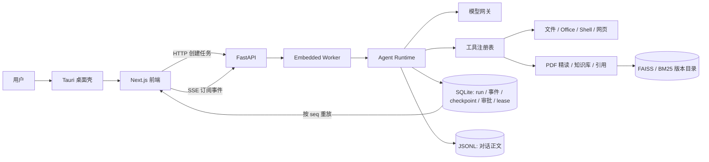

# 21 · WorkPilot Agent 岗大白话面试手册

> 这是 [`19-项目全景与面试作战手册.md`](19-项目全景与面试作战手册.md) 的大白话版。
> 原手册继续作为完整技术审计底稿；这份文档专门解决一件事：**让你应聘 Agent 岗时，能把项目讲明白、讲深入、讲诚实。**
>
> 事实口径：以 2026-08-24 的代码和原手册审计结果为准。没有实现的能力会明确标成“未实现”，历史实验不会冒充当前效果。

不用一次背完整篇：第一次先读第 0、2、4、11、13、14 节，把“产品—架构—Agent—评测—面试表达”串起来；第二次再补后端、工具、RAG 和前端细节；最后按第 17 节回到代码核对。

---

## 0. 先记住：这个项目到底是什么

一句大白话：

> **WorkPilot 是一个跑在用户自己电脑上的 AI Agent。它不只是聊天，还能读论文、找依据、操作文件、修改 Office 文档，并且尽量做到不乱动、不重复动、出错后能接着做。**

如果面试官只给你 30 秒，可以这样说：

> 我做了一个本地桌面 Agent，主打日常办公和论文阅读。办公侧能处理文件、Word、Excel、PPT、网页、Shell 和定时任务；阅读侧能按页读 PDF、跨论文检索，并让引用跳回原文。底层不是一次普通的模型请求，而是一套可恢复的工具循环：任务、事件和 checkpoint 会持久化，高风险操作要经过权限和人工审批，写操作用幂等 lease 防止崩溃恢复后重复执行。我还单独做了评测和回放，验证工具选择、引用、安全、恢复和成本，而不是只看回答像不像。

如果面试官问“你的核心亮点是什么”，优先回答这四条：

1. **Agent 能真的做事**：不是只生成文字，而是能调用文件、Office、Shell、网页、知识库等工具。
2. **做事过程可控制**：有目录授权、能力开关、人工审批、预算和取消。
3. **任务失败能恢复**：checkpoint 负责恢复状态，工具幂等负责避免重复副作用，SSE 事件负责恢复界面。
4. **效果可以被验证**：不只测答案，还测工具轨迹、引用、拒答、文件结果、安全和回归。

这四条比“我用了 FastAPI、FAISS、Next.js”更重要。技术栈是手段，不是项目价值。

---

## 1. 用户为什么需要它

WorkPilot 面向的是经常要读资料、写文档、整理文件的研究者、工程师和知识工作者。

### 1.1 日常办公的问题

普通聊天模型可以告诉用户“怎么改”，但最后还是用户自己在文件、Word、Excel、网页和终端之间来回搬运。

如果直接让模型操作电脑，又会出现几个危险问题：

- 模型会不会看到不该看的目录？
- 它会不会不经确认就执行危险命令？
- 用户正在编辑文件时，它会不会把新内容覆盖掉？
- 任务做到一半崩了，恢复后会不会再写一遍？
- 页面关了以后，长任务是不是直接没了？

所以办公 Agent 的难点不是“接一个文件工具”，而是让模型在真实世界里**安全、可恢复地做事**。

### 1.2 论文阅读的问题

普通 RAG 或长文本摘要很容易给出一个看起来合理的答案，但用户不知道它到底读了哪一页。

论文阅读有几个额外要求：

- 搜索到一句话，不代表模型理解了上下文。
- 引用必须能回到原 PDF 的具体页，最好还能高亮原文。
- 多篇论文的检索和单篇论文的精读不是一回事。
- 找不到依据时，系统应该拒答，而不是编一个引用。

所以阅读 Agent 的难点是让“模型说自己读过”变成**可以验证它真的读过**。

### 1.3 两条线为什么放在一个产品里

真实工作不是“读完就结束”。用户经常需要：

```text
读论文 → 找到证据 → 比较方法 → 得出结论
      → 写进周报 → 更新 Excel → 做成 PPT
```

如果阅读和办公是两个孤立应用，用户还得手工复制。WorkPilot 让它们共用同一个 run、同一份证据、同一套权限和工具循环，因此可以在一次任务里从“读懂”走到“交付”。

### 1.4 项目边界要主动说清楚

当前 WorkPilot：

- 是单用户、本地优先的桌面应用；
- 不是多租户 SaaS；
- 不替代完整的 Microsoft Office；
- 不做全网论文搜索平台；
- 不支持百万级向量库；
- 没有实现个人知识图谱；
- 没有实现可以任意写入的多 Agent 团队；
- 当前是 MCP client，不是 MCP server；
- 桌面签名、公证、自动更新等正式发布链还没做完。

面试里主动讲边界是加分项，因为这说明你知道“代码能跑”和“产品成熟”不是一回事。

---

## 2. 先看全景：系统是怎么拼起来的

可以把整个系统想成一家公司：

- **前端**是用户看得见的办公桌和进度看板；
- **FastAPI** 是前台接待，负责接请求、查状态和推事件；
- **worker** 是真正干活的人，页面关掉它也继续工作；
- **Agent runtime** 是项目经理，决定下一步调用什么工具；
- **工具层**是文件、Office、Shell、网页、阅读器和知识库；
- **模型网关**是统一的模型采购入口；
- **SQLite / JSONL / 文件目录**是档案室；
- **评测系统**是质检部门。



面试时不要按图从左到右念组件。要讲一条任务链：

> 用户创建任务后，API 先把 run、初始消息和 checkpoint 写好，再把状态改成 queued。worker 原子领取任务，从 checkpoint 恢复 Agent 状态。Agent 调模型决定下一步，工具真正执行前再做 capability、目录范围和审批检查；有副作用的工具还要先拿调用 lease。每一步的结果、checkpoint 和事件都会落库，前端通过 SSE 按序号接收，所以刷新页面也能重新还原进度。

### 2.1 为什么是本地桌面，而不是 Web SaaS

因为它要操作用户电脑上的真实文件。对单用户产品来说，本地模式还有三个好处：

- 私人资料默认不需要上传到平台数据库；
- 不要求用户安装 PostgreSQL、Redis、消息队列和对象存储；
- SQLite、JSONL 和普通目录更容易打包、迁移和备份。

代价是它不适合直接扩成企业多租户。以后如果要做企业版，真正要补的是身份、租户、ACL、审计和并发治理，不是简单把 SQLite 换成 PostgreSQL。

### 2.2 后端为什么强制分层

后端依赖方向大致是：

```text
API / Worker / CLI
        ↓
  Cowork 与 RAG
        ↓
     RunStore
        ↓
    Agent Core
        ↓
   模型网关
```

大白话解释：上层知道下层，下层不能反过来知道上层。

这样做是为了避免后期变成一锅粥：API 不应该直接操作模型 SDK，Agent 框架不应该知道某个具体页面，模型网关也不应该依赖业务表。仓库用 import-linter 自动检查这些规则，不只靠人记住。

重要代码入口：

- Agent 循环：[`backend/app/agent_core/loop.py`](../backend/app/agent_core/loop.py)
- Cowork 运行时：[`backend/app/cowork/runtime.py`](../backend/app/cowork/runtime.py)
- Worker：[`backend/app/worker/cowork_run.py`](../backend/app/worker/cowork_run.py)
- Run 与事件：[`backend/app/runstore/runs.py`](../backend/app/runstore/runs.py)
- 模型网关：[`backend/packages/workpilot-ai/src/workpilot_ai/gateway.py`](../backend/packages/workpilot-ai/src/workpilot_ai/gateway.py)

---

## 3. 后端设计：它不是一个“请求进来、回答出去”的普通接口

Agent 任务可能运行几分钟，期间还会等用户审批、执行工具、重试和恢复。因此它不能和一个 HTTP 请求绑死。

### 3.1 Run 是什么

一个 run 就是一次可以保存、暂停、恢复和审计的 Agent 任务。

它大致会经历这些状态：

```text
initializing → queued → executing
                     ├→ waiting_human
                     ├→ sleeping
                     ├→ completed
                     ├→ failed
                     └→ cancelled
```

为什么要先有 `initializing`？

因为创建任务不是只插一行 run，还要写初始消息、checkpoint 和事件。如果一开始就写成 queued，worker 可能在初始化完成前把它抢走，拿到一个残缺任务。

所以正确顺序是：

1. 创建 initializing run；
2. 写初始消息；
3. 写初始 checkpoint；
4. 写初始事件；
5. 最后才改成 queued。

### 3.2 为什么“内存队列 + SQLite”要同时存在

进程内队列像门铃，作用是让 worker 立刻知道有新任务；SQLite 里的 queued 状态才是真实包裹。

如果门铃丢了，worker 下次扫描数据库仍能找到任务。如果只用内存队列，进程一崩任务就没了。如果只轮询 SQLite，也能正确工作，只是响应慢一点。

这是一个很值得讲的设计：**快路径可以丢，事实源不能丢。**

### 3.3 Worker 为什么不跟页面绑定

用户创建 run 后，API 立即返回 `run_id`。worker 独立执行，前端只是订阅结果。

这样：

- 用户刷新页面，任务继续；
- SSE 断线，任务继续；
- 用户关掉页面，任务继续；
- 用户回来以后，可以从数据库重放事件。

只有用户明确点击停止，后端才写 cancel request。正在执行的工具不会被数据库强行改成“已取消”；worker 会在下一个安全检查点响应取消，避免出现“状态说停了，工具还在后台写文件”。

### 3.4 Worker 崩了怎么恢复

worker 领取 run 时会拿一个有过期时间的 lease，并定期续租。

watchdog 发现 lease 过期以后会检查：

- 有安全 checkpoint，而且恢复次数没有用完：重新排队；
- 没有 checkpoint：标记失败；
- 已经请求取消：进入取消终态；
- 恢复次数耗尽：标记失败，不无限重启。

这里的关键不是“自动重试”，而是**只有能证明安全时才恢复**。

### 3.5 后端存什么

| 存储 | 存的内容 | 为什么这么放 |
|---|---|---|
| SQLite | run、事件、checkpoint、审批、工具 lease、记忆、计划、成本 | 需要事务、索引和状态更新 |
| JSONL | 长对话正文 | 适合只追加，避免大段文本频繁改 SQLite page |
| 普通目录 | 知识库索引、附件、Artifact、Skill | 大文件更适合文件系统，发布时可用原子 rename |

对话正文采用 append-only：更新不是原地改旧记录，而是追加同一个 record id 的新版本，读取时取最后一条。它不等于完整 event sourcing，更准确的说法是：**关系型控制面 + 追加式消息正文**。

### 3.6 SQLite 的几个工程细节

- 开启 WAL，提高读写并发体验；
- 开启 foreign keys 和 busy timeout；
- 关键短事务用 `BEGIN IMMEDIATE`；
- 同一个 run 的复合操作再用分片 asyncio lock 减少交错；
- 时间统一存 UTC ISO 字符串，避免带时区字符串按字典序比较出错；
- 金额存整数 micro-USD，不用浮点数比较预算。

面试官问“SQLite 能不能并发”时，不要回答“能”或“不能”两个字。正确回答是：

> SQLite 支持多读，但写入仍需要协调。当前是单用户、单机、低并发，所以 WAL、短事务和按 run 分片锁够用；如果变成多用户高写并发，控制面才需要迁到服务数据库。

---

## 4. Agent 设计：最需要讲透的一部分

### 4.1 当前 Agent 不是一张很花哨的大图

当前真正运行的是一个很简单的两节点循环：

```text
          ┌──────────────┐
          │ decide       │  调模型：回答，或选择工具
          └──────┬───────┘
                 │ 有工具调用
                 ▼
          ┌──────────────┐
          │ execute_tools│  校验、审批、执行、记录
          └──────┬───────┘
                 └──────────────→ 回到 decide

没有工具调用 → 结束
需要人工 → waiting_human
需要等待 → sleeping
预算超限 / 取消 / 错误 → 对应终态
```

没有单独实现 planner 节点，也没有每轮都跑 reflection。

为什么？因为复杂的 Agent 图不自动等于更聪明。这个项目更在意的是：状态能不能保存、工具能不能管住、恢复会不会重复执行、错误能不能定位。把 planner 和 reflector 全都接上，会增加模型调用、延迟和新的失败点。

计划功能仍然存在，但它是模型通过 `propose_plan` 显式提交的外部状态，不是一个单独 planner Agent。用户批准前，写工具根本不会出现在模型可见工具里；批准后再进入执行模式。

### 4.2 Agent state 为什么必须能 JSON 序列化

Agent state 里会保存：

- run 和 conversation 标识；
- 用户目标；
- 消息历史；
- 当前模式和 capability；
- Todo 和 plan；
- 已读证据；
- 工具调用与待审批信息；
- 预算使用量；
- 压缩状态；
- 当前终态或错误。

它不能保存数据库连接、模型客户端、闭包、文件句柄这些运行时对象。

原因很简单：checkpoint 要把 state 变成 JSON 存进数据库。进程重启以后，新 worker 再把 JSON 读出来继续。如果 state 里混入活对象，恢复能力就只剩一句口号。

### 4.3 一轮 Agent 是怎么工作的

每一轮大致做这些事：

1. 从 canonical history 生成本次要发给模型的上下文视图；
2. 根据工作模式、capability、权限和已加载 Skill 计算模型能看见哪些工具；
3. 在模型调用前检查 token、调用次数、墙钟和费用预算；
4. 调模型，得到普通文本或结构化 tool call；
5. 如果是工具调用，先做参数 schema、能力、资源范围和审批检查；
6. 有副作用的工具先抢幂等 lease，再真正执行；
7. 工具结果写回 state，保存 checkpoint，追加事件；
8. 回到模型，让它根据观察决定下一步；
9. 没有工具调用时，校验引用并结束。

### 4.4 Checkpoint 和幂等不是一回事

这是 Agent 岗最容易被问、也是最值得拿分的一题。

checkpoint 只回答：**任务恢复时从哪里继续。**

它不回答：**checkpoint 后面的写操作到底有没有已经成功。**

举个例子：

1. Agent 修改了文件；
2. 进程还没来得及保存“修改成功”的 checkpoint 就崩了；
3. 恢复后又从上一个 checkpoint 开始；
4. 同一个写文件工具可能再执行一次。

所以副作用幂等必须放在工具边界。

WorkPilot 用下面的内容算一个稳定调用 identity：

```text
run_id + plan_step_id + tool_name + canonical_json(arguments)
```

然后走这样的协议：

1. 在 `tool_invocations` 里读取或创建记录；
2. 原子获取限时 lease；
3. 只有 lease 持有者能真正执行；
4. 成功后保存结果；
5. 相同 identity 再次出现，直接复用旧结果；
6. 只有 lease 过期且没有成功结果时，才允许重新执行。

面试标准答案：

> checkpoint 解决状态恢复，invocation identity + lease 解决副作用重放，attempt 记录解决每次尝试的审计和归因。三者不是一回事。

还要主动补一句边界：

> 这只能做到协议内 effectively-once。外部 API 已成功、但本地成功记录还没落盘时进程崩溃，如果下游不支持幂等 key，系统仍然无法证明外部动作是否发生过，所以不能宣称绝对 exactly-once。

### 4.5 HITL 是怎么做的

HITL 就是 human in the loop，中文是“关键时刻让人确认”。

系统不会只在 prompt 里告诉模型“危险时记得问用户”，而是把中断变成持久状态：

- run 进入 `waiting_human`；
- 写入 interrupt 事件；
- 保存 resume token 和 tool call id；
- 用户批准或拒绝时，后端同时校验这两个值；
- 校验通过才从 checkpoint 恢复。

为什么要两个值？因为用户可能同时开着多个任务，旧审批不能串到另一个工具调用上。

### 4.6 Capability、Permission、Approval 要分开

这三个词很容易混：

| 概念 | 大白话 | 例子 |
|---|---|---|
| Capability | 这类能力是否允许出现 | 阅读模式不应该看到写文件工具 |
| Permission scope | 允许作用到哪些资源 | 只能写用户点名的工作目录 |
| Approval | 这一次具体动作是否要人确认 | 执行某条 Shell 命令前弹确认 |

批准一份计划，不等于以后所有写操作都免审；批准一次 Shell，也不会自动扩大目录权限。

### 4.7 怎么防 Agent 死循环

只设一个 `max_steps=20` 太粗糙，因为 Agent 可能在前 10 步已经白烧钱。

当前有几层保护：

- 同一规范化工具签名连续出现超过 3 次，阻断；
- 连续两轮所有调用都是重复调用，下一轮收回工具并要求直接收尾；
- 模型调用次数、token、active wall time 可分别设上限；
- 每个工具有 timeout；
- 用户可以取消；
- 每日费用有调用前 reservation，避免并发超支。

active wall time 不计算等待用户审批的时间，因为它要限制的是机器失控执行，不是限制用户思考多久。

### 4.8 为什么不默认做 Reflection

Reflection 会再调用一次模型，让模型检查自己。听起来很合理，但它有三个代价：

- 成本和延迟增加；
- 检查模型也可能犯错；
- 确定性工具已经给出明确结果时，再反思没有多少价值。

当前正式运行时没有单独 reflector 节点，用重复调用熔断、schema 校验、工具结果检查、引用校验和评测来承担更确定的质量控制。

不要在面试里说“我做了 planner-executor-reflector 多 Agent 架构”，那是旧蓝图，不是当前实现。

### 4.9 只读子 Agent 是什么

当前有一个 `explore` 子 Agent，用于并行探索资料，但边界很收敛：

- 独立上下文；
- 只能拿只读工具；
- 最多 4 轮、8 次工具调用；
- 和父任务共享总预算；
- 工具前检查取消；
- 进度会通过事件展示给用户；
- 最终用 light tier 压缩探索结果。

它不是可以自由委派写操作的多 Agent 团队。面试时把它称为“受限只读探索子 Agent”最准确。

---

## 5. 工具系统：Agent 的手怎么被管住

### 5.1 工具不是一个 Python 函数就结束了

一个可用工具至少需要这些信息：

- 名称和参数 schema；
- 什么时候该用；
- 什么时候不该用；
- 风险类型：只读、写入还是外部操作；
- 副作用类型：文件、内部存储还是外部系统；
- 需要什么 capability；
- 资源目标是什么；
- 是否需要审批；
- timeout 和结果大小限制；
- 失败以后给模型什么可执行提示。

工具错误应该写给模型看，而不是只返回堆栈。例如：

```text
差：ValidationError: field required
好：缺少 start_date，请使用 YYYY-MM-DD，例如 2026-08-01
```

因为模型收到第二种错误以后，下一轮知道怎么修参数。

### 5.2 为什么不把所有工具都塞给模型

工具越多，prompt 越长，模型越容易选错，也越难做权限治理。

WorkPilot 先给模型一个工具 catalog，需要时再加载 Skill 或 MCP 工具。最终可见工具由这些条件共同决定：

- 当前是办公还是阅读模式；
- 会话打开了哪些 capability；
- 用户授权了哪些目录或网络范围；
- 当前是计划阶段还是执行阶段；
- Skill / MCP 是否已经加载并通过策略检查。

当前可以说“31 个核心工具，加上按 capability、Skill 和 MCP 渐进加载的扩展工具”。不要把动态总数写死成永远不变的数字。

### 5.3 文件授权怎么防越界

一个文件路径不能只检查“字符串以授权目录开头”。例如 `/tmp/work` 和 `/tmp/work-secret` 的字符串前缀可能误判，符号链接也可能跳出目录。

后端会做这些检查：

- 必须是绝对路径；
- 授权根真实存在；
- 路径规范化后仍在根目录内；
- 拒绝 NUL 和 `..` 逃逸；
- 解析符号链接后不能越界；
- 文件类型必须符合工具声明。

前端文件选择器只是用户体验，后端不能信任它，必须再校验。

### 5.4 怎么避免覆盖用户刚改的文件

模型第一次读文件时记录 SHA-256 baseline。真正写入前再算一次：

- hash 一样：说明文件没有被别人改，可以继续；
- hash 不一样：说明用户或其他程序已经改过，拒绝覆盖，让 Agent 重新读取。

写入时还会：

1. 创建数量受限的备份；
2. 在同目录写临时文件；
3. `fsync`；
4. 保留原权限 mode；
5. 用 `os.replace` 原子替换。

这叫 optimistic concurrency control，中文可以说“乐观并发控制”：平时不锁住用户编辑器，提交时再检查有没有冲突。

### 5.5 Shell 怎么控制风险

Shell 命令先经过 `shlex` 分析。

- 简单 argv 命令可以直接执行；
- 一旦出现管道、重定向、`;`、反引号、`$()` 或换行，就按 shell command 处理；
- 这种复杂命令永远不能命中免审批规则；
- 执行环境最小化，没有 stdin，有 timeout 和输出上限；
- 取消时终止整个进程组，避免留下子进程。

另外还有 Docker / Podman 沙箱：禁网、只读 rootfs、drop capabilities、限制 CPU / 内存 / PID，只挂载授权目录。容器不可用时明确失败，不会悄悄退回宿主机执行。

### 5.6 Artifact 是什么

Artifact 是 Agent 真正生成或修改的文件结果，例如周报、Excel 或 PPT。

系统在工具执行前后扫描授权工作区，找出新增或修改文件，然后：

- 重新打开验证格式；
- 记录 hash；
- 生成预览；
- 保存执行前快照；
- 提供文本、DOCX、XLSX、PPTX、PDF 的语义 diff。

很重要的边界：如果 Shell 已经成功，但 Artifact 扫描失败，只能报告“后处理失败”，不能为了补扫描把 Shell 再执行一遍。

### 5.7 为什么 Office 用 Skill + Shell

没有为 Word、Excel、PPT 各做几十个模型原生工具，而是：

- Skill 告诉模型格式操作规则；
- Shell 调用成熟 Python 库或 CLI；
- 所有文件继续复用同一套目录授权、审批、备份和 Artifact 协议。

这样工具面更小、格式能力更容易扩展。代价是依赖管理更复杂，而且“文件能重新打开”不等于视觉排版一定完美，所以仍要预览或人工检查。

---

## 6. 论文阅读与 RAG：Agent 怎么做到“有依据地回答”

### 6.1 单篇精读和跨论文检索为什么分开

单篇精读关注的是“这份 PDF 的第几页说了什么”；跨论文检索关注的是“很多资料里哪些内容相关”。

| 场景 | 单篇精读 | 跨论文知识库 |
|---|---|---|
| 输入 | 用户正在看的原文件 | 多个已经建索引的文件 |
| 位置 | PDF 物理页、bbox | 文件、页码、chunk |
| 搜索作用 | 只帮助导航 | 检索结果可以成为回答证据 |
| 是否需要建向量索引 | 不需要 | 需要 |

把它们强行统一会丢掉“模型到底读了哪一页”的语义。

### 6.2 搜索过不等于读过

在单篇阅读模式里：

- `search_material` 只给导航 snippet；
- `read_material` 才把完整页或章节放进已读证据；
- `reader_goto` 可以跳页，但 quote 要匹配才能高亮；
- `reader_annotate` 是持久写入，quote 不精确就直接拒绝。

所以模型不能搜到一句就马上引用。它必须先 read，再 claim。

这条规则对应一个很好的 Agent 岗概念：**工具调用本身不是事实，只有通过验证并写入 evidence ledger 的结果才是可用事实。**

### 6.3 PDF locator 和 bbox 是什么

locator 是材料里的稳定位置：

- PDF 使用从 1 开始的物理页码，空白页也算；
- Markdown / 文本使用章节。

空白页不能跳过，否则后面所有页都会错一位。

PDF 高亮不只存四个 bbox 数字，还要存：

- 页面宽高；
- rotation；
- 坐标原点；
- 归一化 bbox；
- 多区域 locations。

因为不同 PDF 渲染器和旋转页面的坐标系不一样，只存四个数字很容易高亮错位。

### 6.4 引用怎么防伪造

模型真正读过的内容会进入 evidence ledger，并分配引用 id。

最终回答检查：

- 引用 id 是否存在于当前 ledger；
- 引用 quote 能不能回到原文；
- 有事实断言的回答是否缺引用；
- 代码块里的 `[S1]` 是否只是示例，而不是真引用。

如果引用有问题，系统会专门做一次 citation repair。修复仍失败，就让 grounded answer 失败，而不是交付一个看起来流畅但没有依据的答案。

### 6.5 知识库怎么建

每个知识库是一个目录，里面有：

- manifest；
- 按内容 hash 保存的 source snapshot；
- 多个 `versions/<version_id>`；
- 每个版本自己的 FAISS、BM25 和元数据。

每个版本会记录 embedding model、维度、revision、分块配置和文档 hash。

构建新版本时：

1. 先写 staging 目录；
2. 完整构建索引；
3. 校验文件和签名；
4. rename 成正式版本；
5. 最后原子更新 active manifest。

失败时旧 active 继续服务，不会把半成品切上线。

为什么 embedding signature 很重要？因为旧文档向量和新查询向量如果来自不同模型，系统通常不会报错，只会安静地返回错误结果。这种无声失败比显式报错危险得多。

### 6.6 检索链路是什么

当前链路是：

```text
query
  ├→ FAISS IndexFlatIP 稠密检索
  └→ BM25 词法检索
          ↓
        RRF 融合
          ↓
   可选 cross-encoder reranker
          ↓
       top-k 证据
```

FAISS 中向量先做 L2 归一化，之后 inner product 就等价于 cosine similarity。

为什么是 `IndexFlatIP`，不是 HNSW？

因为当前是个人小型知识库，精确扫描简单、结果可解释，也不用调近似召回参数。代价是数据量很大以后查询时间线性增长，到百万级向量才应该考虑 HNSW、IVF 或专用向量数据库。

### 6.7 为什么用 RRF

BM25 分数和 cosine 分数不是一个量纲，直接相加需要做归一化和权重调参。

RRF 只看每一路排名：

```text
RRF(d) = Σ 1 / (k + rank_i(d))
```

它不是理论上永远最好，而是在当前标注规模下参数少、稳定、容易解释。项目试过 lexical weight 0.75，没有明确收益，所以保留等权基线。

### 6.8 Reranker 为什么默认关闭

离线实验里 reranker 的排序指标有明显改善，但仍有三点限制：

- dev 集还没有完成人工复核；
- 调参和评测用了同一批数据，没有独立 holdout；
- 模型约 2.3 GB，并增加约 655ms 延迟，桌面分发成本高。

所以当前策略是：可选、超时后 fail-open 回到 RRF、默认关闭。

这是很适合面试讲的决策：**指标变好不等于应该立刻上线，还要看数据可信度、延迟和产品分发成本。**

---

## 7. 记忆：Agent 怎么“记住用户”，又不把旧话当成永远正确

### 7.1 当前实现了什么

长期记忆按 scope 分为：

- global：所有工作区都可见；
- workspace：某个工作目录可见；
- conversation：某个会话可见。

内容类别包括 preference、profile、interest 和 fact。每条记录还保存来源、置信度、是否 pin、开始生效时间、失效时间和替代关系。

知识图谱没有实现，不能说“三层记忆已经包含知识图谱”。

### 7.2 为什么不直接覆盖旧偏好

用户过去说“我在做多模态检索”，现在说“我转做 Agent 评测了”。

如果直接覆盖，历史就没了；如果一个旧的异步任务晚到，还可能把旧偏好重新写回当前。

WorkPilot 的做法是：

- 旧记录写 `invalid_at`；
- 新记录写 `valid_from`；
- 旧记录用 `superseded_by` 指向新记录；
- 当前查询只取仍然有效的记录。

这样既能回答“现在关注什么”，也保留“之前关注什么”。

### 7.3 两阶段提取

对话结束后，后台任务做两次轻量模型调用：

1. 从对话中提取最多 6 条候选事实；
2. 对照最近 active memories，判断 ADD / UPDATE / DELETE / NOOP。

source snapshot 会冻结，`valid_from` 使用原始对话事件时间，不使用后台任务完成时间。因此迟到的旧任务可以进入历史，但不会覆盖更晚的新事实。

### 7.4 记忆是否真的提升了效果

当前诚实结论是：机制能运行，实验中模型更经常正确使用记忆，但端到端任务质量没有被证明提升，而且出现了回归，总门禁失败。

所以简历可以写记忆机制和时序冲突消解，不要写“记忆显著提升个性化质量”。

---

## 8. 模型网关、上下文和成本

### 8.1 为什么所有生成模型都要走网关

如果业务代码直接调用不同供应商 SDK，会带来这些问题：

- 每处都要自己处理消息格式；
- fallback 行为不一致；
- token 和费用统计漏记；
- 预算无法统一拦截；
- trace 无法串起来；
- 换模型要到处改代码。

所以 `workpilot-ai` 把 OpenAI-compatible、Anthropic 和 Gemini 统一成一套消息、工具、usage 和 streaming delta 协议。

当前有 `light / main / heavy / external` 四个逻辑档位。业务只说“这是什么任务”，路由配置决定用哪个 provider 和 model。

### 8.2 Fallback 有什么边界

只有流式首字节发出前才能换模型。用户已经看到一半答案以后再切模型，会把两种模型的输出拼起来，破坏语义和事件协议。

预算不足也不能触发 fallback，因为换模型不能成为绕过预算的办法。

评测模式必须关闭 fallback，否则报告写的模型和真实执行模型可能不一样，实验不可复现。

### 8.3 Prompt cache 和答案缓存不是一回事

- **Prompt cache**：供应商复用稳定的输入前缀；
- **Completion cache**：本地直接复用一次完整回答。

WorkPilot 把稳定内容放在前缀：system、工具定义、环境、记忆、persona、工作模式和预检索；把会变化的 Todo、当前目录、grant、plan 和阅读位置放在后面，提升 prompt cache 命中。

Completion cache 只用于 temperature=0 的完整非流式成功结果，流式回答不缓存，避免伪造流式时序和取消语义。项目不做模糊语义答案缓存，因为“看起来相似”的问题可能对应不同知识版本、权限和时间，错误命中会安静地给出错答案。

### 8.4 上下文压缩怎么做

canonical history 永远不改，压缩只生成本次发给模型的视图。

- 旧对话先滚动摘要；
- 工具调用和工具结果按完整轮保留，不能只留下半轮；
- 超长工具结果再裁剪；
- 如果 provider 仍报 context overflow，只有压缩后 token 确实下降才允许重试；
- reasoning 和最终 answer 分开，避免把内部推理当成正式消息。

### 8.5 成本怎么记

云模型成本按输入、输出、cache read、cache write token 分开计算，内部存整数 micro-USD。未知成本是 `NULL`，不能当 0。

每日预算在调用前先 reservation，调用完成后按实际 usage settle。这样多个并发请求不能同时看到“还有余额”然后一起把预算打穿。

自建 GPU 成本不能用“每个请求 latency × GPU 单价”相加，因为并发请求共享同一段 GPU 时间。正确口径是按批次 wall time 摊到完成任务数，并同时报告吞吐、batch 和并发。

---

## 9. 前端设计：不是做个聊天框，而是把 Agent 黑盒变成玻璃盒

Agent 前端的价值不只是好看，而是让用户知道：

- Agent 现在在做什么；
- 为什么停下来；
- 调了什么工具；
- 哪一步失败了；
- 它想改哪个文件；
- 引用来自哪一页；
- 页面刷新后任务是否还在；
- 最终到底生成了什么。

### 9.1 技术结构

当前使用：

- Tauri 2 桌面壳；
- Next.js 16 + React 19；
- TypeScript strict；
- 原生 CSS；
- react-markdown；
- 自写 SSE 客户端。

没有使用 Vercel AI SDK，因为事件不只有 token delta，还包括 plan、tool、interrupt、Artifact、citation、reader、memory 和 run terminal。强行套通用聊天 SDK，最后仍要绕开它的抽象。

### 9.2 Cowork 页面怎么分

可以把主界面理解成三块：

```text
左侧：会话、知识库、模型、Skill、自动化等入口
中间：对话、计划、Todo、工具步骤、审批和输入
右侧：办公模式看 Artifact 预览/diff；阅读模式看 PDF 原文和高亮
```

另外还有 Knowledge、Automations、Connectors、MCP、Providers、Skills、Memory 和 Cost 页面。

### 9.3 SSE 怎么做到断线恢复

每个后端事件都有：

```text
run_id + 单调递增 seq + type + data
```

服务端流程：

1. 先订阅本地唤醒 bus；
2. 再查询 `after_seq` 后的历史事件；
3. 分批回放；
4. 没有新事件时发 heartbeat；
5. 新事件到来后继续查数据库。

为什么先订阅、后查历史？

如果先查到 seq=10，再订阅，而 seq=11 恰好落在两步中间，11 就永久丢了。先订阅可以关闭这个竞态。

前端保存每个 run 的 cursor，任何 `seq <= cursor` 的事件都丢弃。因此重复投递不会重复渲染。

### 9.4 为什么事件 reducer 要是纯函数

实时事件、断线补发和从 0 完整回放，最终必须得到同一个 UI 状态。

所以前端把核心逻辑写成：

```text
旧 RunState + 新 Event → 新 RunState
```

同一个 reducer 同时处理实时流和 replay。这样可以用固定事件序列做确定性测试，也不会让每个 React 组件自己解释一遍协议。

代码入口：

- 协议：[`frontend/src/lib/run-protocol.ts`](../frontend/src/lib/run-protocol.ts)
- reducer：[`frontend/src/lib/run-state.ts`](../frontend/src/lib/run-state.ts)
- SSE：[`frontend/src/lib/use-run-stream.ts`](../frontend/src/lib/use-run-stream.ts)
- Cowork 状态：[`frontend/src/lib/use-cowork-run.ts`](../frontend/src/lib/use-cowork-run.ts)

### 9.5 前端必须能回答的三个问题

**流式生成时刷新页面怎么办？**

重新按 run id 从 seq=0 或已知 cursor 回放事件，再接实时流；worker 一直在后端运行。

**SSE 断线怎么不重不丢？**

服务端事件先落库并有 seq；连接带 `Last-Event-ID` / `after_seq`；前端按 cursor 去重。

**长任务时关页面怎么办？**

只关闭观察连接，不取消 run。回来后通过事件重建时间线。

这三题表面是前端题，本质是在考你是否理解 Agent 任务和 HTTP 连接的生命周期分离。

### 9.6 Reader 怎么工作

PDF 页面由 canvas 渲染，上面叠加可选文字层和高亮层。用户点击 `[p.N]` 或 `[S1]`：

1. 找到对应材料和 locator；
2. 跳到物理页；
3. 根据归一化 bbox 还原高亮；
4. quote 不匹配时只跳页，不画错误高亮；
5. 批注写入失败也不能让 PDF 阅读本身白屏。

### 9.7 Artifact 前端为什么重要

用户不能只听 Agent 说“文件改好了”，必须看到：

- 哪个文件变了；
- 是新增还是修改；
- 预览能不能打开；
- 文本、单元格、公式或幻灯片内容改了什么；
- 没有 baseline 时为什么不能显示 diff。

预览和 diff 并行加载，一个失败不应该阻塞另一个。

### 9.8 当前前端债务

Cowork 主页面和 API client 仍然偏大。后续应该按 conversation、run control、HITL、Artifact、Reader 等领域继续拆分，并把更多状态逻辑移到可单测的纯函数中。

面试时不要把“页面多”当亮点，真正的亮点是**事件驱动的恢复、一致性和错误态设计**。

---

## 10. 安全设计：Agent 岗不能只讲能力，不讲约束

### 10.1 桌面 API 为什么还需要 token

只绑定 `127.0.0.1` 还不够，本机恶意网页或其他进程也可能访问 localhost。

Tauri 启动时生成随机 token，注入 sidecar；前端请求和 SSE 都要携带。后端还限制 CORS，owner identity 由服务端确定，不信任请求体。

### 10.2 网页读取怎么防 SSRF

系统会：

- 只允许 HTTP / HTTPS；
- 禁止 URL userinfo；
- IDNA 规范化域名；
- DNS 解析后拒绝内网和非 global IP；
- 固定已经检查过的 IP 去连接；
- Host 和 TLS SNI 仍保留原域名；
- 禁用环境代理；
- 每次重定向都重新检查；
- 限制响应大小、跳转次数和 MIME。

为什么要固定 IP？因为攻击者可能第一次 DNS 返回公网地址通过校验，第二次真正请求时返回 127.0.0.1，这叫 DNS rebinding。

### 10.3 MCP 为什么不能全部自动开放

MCP 工具来自外部程序，schema 还可能发生变化，所以必须：

- server 明确配置；
- catalog hash 固定；
- 每个工具逐项启用；
- 语料出站要有 `corpus_allowed`；
- 外部写操作要额外 capability 和逐次审批；
- stdio server 要有本机信任。

当前没有字段级 taint tracking，所以采用粗粒度的 fail closed，比假装能精确追踪安全。

### 10.4 Secret 加密的真实边界

OAuth token 等使用 Fernet 加密，主密钥单独保存，文件尽量 0600，目录 0700，写入使用临时文件加原子替换。

但密文和主密钥仍在同一台机器。能读取用户全部文件的高权限攻击者仍可能同时拿到两者，所以它不是硬件密钥或云 KMS。

---

## 11. 评测：怎么证明 Agent 改完以后真的更好

### 11.1 为什么不能只看最终答案

Agent 任务可能出现这些情况：

- 最终话术很好，但工具选错了；
- 文件看起来改了，其实写了两次；
- 回答有引用，但引用是编的；
- 任务完成了，但越权访问目录；
- 正确率涨了，但 token 和延迟翻倍；
- 总分涨了，但一个安全 case 从通过变成失败。

所以评测要覆盖：

- task success；
- tool selection；
- tool error；
- tool budget；
- guardrail / HITL；
- Artifact 结果；
- read-before-claim；
- citation / locator；
- retrieval Recall、nDCG、MRR；
- refusal；
- token、延迟和成本。

### 11.2 评测系统怎么分层

```text
Suite 样本
  ↓
Runner 跑真实被测路径
  ↓
Raw report 保存逐 case observation
  ↓
Normalizer 统一不同轨道的报告形状
  ↓
Baseline + Policy
  ↓
Regression Gate 给出 0 / 1 / 2
```

- `0`：可比较，而且所有规则通过；
- `1`：可比较，但质量、成本或安全回退；
- `2`：不能安全比较，例如 suite、配置、case、指标分母或完整性对不上。

为什么 exit 1 和 exit 2 必须分开？

因为“模型真的变差了”和“尺子坏了”不是同一个问题。把尺子坏了当质量回退，会引导错误优化；把它当通过更危险。

### 11.3 为什么不只接 Ragas

Ragas 适合回答相关性和 faithfulness，但很难直接表达：

- 写操作有没有重复；
- HITL 状态是否正确；
- 路径有没有越权；
- 搜索以后有没有真正 read；
- 页码和 bbox 是否正确；
- 事件流能不能重建 UI；
- scorer 改了以后能不能不重跑模型就重新打分。

所以项目自建了理解自己 Agent 协议的评测层。不是因为通用框架不好，而是被测对象超出了普通 RAG answer 的范围。

### 11.4 几种“回放”别混着说

| 名称 | 大白话 | 会不会重新调用模型 / 工具 |
|---|---|---|
| Event replay | 把已经记录的 UI 事件重新折叠成界面状态 | 都不会 |
| Offline rescore | 用旧 observation 跑新 scorer | 都不会 |
| Checkpoint recovery | 生产任务从中断处继续 | 可能会 |
| Live rerun | 用当前代码和模型重新跑 suite | 都可能会 |
| Model cassette replay | 用录好的模型输入输出代替真实模型 | 不调真实模型，但会跑受限 fixture 工具 |
| Full execution cassette | 连工具、RAG、外部世界也全部录制和短路 | 未实现 |

面试里最容易说错的是“支持完整 Agent 回放”。当前只完成事件回放、离线重评分和 fixture 范围模型 cassette，不是生产全链路确定性重演。

### 11.5 最值得讲的评测故事：22.5 个百分点的假回归

一次架构调整后，Agent 成功率掉到 52.5%，直觉上像是模型或 prompt 变差了。

逐 case 检查后发现，评测集还引用旧工具和旧 capability，其中一些任务在当前工作模式下根本不可解。修正 suite 的可解性以后，结果回到 82.5%，后续三次是 87.5%、82.5%、87.5%。

这个故事的重点不是“修复以后涨了 30 分”，而是：

> **评测系统自己也会出 bug。优化模型以前，要先确认任务可解、配置一致、样本和指标口径可比较。**

这比只讲“我把准确率调高了”更能体现 Agent 评测能力。

### 11.6 当前评测能说什么

可以说：

- 有统一 normalizer、policy 和三态 regression gate；
- 有事件 bundle 的完整性校验和确定性 fold；
- 有 observation offline rescore；
- 有严格 request hash、零真实模型 dispatch 的 fixture model cassette；
- 有 Cowork、文件系统 KB retrieval、grounded generation 三条轨道的契约。

不能说：

- 三条新正式 baseline 已经可以用于发布；
- grounded generation 已完全接回当前生产链；
- nightly 已稳定持续运行；
- synthetic / pending-human suite 代表真实产品质量；
- 支持完整生产 Agent execution replay。

原手册 2026-08-24 的本地审计记录是 881 个后端测试、42 个使用 mock backend 的 Playwright E2E、5 个 reranker 测试，共 928 个自动化用例。这个数字只能带日期和验证边界使用，不能扩写成“生产全链路通过”。

---

## 12. 关键技术取舍：面试官真正想听的是“为什么”

| 选择 | 为什么选 | 代价 |
|---|---|---|
| 自研两节点工具循环 | 对状态、审批、预算、事件和恢复有直接控制 | 图分支变复杂后维护成本会上升 |
| SQLite + JSONL + 目录 | 单用户本地应用，零外部服务、好打包 | 不适合多用户高写并发 |
| Tauri | 壳轻，Rust 适合管理 sidecar 和本机生命周期 | 跨平台打包、签名和 Python sidecar 更复杂 |
| SSE + 持久事件 | 主要是服务端单向推送，天然支持按 seq 重连 | 高频双向协作不如 WebSocket 自然 |
| 工具边界幂等 | checkpoint 不能防副作用重放 | 外部系统不支持幂等 key 时仍有不确定窗口 |
| FAISS FlatIP | 个人小库精确、简单、可解释 | 数据量很大时线性扫描 |
| BM25 + RRF | 同时利用关键词和语义，避免直接混加不同量纲分数 | 有足够标注后，学习式融合可能更好 |
| 单篇阅读不建库 | 保留物理页、bbox 和“实际读过”语义 | 大范围跨材料关联仍要知识库 |
| Skill + Shell | 缩小工具面，复用文件安全协议 | Office 视觉保真仍要人工或专门 QA |
| 自建 eval | 能测 Agent 轨迹、恢复、安全和 locator | 指标、runner 和数据集维护成本高 |

一个通用回答模板：

> 当时的问题是 X，约束是 Y。我比较过 A 和 B，最终选 A，因为它更符合当前单用户、本地、可恢复的目标。代价是 Z。如果数据量、并发或产品形态变化到某个条件，我会重新选择 B。

---

## 13. 面向 Agent 岗，你应该怎么包装这个项目

### 13.1 你的主线不是“我做了一个全栈应用”

建议把自己定位成：

> **我做的是一个能在真实文件和知识环境里可靠执行的 Agent 系统。后端解决状态、工具、副作用和恢复；RAG 解决证据接地；前端解决执行过程和风险的可见性；评测解决改动是否真的有效。**

### 13.2 推荐的四条简历内容

**WorkPilot｜本地日常办公与论文阅读 Agent**　`[角色｜时间｜链接]`

- 设计自研“决策—工具—观察”循环，使用 JSON 化 state、checkpoint、HITL、上下文压缩、三维预算和重复调用熔断，支持长任务暂停、恢复和运行中纠偏。
- 将幂等下沉到工具副作用边界，用 `run + step + tool + canonical args` 生成稳定 invocation identity，结合数据库 lease 和成功结果复用，避免崩溃、重复确认和 checkpoint 重放导致重复写入。
- 构建办公与论文阅读两种工作模式：办公侧组合文件、Office、Shell、网页与 Artifact；阅读侧用 read-before-claim、evidence ledger、页码 / bbox 和版本化 FAISS + BM25 + RRF 约束引用，两侧共享同一个 run 和权限体系。
- 建立覆盖任务完成、工具选择、安全、引用、检索、成本的版本化评测体系，支持三态 regression、事件回放、离线重评分和 fixture model cassette，并通过 suite 可解性审计定位一次 22.5pt 假回归。

如果简历只能留三条，优先保留：

1. Agent 循环与恢复；
2. 工具幂等与安全；
3. 评测与证据接地。

### 13.3 2 分钟面试开场

> 我做 WorkPilot 的出发点是，普通大模型会回答，但很难在真实文件环境里可靠地连续做事。这个项目有日常办公和论文阅读两个工作模式：办公侧可以操作文件、Word、Excel、PPT、网页和 Shell；阅读侧可以按页读 PDF、跨论文检索，并让引用回到原文。两者可以在一个 run 里完成“读论文—形成结论—更新周报和表格”。
>
> 我最关注的不是工具数量，而是 Agent 的可靠执行。后端把一次任务建模成持久 run，worker 和 HTTP 连接解耦；Agent 使用 JSON 化 state 和 checkpoint 恢复，但我没有把 checkpoint 当成幂等，而是在副作用工具边界设计稳定 invocation identity 和 lease，避免崩溃恢复后重复写文件。工具执行前还会分别检查 capability、资源 scope 和本次 approval。
>
> 在知识接地上，我把单篇精读和跨论文检索分开。单篇阅读要求 search 以后必须真正 read，只有 evidence ledger 里的内容才能引用；知识库使用版本化 FAISS FlatIP、BM25 和 RRF，新索引完整构建后再原子激活。前端通过持久 SSE 事件和纯 reducer 支持刷新恢复，并把计划、工具、审批、引用和 Artifact 变成用户可见状态。
>
> 最后我做了独立评测层，不只测回答，还测工具选择、HITL、安全、引用、检索和成本。一次指标掉到 52.5% 时，我最后发现不是模型退化，而是 suite 里有当前系统不可解的旧任务。这让我把“先证明可比较，再讨论好坏”做成了三态 regression gate。

---

## 14. Agent 岗高频追问与大白话答案

### Q1：为什么不用 LangGraph 等通用框架？

不是因为通用框架做不到，而是当前图只有“决策—执行工具”两个核心节点，真正复杂的是 checkpoint、审批、预算、事件和副作用幂等。自研循环能把这些协议直接做成显式状态并单测。以后如果复杂分支明显增加，也可以重评通用框架，但不能把可靠性责任交给框架名字。

### Q2：长任务做到一半崩了，怎么继续？

worker lease 过期后由 watchdog 检查是否有安全 checkpoint；有就重新排队并恢复 state。已经成功的副作用工具通过 invocation identity 复用结果，不重复执行；attempt 表记录每次尝试。没有安全 checkpoint 或恢复次数耗尽就失败，不盲目重跑。

### Q3：有 checkpoint 为什么还会重复写？

因为写操作可能发生在 checkpoint 之后、本次成功状态落盘之前。恢复只知道上一个保存点，不知道外部副作用是否已经发生。所以幂等必须在工具边界单独做。

### Q4：能保证 exactly-once 吗？

只能保证本地协议可见范围内 effectively-once。对支持 idempotency key 的下游透传同一个 key；不支持的外部系统仍有“外部成功、本地未提交”的不确定窗口，需要 reconciliation 或人工确认。

### Q5：怎么防 Agent 越权？

模型是否看得见某类工具由 capability 控制，能作用到哪个目录或网络范围由 permission scope 控制，这一次是否需要用户确认由 approval 控制。真正执行时后端重新做 canonical path、symlink 和 scope 校验，不相信前端或 prompt。

### Q6：怎么防死循环？

对规范化工具签名计数，超过 3 次阻断；连续两轮全是重复调用就收回工具并要求收尾；再叠加 calls、tokens、active wall、tool timeout、取消和每日费用预算。

### Q7：为什么不做 planner-executor-reflector？

当前没有证据证明多两个模型节点能抵消成本、延迟和新失败点。计划可以作为显式 Todo / plan 外置；校验则更多依靠 schema、工具结果、引用验证、熔断和离线评测。复杂不是目标，可验证才是。

### Q8：工具描述怎么写才能减少选错？

除了“能做什么”，还要写“什么时候不要用”、参数约束、正反例和面向模型的错误修复提示。工具也不能一次全暴露，要按模式和 capability 渐进加载。

### Q9：为什么 SSE，不用 WebSocket？

当前主要是服务端向前端推送事件，用户审批和取消走普通 HTTP。SSE 更简单，并且原生支持事件 id；结合持久 seq 可以断点续传。如果未来变成高频双向协作或多人实时编辑，WebSocket 更合适。

### Q10：SSE 怎么做到不重不丢？

事件先落 SQLite，再通知；服务端先订阅通知再查历史，避免建连竞态；客户端带上次 seq 重连，并按 cursor 去重。严格说通知可以丢，数据库事件不能丢。

### Q11：为什么单篇 PDF 不直接放进向量库？

单篇精读需要物理页、bbox 和“模型实际读过”语义。向量 chunk 更适合跨文档找候选，但会弱化原文件位置和上下文边界，所以两条路径分开。

### Q12：怎么防引用是模型编的？

只有工具真正 read 后验证过的内容才进 evidence ledger；最终回答只能引用 ledger 里的 id。未知引用、缺引用或 quote 对不上会触发一次 repair，仍失败就不交付 grounded answer。

### Q13：为什么用 BM25 + FAISS + RRF？

关键词检索擅长术语、编号和专名，向量检索擅长语义改写。两路分数尺度不同，所以用只看排名的 RRF 融合，减少分数校准和小样本调参。

### Q14：如果数据量涨 100 倍，哪里先崩？

先看 FlatIP 线性扫描和文档变化后的全量 BM25 重建，其次是单进程 SQLite 写竞争。先 benchmark，再考虑 HNSW / IVF、可保持版本一致的增量 lexical index、独立 indexing worker。只有多用户并发真的出现，才迁控制面数据库。

### Q15：记忆冲突怎么办？

不覆盖旧记录，而是让旧记录失效，新记录带自己的生效时间。迟到的旧 extraction 使用源事件时间，所以能写进历史，但不会覆盖更晚的当前偏好。

### Q16：记忆真的提升质量了吗？

目前只能证明模型更常正确使用记忆，不能证明端到端任务质量提升，因为 A6 总门禁失败并有回归。这个结论也应该保留，而不是挑好看的子指标。

### Q17：为什么评测时关闭 fallback？

否则报告声明的模型和实际执行模型可能不一样，改动不可复现，也无法知道收益来自候选模型还是兜底模型。

### Q18：为什么一个指标涨了还不采用？

点估计不等于可靠证据。要看样本是否人工复核、置信区间是否跨 0、是否有 holdout、延迟和成本是否可接受，以及有没有其他类别回退。

### Q19：为什么 regression 要有 exit 2？

exit 1 表示可比较但候选变差，exit 2 表示报告、suite、配置或指标口径不一致，系统没有资格判断。把“尺子坏了”当“模型变差”会驱动错误优化。

### Q20：你在前端部分最大的设计贡献是什么？

不是页面样式，而是持久事件协议和恢复语义：run 和 HTTP 解耦、事件带 seq、实时与回放共用纯 reducer，以及把 plan、tool、HITL、citation 和 Artifact 显式呈现出来。

---

## 15. 三个推荐 STAR 故事

### 15.1 从服务化原型收敛到本地桌面

**S：**早期用了 PostgreSQL、Redis、pgvector 等服务，但真实产品是单用户操作本机文件。

**T：**降低安装复杂度，同时保留任务恢复、审计、知识版本和评测能力。

**A：**结构化状态迁到 SQLite，正文迁到 JSONL，知识索引改成版本目录；队列变成“内存唤醒 + SQLite 真相”；Tauri 负责 sidecar、随机 token 和进程生命周期；import contract 固化依赖方向。

**R：**默认启动不再依赖外部数据库、队列或容器。代价是不能直接支持多租户高并发，正式桌面发布链也还没完成。

### 15.2 避免 HITL 恢复后重复写文件

**S：**Agent 在危险工具前暂停，恢复时可能从节点开头重放，审批机制本身反而可能造成重复写。

**T：**让崩溃、重复确认和 lease 恢复不重复执行已经成功的副作用。

**A：**用 run、step、tool 和 canonical args 生成稳定 identity；数据库原子 lease；成功结果持久复用；resume token + tool call id 双校验；文件层再加 baseline hash、备份和原子替换。

**R：**状态恢复和副作用恢复被正确拆开，可以对重复调用做确定性测试。外部系统无幂等 key 时仍保留不确定窗口。

### 15.3 发现 22.5pt 假回归

**S：**Agent 指标从历史水平掉到 52.5%。

**T：**判断是模型、prompt、runtime 还是评测系统的问题。

**A：**逐 case 比较任务需要的工具和当前 registry，发现 suite 中有已经不可用的旧 capability；让 suite 从产品配置派生，并增加可解性检查。

**R：**修正后回到 82.5%，多次重复显示约 5pt 噪声。最终收获不是一次“涨分”，而是一套先检查可比性的评测规则。

---

## 16. 5 分钟 Demo 怎么演

准备：

- 一份有清晰结论和页码的 PDF；
- 一个只用于演示的工作目录；
- 一份周报 Markdown / DOCX；
- 一份小型 XLSX；
- 不含私人信息的资料。

演示顺序：

1. 选择工作目录，让 Agent 修改周报并更新 Excel；
2. 展示目录授权、plan、工具步骤和审批；
3. 展示 Artifact preview 和 semantic diff；
4. 打开 PDF，问一个必须跨页回答的问题；
5. 展示 search 后 read、点击引用跳页和高亮；
6. 让 Agent 把有页码依据的结论写进周报；
7. 刷新页面，展示 run 仍在、事件可以恢复；
8. 问一个资料里没有的问题，展示拒答；
9. 如果环境稳定，再演示 sidecar 重启和 checkpoint 恢复。

演示过程中主动说：

- 单篇精读和跨论文检索是两条证据路径；
- checkpoint 不等于副作用幂等；
- event replay 不等于完整 Agent execution replay；
- reranker 默认关闭；
- 记忆质量门禁尚未通过；
- 当前是本地单用户产品。

---

## 17. 面试前代码阅读路线

### 第一轮：先把主链讲通

1. [`backend/app/worker/cowork_run.py`](../backend/app/worker/cowork_run.py)：worker 怎么领取、执行和结束 run。
2. [`backend/app/cowork/runtime.py`](../backend/app/cowork/runtime.py)：Agent 状态和完整运行逻辑。
3. [`backend/app/agent_core/loop.py`](../backend/app/agent_core/loop.py)：两节点循环。
4. [`backend/app/runstore/runs.py`](../backend/app/runstore/runs.py)：run、事件、lease 和 watchdog。
5. [`backend/app/runstore/invocations.py`](../backend/app/runstore/invocations.py)：工具幂等 lease。
6. [`frontend/src/lib/run-state.ts`](../frontend/src/lib/run-state.ts)：事件如何还原前端状态。

### 第二轮：准备 Agent 深挖

1. [`backend/app/agent_core/budget.py`](../backend/app/agent_core/budget.py)：三维预算和网关包装。
2. [`backend/app/agent_core/compaction.py`](../backend/app/agent_core/compaction.py)：上下文压缩。
3. [`backend/app/cowork/tools.py`](../backend/app/cowork/tools.py)：工具 schema、风险和注册表。
4. [`backend/app/cowork/permissions.py`](../backend/app/cowork/permissions.py)：资源授权。
5. [`backend/app/cowork/approvals.py`](../backend/app/cowork/approvals.py)：审批规则。
6. [`backend/app/cowork/repetition.py`](../backend/app/cowork/repetition.py)：重复调用熔断。
7. [`backend/app/cowork/evidence.py`](../backend/app/cowork/evidence.py)：证据和引用校验。

### 第三轮：准备 RAG、前端和评测

1. [`backend/app/rag/kb/index.py`](../backend/app/rag/kb/index.py)：FAISS、BM25 和 RRF。
2. [`backend/app/cowork/reading/service.py`](../backend/app/cowork/reading/service.py)：单篇阅读。
3. [`frontend/src/lib/run-protocol.ts`](../frontend/src/lib/run-protocol.ts)：事件契约。
4. [`frontend/src/components/reader-pane.tsx`](../frontend/src/components/reader-pane.tsx)：PDF 和高亮。
5. [`frontend/src/components/artifact-rail.tsx`](../frontend/src/components/artifact-rail.tsx)：预览和 diff。
6. [`eval/regression.py`](../eval/regression.py)：三态回归门禁。
7. [`eval/replay.py`](../eval/replay.py)：事件回放。
8. [`eval/model_cassette.py`](../eval/model_cassette.py)：模型 cassette。

读代码时每个文件只回答三个问题：

1. 它在整条任务链的哪个位置？
2. 它保护了哪个边界条件？
3. 如果拿掉它，用户会看到什么失败？

---

## 18. 术语速记

| 术语 | 大白话解释 |
|---|---|
| Run | 一次可以保存、暂停、恢复的 Agent 任务 |
| Checkpoint | Agent 状态的存档点，不保证写操作没重复 |
| Event | 给前端和审计看的有序变化记录 |
| Lease | 某个 worker 或工具调用在一段时间内的执行权 |
| Capability | 是否允许出现某类能力 |
| Permission scope | 这类能力能作用到哪些资源 |
| Approval | 用户是否批准这一次具体动作 |
| HITL | 关键动作暂停，等待人确认 |
| Artifact | Agent 生成或修改、可预览和 diff 的文件 |
| Locator | 原材料中的稳定位置，PDF 中就是物理页 |
| Evidence ledger | 当前 run 里真正读过并允许引用的证据清单 |
| RRF | 只看多路排名、再做倒数融合的方法 |
| Reranker | 对初步召回候选做更贵、更精细的二次排序 |
| Prompt cache | 供应商复用稳定输入前缀 |
| Completion cache | 本地复用一份完整模型结果 |
| Grounding | 用可验证证据约束回答 |
| Fail closed | 不确定时拒绝继续，例如权限校验 |
| Fail open | 某个优化失败后回退基础能力，例如 reranker 超时 |
| Offline rescore | 不重跑模型，只重新给旧 observation 打分 |
| Model cassette | 录下模型 I/O，测试时用录制结果代替真实模型 |

---

## 19. 最后自查清单

- [ ] 能用一句话、30 秒和 2 分钟介绍项目。
- [ ] 开场先讲用户问题，不先报技术栈。
- [ ] 能白板画出 run 创建、worker claim、decide、tool、checkpoint、SSE 的主链。
- [ ] 能解释 checkpoint、invocation lease 和 attempt 的区别。
- [ ] 能解释 capability、permission scope 和 approval 的区别。
- [ ] 能说明为什么当前没有 planner / reflector 大图。
- [ ] 能说清只读子 Agent 的限制，不夸成通用多 Agent。
- [ ] 能解释 search 不等于 read、evidence ledger 怎么防伪引用。
- [ ] 能解释当前 FAISS 是 FlatIP，不是 HNSW。
- [ ] 能解释为什么 RRF 比直接相加更适合当前项目。
- [ ] 能回答刷新页面、SSE 断线、关闭页面三个前端问题。
- [ ] 能讲 22.5pt 假回归故事，并说清“尺子坏了”和“模型变差”的区别。
- [ ] 能区分 event replay、checkpoint recovery、live rerun 和 model cassette。
- [ ] 不把记忆写成已经显著提升质量。
- [ ] 不把 reranker 写成默认生产能力。
- [ ] 不把历史 PostgreSQL / HNSW 实验说成当前文件系统 KB。
- [ ] 不宣称 exactly-once、完整 Agent replay、三条正式 baseline ready 或生产级发布。
- [ ] 每个技术选择都能回答“替代方案、代价、什么时候重选”。

最后记一句：

> **Agent 岗不是比谁接的工具多，而是比谁能把“模型做决定、工具产生副作用、系统发生失败”这三件事讲清楚，并且用协议和评测把它们管住。WorkPilot 最有价值的地方，正是这套可靠执行闭环。**
