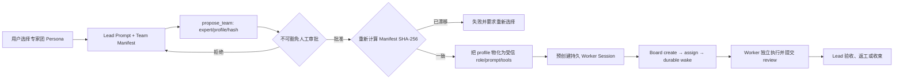

# WorkBuddy 与 OpenWorker 专家团对照设计

## 结论先行

WorkPilot 不需要再造一套多 Agent 调度器。现有 Agent Team 已具备人工编制审批、持久 Worker Session、Board 状态机、返工、部分完成、写目录委派、预算预留、durable wake 和事件审计；缺口在“成员是谁”这一层：原先的 `role` 只是模型提交并写入数据库的自由文本，Worker 启动后仍使用同一份通用提示词和同一组工具。

本次采用“专家 Persona 包 + 受信 Worker profile + 既有 Agent Team 控制面”的组合：专家团定义 Lead SOP、成员身份、成员提示词和工具白名单；运行时仍由现有 Board 与 Worker Session 执行。这样既吸收 WorkBuddy 的专家包与分阶段 SOP，也吸收 OpenWorker 的类型化 worker persona 和能力防火墙，同时保留 WorkPilot 已有的强审批、范围回执与恢复语义。

## 调研边界

- WorkBuddy：依据本机 `/Applications/WorkBuddy AI.app` 5.4.0 安装包内随附的 Agent Teams 文档、专家管理 Skill 与格式规范。它不是完整开源仓库，因此对“运行时内部如何实现”的描述仅限文档可证实内容，不把模板约定推断成底层硬约束。
- OpenWorker：依据本机开源仓库 `/Users/rance/openworker` 的 Persona、Team、Board、Journal 与会话管理源码。
- WorkPilot：依据当前仓库的 Persona、Team、Worker wake、SQLite Store 与测试。

## 三套系统的分层

| 维度 | WorkBuddy | OpenWorker | WorkPilot（改造前） | WorkPilot（本次） |
| --- | --- | --- | --- | --- |
| 专家定义 | 插件包；`expertType=agent/team`；Lead 与成员各自 Agent MD | YAML frontmatter + Markdown prompt；`team: lead/worker` | Persona 只有主会话提示词和工具过滤 | Persona 增加 `expert_type=team` 与 2-4 个受信 member profile |
| 多 Agent 运行 | Team Lead + 独立 teammate，上下文隔离、任务表、Mailbox | Lead + 独立持久 session、Board、可选 chat | Lead + 独立持久 Worker Session、Board | 复用原控制面，不增加第二套调度器 |
| 成员选择 | Team 包声明成员；Lead Prompt 按 SOP spawn | `propose_team` 按 persona ID 选择注册且启用的 worker | `propose_team` 自由填写 name/role/reason | `expert + profile + manifest hash` 选择包内成员，role 不可覆盖 |
| 能力边界 | Agent MD 不声明 tools，工具由系统分配；成员通常继承权限模式 | Persona 明确 tools/skills/connectors；solo persona 不能入队 | Worker 统一使用路径型本地工具，再受 Board scope 限制 | 在统一安全上限内按 member tool patterns 再收窄 |
| 协作协议 | 专家模板强调 TeamCreate、阶段 SOP、Lead 中转；大量是 Prompt 铁律 | 角色权限由 Store 再校验；Board 是事件投影；另有 Journal | Board 状态机与 Lead 验收由 Store 强制 | 保留硬约束，Lead Prompt 只负责业务阶段编排 |
| 恢复与审计 | 文档明确团队会话暂不支持恢复 | Worker session 持久化；Board/Journal 追加式记录 | durable wake、outbox/cursor、hash chain、未知副作用阻断 | 专家身份、提示词、工具白名单一并写入 Worker checkpoint |
| 用户控制 | 自然语言创建；可直接 @成员；Delegate Mode | roster 审批后零 token 预创建 session | roster 与写目录不可豁免审批 | 审批卡同时固定专家 manifest 收据，定义漂移则拒绝执行 |

## WorkBuddy 是怎么设计多 Agent 的

WorkBuddy 把“专家身份”和“Agent Team”拆成两层。Agent Teams 文档描述的是运行层：一个主会话成为 Team Lead，多个 teammate 拥有独立上下文，通过共享任务列表和 Mailbox 协作；用户可直接查看或 @任意成员。成员会加载项目上下文，但不会继承 Lead 对话历史，所以任务 Prompt 必须显式携带必要信息。Delegate Mode 可把 Lead 限制为协调工具，不过成员仍获得自己的执行权限。文档同时明确当前没有 team session 恢复、不支持嵌套团队且 Lead 固定。

专家管理器描述的是产品与分发层：插件 manifest 用 `expertType` 区分单 Agent 和 Team；Team 包声明一个 Lead Agent、若干 member Agent、展示信息、技能与头像。Lead Agent MD 内嵌成员清单、单 Agent 路由和分阶段 Workflow；Team 规范要求并行阶段一次启动无依赖成员，串行阶段把前序原文交给下一角色。这里的“不能模拟成员、跨成员信息经 Lead 中转”等主要由 Prompt 合同表达，不能等同于 Store 层权限校验。

可学习点：专家是可发现、可安装、可选择的产品对象；每个成员有独立角色 Prompt；Lead 持有显式 SOP；专家包有严格校验和展示元数据。不能照搬点：把安全边界主要寄托在 Prompt、成员默认继承较宽权限，以及当前缺少团队恢复。

## OpenWorker 是怎么做专家与团队的

OpenWorker 没有单独使用“专家团”产品名，而是把专家能力建模为 Persona。Manifest 同时声明 system prompt、tools、skills、connectors 和 `team: lead|worker`。`team: worker` 是能力防火墙：worker persona 不出现在普通选择器中，组队入口也会再次校验；solo persona 即使名字相同也不能被塞进团队。

Lead 先通过动态 `team_options` 获取当前注册且启用的 worker，再以 `{persona, name, model?, reason?}` 提出 roster。用户批准后，系统预创建零 token 的独立会话，并把 persona、model、session 与 actor 固化。Board 是追加事件日志的投影，worker 只能把自己的任务提交到 review，不能标 done；Journal 又把长期 case 证据从短生命周期 Board 中拆开，支持归属、时间、taint 与 hash chain。

可学习点：用注册表里的类型化 persona 代替自由文本角色；成员身份和能力随 session 固化；worker 不面向普通用户；权限在数据层重复校验；任务状态与长期证据分层。需要结合 WorkPilot 取舍点：OpenWorker 的通用 worker 能力比 WorkPilot 当前的精确目录委派更宽，且它没有直接替代 WorkPilot 四维团队预算、工具尝试 unknown 状态和写范围回执的机制。

## WorkPilot 原有优势与真实缺口

原有执行链路已经是完整团队系统：

1. `propose_team` 无论 auto 与否都必须人工审批，并可在同一张卡片中委派 Worker 可写根目录。
2. 审批后只预创建 idle Session；Board assignment 才触发 durable wake。
3. Worker 每次只收到任务描述、验收标准和最小资源范围；路径工具还要再次通过 Lead grant 与 Board receipt。
4. Worker 只能提交 review，Lead 负责 accept/rework/partial/cancel。
5. 团队预算同时约束模型调用、工具调用、墙钟时间和 assignment；写工具在崩溃点结果未知时阻止盲目重放。

缺口是原 `TeamMemberProposal.role` 没有进入 Worker system prompt，assignment envelope 也不包含成员身份。数据库里虽然有不同角色名称，运行时却都是 `TEAM_WORKER_SYSTEM_PROMPT`，因此属于“多会话协作”，还不是“差异化专家协作”。

## 最终设计



### 定义层

`PersonaDefinition` 新增：

- `expert_type`: `agent | team`。
- `team_members`: 2-4 个成员；每个成员包含稳定 `profile`、展示 label、受信 role、默认 reason、专属 system block 和工具匹配规则。
- 用户或项目仍可使用 `.workpilot/personas/{name}.toml` 覆盖或新增专家团；文件大小、字段集合、标识符、成员数、提示词总长和工具模式都 fail closed 校验。

内置 `expert-council` 包含证据研究、领域分析、批判审阅三种 profile。Lead 采用“两路并行调查 → 独立串行质疑 → Lead 汇总”的会诊 SOP，明确共识、分歧、证据与未知项。

项目可以在已授权根目录新增 `.workpilot/personas/release-council.toml`，使用同一声明协议扩展专家团：

```toml
name = "release-council"
label = "发布专家团"
description = "实现检查与独立复核"
expert_type = "team"
tool_patterns = []
default_approval_mode = "interactive"
recommended_connectors = []
recommended_work_mode = "office"
system_block = "先并行核对实现与风险，再由 Lead 汇总。"

[[team_members]]
profile = "implementer"
label = "实现专家"
role = "检查实现与交付证据"
reason = "建立实现侧证据"
system_block = "只报告实际实现证据、路径和缺口。"
tool_patterns = ["read_*", "search_files"]

[[team_members]]
profile = "reviewer"
label = "复核专家"
role = "独立挑战实现结论"
reason = "避免自验收"
system_block = "寻找反例、边界和不成立的验收证据。"
tool_patterns = ["read_*"]
```

当前内置用法是：在 Cowork 的 Persona 选择器选“深度研究与风险评审团”，提交需要证据核验、方案分析和独立风险审查的问题；Lead 判断确需会诊后会提出 roster，用户批准不可豁免的编制卡，随后才创建 idle Worker 并通过 Board 分阶段执行。简单任务允许 Lead 直接完成，避免无意义组队。

### 提案与审批层

专家提案不再允许模型自由填写 role，而是提交 `expert`、`expert_sha256`、`name` 和 `profile`。运行时注入只含公开元数据的 `expert_team_manifest`；整体摘要覆盖 Lead Prompt、成员 Prompt 与工具边界。审批后执行前重新从当前已授权 Persona 来源计算摘要，不一致就中止，封住配置在等待审批期间被替换的竞态。

### Worker 执行层

物化时把成员专属 system prompt、专家身份和工具模式直接写进 Worker Session state。后台唤醒不依赖当时进程内的 Persona 对象，因此重启后仍是同一专家。工具边界采取交集：

`全局 Worker 安全上限 ∩ Board resource_scope ∩ member tool_patterns`

专家 profile 只能进一步收窄，不能获得 Shell、浏览器、连接器、Team 控制或需要独立审批的工具。Assignment envelope 同时包含固定后的 name、role、reason 与 profile，解决原来 role 只存库不入上下文的问题。

## 为什么不直接复制 WorkBuddy 或 OpenWorker

- 不复制 WorkBuddy 的 TeamCreate/Mailbox 运行时：WorkPilot 已有可恢复的 Board/outbox，再建一套会制造双状态源；而且 WorkBuddy 文档明确其 team recovery 仍受限。
- 不把成员做成选择器里的普通 Persona：团队 Worker 的 Prompt 面向 Lead，不应被用户误开成 solo 会话；本次先以内嵌 member profile 形成自包含专家包。
- 不放宽 Worker 工具：专业化不等于加权限。先在 WorkPilot 已有路径与审批上限内收窄，后续若需要连接器或网页专家，应新增显式 capability 与审批协议。
- 不增加成员直连：当前会诊需要的是可复核的阶段依赖，Lead 经 Board 传递前序原文更容易审计；可选 peer chat 属于后续能力，不应混进 P0。

## 后续演进

### P1：专家包产品化

- 前端 Persona 选择器展示 Team 徽标、成员预览、SOP 与能力边界。
- 将内嵌成员升级为自包含目录包，加入版本、作者、技能依赖、头像和安装来源。
- worker profile 默认不进入普通 Persona picker；支持显式启用/禁用和能力变更再同意。

### P2：证据与模型路由

- 参考 OpenWorker 增加跨 Board 的 Case/Journal，区分任务进度和长期证据。
- 为成员声明推荐模型、轮次上限与成本档，但仍由团队预算做硬上限。
- 增加“提出者与验证者不能是同一 profile”的 reviewer separation 策略。

### P3：协作体验

- 增加成员状态、token/tool 使用量与阶段依赖可视化。
- 评估只读 peer message；默认仍让关键证据经 Lead/Board 中转。
- 建立单 Agent、Subagent、Expert Team 的路由评测，避免简单任务因组队增加成本。

## 源码证据

### WorkPilot

- `backend/app/cowork/personas.py`：专家定义、TOML 校验、行为摘要与内置会诊团。
- `backend/app/cowork/teams.py`：专家提案校验、manifest 防漂移、成员物化、Worker 状态与工具交集。
- `backend/app/cowork/runtime.py`：把运行时 manifest receipt 注入冻结的 Persona block。
- `backend/app/cowork_store/sqlite.py`：Team/Worker Session 预创建、Board 状态、预算、outbox 与事件链。
- `backend/tests/test_cowork_capabilities_and_personas.py`、`backend/tests/test_cowork_teams.py`：定义、快照、审批、持久化和兼容性证据。

### WorkBuddy

- `/Applications/WorkBuddy AI.app/Contents/Resources/app.asar.unpacked/cli/dist/web-ui/docs/cn/cli/agent-teams.md`：独立上下文、共享任务、Mailbox、Delegate Mode、权限与恢复限制。
- `/Applications/WorkBuddy AI.app/Contents/Resources/app.asar.unpacked/resources/plugins/workbuddy-builtin/skills/expert-manager/references/team-spec.md`：Team 协作铁律与串并行 SOP。
- 同目录 `agent-md-spec.md`、`plugin-json-spec.md`：成员 Agent、技能与 `expertType/teamInfo/members` 包结构。

### OpenWorker

- `/Users/rance/openworker/coworker/personas/manifest.py`：Persona 能力与 `team: lead|worker` 类型。
- `/Users/rance/openworker/coworker/personas/registry.py`：安装快照、启用状态与隐藏 worker。
- `/Users/rance/openworker/coworker/server/manager.py`：动态 team options、worker 类型校验、零 token 预创建与 session 固化。
- `/Users/rance/openworker/coworker/teams/model.py`、`store.py`：Board 事件投影、状态机与角色权限。
- `/Users/rance/openworker/coworker/teams/journal.py`：独立、追加式、带归属的长期证据记录。
